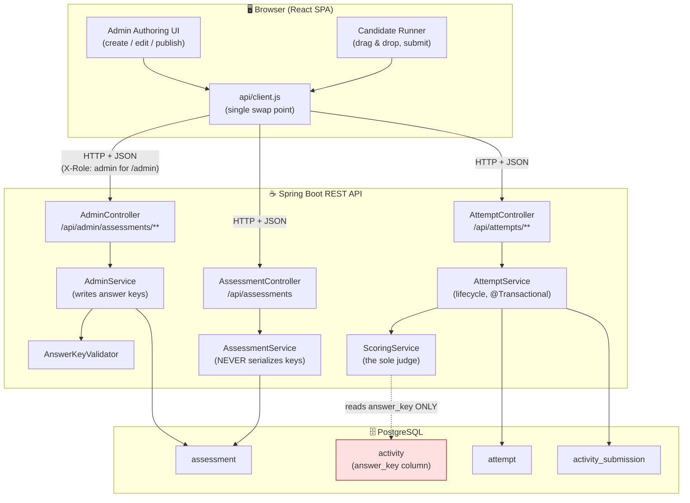
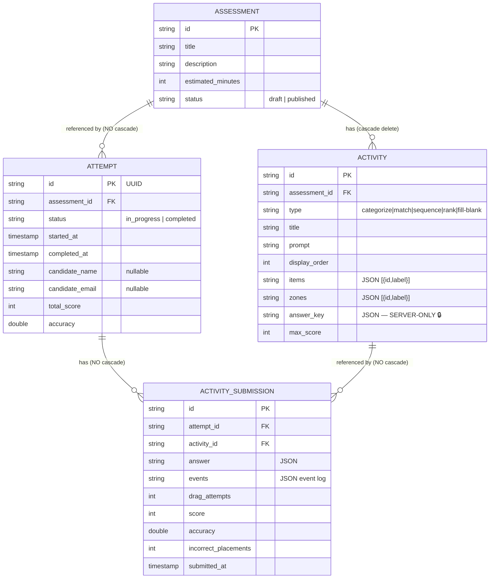
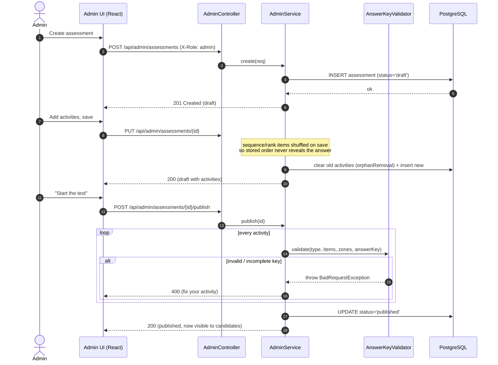
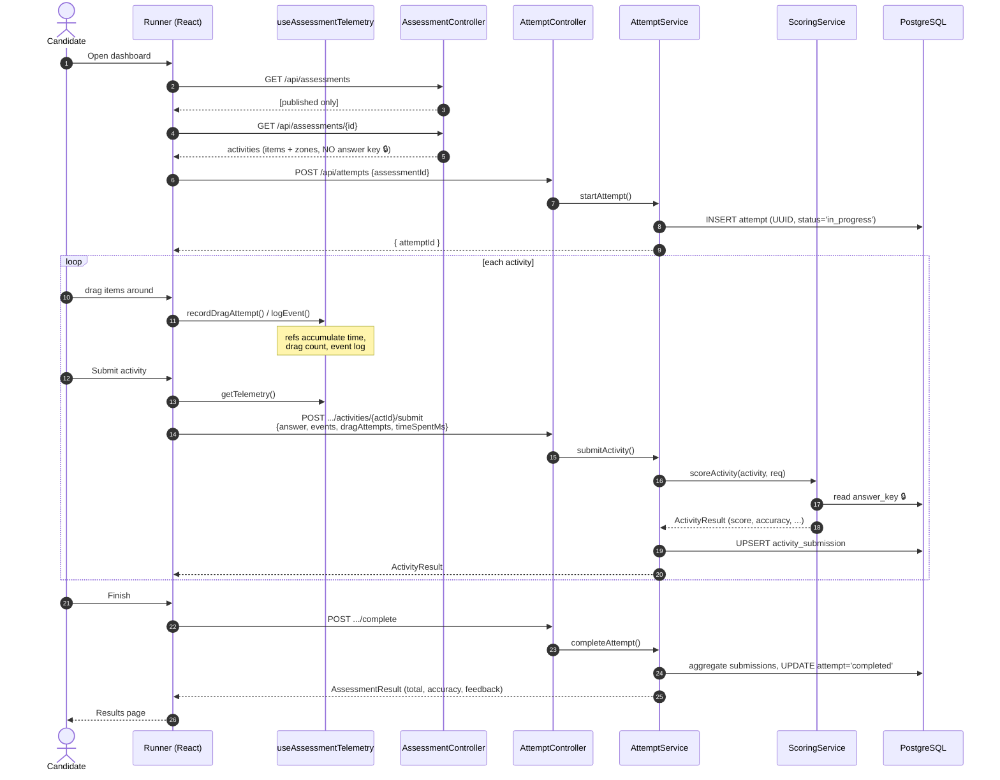
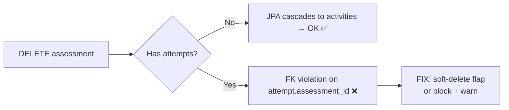

# Drag-and-Drop Assessment Platform — Technical Presentation & Interview Guide

> **Purpose:** A complete, whiteboard-ready breakdown of this project for a mentor evaluation
> and technical interviews. Every claim here is grounded in the actual code in this repository.
>
> **Diagrams:** Written in [Mermaid](https://mermaid.js.org/). They render on GitHub, in VS Code
> (with a Mermaid extension), and in most Markdown viewers. If yours doesn't render them, the ASCII
> fallbacks and prose still stand on their own.

---

## Table of Contents

1. [Reality Check — what this repo actually contains](#0-reality-check-read-this-first)
2. [High-Level System Architecture](#1-high-level-system-architecture)
3. [Data Model (ER diagram)](#2-data-model-er-diagram)
4. [End-to-End User & Data Flow (timing diagrams)](#3-end-to-end-user--data-flow)
5. [How Drag-and-Drop Works End-to-End](#4-how-drag-and-drop-works-end-to-end)
6. [The Scoring Engine, Line by Line](#5-the-scoring-engine-line-by-line)
7. [Database Optimization & Constraint Choices](#6-database-optimization--constraint-choices)
8. [Integration Points (Admin ↔ Candidate seam)](#7-integration-points-admin--candidate-seam)
9. [Code Deep-Dives (3 snippets to own on a whiteboard)](#8-code-deep-dives)
10. [Expected Mentor & Interview Questions](#9-expected-mentor--interview-questions)
11. [Appendix A — REST API Reference](#appendix-a--rest-api-reference)
12. [Appendix B — Glossary (plain English)](#appendix-b--glossary)

---

## 0. Reality Check (read this first)

Some common project-template phrases do **not** apply to this codebase. Know these cold so a mentor
opening the repo can never blindside you:

| Common claim | Reality in this code | What to say instead |
|---|---|---|
| "AI evaluates submissions" | **No AI/LLM anywhere.** Scoring is 100% deterministic rule-based logic in `ScoringService`. | "Scoring is deterministic and rule-based — fast, explainable, unit-tested." |
| "AI generation pipeline" | One `/generate` endpoint that returns **HTTP 501 Not Implemented** — a documented placeholder. | "There's a designed *seam* where AI question-authoring could plug in later; it isn't built." |
| "Cascade-delete across 8 entities" | **4 entities total.** Cascade covers **one** relationship (Assessment → Activity). | Explain the single JPA cascade + the FK limitation (§6). |
| "Cross-hackathon score normalization" | **Doesn't exist.** Scoring is per-activity accuracy, aggregated weighted by item count. | Explain the real weighted aggregation + capped penalty (§5). |
| "Server-side pagination" | **Not implemented.** `AdminService.list()` uses `findAll()`. | Present it honestly as a known scaling limitation with a one-line fix (§6). |

**Golden rule of the interview:** volunteer limitations *before* you're asked. Self-awareness reads
as senior; overclaiming reads as junior (or dishonest).

---

## 1. High-Level System Architecture

**One sentence:** A classic **3-tier web application** where admins author drag-and-drop assessments
and candidates take them, under one strict security rule — *the correct answers and all scoring live
only on the server.*

### Tech stack

| Tier | Technology | Role |
|---|---|---|
| **Frontend** | React 18 + Vite, Tailwind CSS v4, `@dnd-kit`, React Router, framer-motion | One SPA, two experiences: an **Admin** authoring UI and a **Candidate** assessment runner |
| **Backend** | Spring Boot 4.1, Java 21, Spring Web MVC, Spring Data JPA, Lombok, Jackson 3 | REST API, business logic, scoring |
| **Database** | PostgreSQL 18 (production) / H2 in-memory (tests), **Flyway** migrations | Persistence + the *only* home of answer keys |

### Component / layer diagram



### The one principle that defines this system

Both modules hit the **same four tables**, but they have **asymmetric access to one column**:
`activity.answer_key`.

- `AdminService` is the **only writer** of `answer_key`.
- `AssessmentService` (candidate reads) is **structurally incapable** of leaking it, because none of
  its DTOs (`ActivityDto`, `AssessmentDetailDto`, …) contain an `answerKey` field.
- An integration test asserts the key **never** appears in any candidate response.

This is **"the Golden Rule."** Name it explicitly in the interview — it's your strongest signal of
security maturity.

---

## 2. Data Model (ER diagram)

Four tables. Schema is owned by **Flyway** (`V1__init.sql` … `V4`), not Hibernate auto-DDL.



**Key schema facts to cite:**
- `answer_key` is stored as JSON **text**, read only by `ScoringService`, never in a DTO.
- Index `idx_activity_assessment` on `activity(assessment_id)` and `idx_submission_attempt` on
  `activity_submission(attempt_id)`.
- **Unique constraint** `uq_attempt_activity UNIQUE(attempt_id, activity_id)` → one submission per
  activity per attempt (this is what makes re-submitting an *upsert*, not a duplicate).
- Cascade is **JPA-level and only Assessment → Activity**. `attempt` and `activity_submission`
  reference their parents with **no `ON DELETE CASCADE`** (see §6 for why that matters).

---

## 3. End-to-End User & Data Flow

### Scenario A — Admin authors and publishes a test (write path)



### Scenario B — Candidate takes the test (read + submit path)



### The full picture in one line

> Admin authors a **draft**, publishes it (which **validates** every answer key); the candidate sees
> only **published** tests, drags items while the client logs **raw telemetry**, and on submit the
> **server** scores against a key the browser never sees and **upserts** the result; `complete`
> aggregates everything into a final weighted score.

---

## 4. How Drag-and-Drop Works End-to-End

This is your strongest technical story. Three stages: **browser → payload → server.**

```mermaid
sequenceDiagram
    autonumber
    actor User as Candidate
    participant DK as @dnd-kit DndContext
    participant Comp as CategorizeActivity
    participant Tel as Telemetry hook
    participant Srv as ScoringService (server)

    User->>DK: drag item, drop on a zone
    DK->>Comp: onDragEnd({ active, over })
    Comp->>Comp: setPlacements(itemId → zoneId)
    Comp->>Tel: onDragAttempt()  (count++)
    Comp->>Tel: onEvent({type:'place'|'move'|'remove', itemId, zoneId})
    Note over Comp: NO correctness check here —<br/>zones react to HOVER, never right/wrong

    User->>Comp: Submit
    Comp->>Comp: getAnswer() → {kind:'mapping', placements:{...}}<br/>or {kind:'order', order:[...]}
    Comp->>Srv: POST submit { answer, events, dragAttempts, timeSpentMs }
    Srv->>Srv: load answer_key (secret)
    Srv->>Srv: compare placements/order vs key → correctCount
    Srv->>Srv: replay events → count wrong-zone drops (incorrectPlacements)
    Srv->>Srv: accuracy = correct/total; score = round(acc*100) - cappedPenalty
    Srv-->>Comp: ActivityResult
```

**Stage 1 — Browser (`@dnd-kit`).** A `DndContext` wraps draggable items and drop zones. On drop,
`handleDragEnd({active, over})` gives *what* was dragged (`active.id`) and *where* it landed
(`over.id`). The component updates a local `placements` map, increments the drag counter, and logs a
raw event. **It never judges correctness** — the pulsing zone feedback reacts to *hover*, not to
right/wrong.

**Stage 2 — The payload.** `getAnswer()` produces one of two shapes:
- **Mapping** (categorize / match / fill-blank): `{ kind:'mapping', placements: { itemId: zoneId } }`
- **Order** (sequence / rank): `{ kind:'order', order: [itemId, ...] }`

...bundled with telemetry `{ answer, events, dragAttempts, timeSpentMs }` and POSTed.

**Stage 3 — Server (`ScoringService`).** Loads the secret `answer_key`, counts correct placements,
**replays the event log** to count wrong-zone drops (`incorrectPlacements`), computes accuracy, and
applies a small **capped efficiency penalty**.

**One-liner for the whiteboard:**
> *"The browser is a dumb terminal reporting the arrangement and the raw sequence of moves; the
> server is the sole judge — scoring against a key the browser never sees and replaying the moves to
> grade the process, not just the final answer."*

---

## 5. The Scoring Engine, Line by Line

`ScoringService.scoreActivity()` — the mapping branch + the score formula:

```java
if (answer != null && "mapping".equals(answer.kind())) {
    Map<String, String> key = Json.read(activity.getAnswerKey(), MAPPING);
    totalCount = key.size();                              // (a) total = key size, NOT item pool
    Map<String, String> placements =
        answer.placements() == null ? Map.of() : answer.placements();
    for (Map.Entry<String, String> entry : key.entrySet()) {   // (b) count correct
        String placed = placements.get(entry.getKey());
        if (placed != null && placed.equals(entry.getValue())) {
            correctCount++;
        }
    }
    for (ActivityEventDto ev : events) {                 // (c) replay: wrong-zone drops
        if (("place".equals(ev.type()) || "move".equals(ev.type()))
                && ev.zoneId() != null
                && !ev.zoneId().equals(key.get(ev.itemId()))) {
            incorrectPlacements++;
        }
    }
}
double accuracy = totalCount > 0 ? (double) correctCount / totalCount : 0.0;   // (d) guard /0
int excessDrags = Math.max(0, dragAttempts - totalCount * 2);                  // (e) 2 free/item
int penalty     = Math.min(5, excessDrags);                                    //     cap at 5
int score       = Math.max(0, (int) Math.round(accuracy * 100) - penalty);     //     floor at 0
```

- **(a)** Total is the **key's** size, not the item pool — an activity may have *decoy* items with no
  correct home (e.g. fill-blank distractors); those must not count.
- **(b)** For each correct pairing, look up where the candidate actually placed it. `placed != null &&
  placed.equals(...)` calls `.equals` on the known-non-null side → no `NullPointerException`.
- **(c)** **Event replay** — the behavioral signal. Any drag into a *wrong* zone is a fumble, even if
  the final arrangement is correct.
- **(d)** `accuracy` = fraction correct; the `totalCount > 0` guard prevents division by zero.
- **(e)** **Efficiency penalty:** two free drags per item; excess is penalized but **capped at 5** and
  the final score is **floored at 0**. Small, bounded, fair.

**Aggregation** (`aggregate()`): sums per-activity scores, and computes overall accuracy as
`totalCorrect / totalItems` — i.e. **weighted by item count**, so a 10-item activity counts more than
a 2-item one. Feedback bands trigger at accuracy ≥ 0.9 / 0.7 / 0.5.

**Complexity:** `O(items + events)` per submit — linear, no nested loops, no algorithmic bottleneck.

---

## 6. Database Optimization & Constraint Choices

### Implemented (defend these)

- **Foreign keys** on every child table — the DB refuses orphan rows.
- **Indexes on FK columns:** `idx_activity_assessment`, `idx_submission_attempt` — lookups by parent
  don't table-scan.
- **Unique constraint** `UNIQUE(attempt_id, activity_id)` → idempotent submissions (re-submit updates,
  never duplicates).
- **JPA cascade (one relationship):** `Assessment @OneToMany(cascade=ALL, orphanRemoval=true)` — delete
  or edit an assessment and its activities are cleaned up automatically.
- **Flyway owns the schema** (`ddl-auto=none`) — versioned, reviewable, reproducible; Hibernate never
  mutates tables.

### Not implemented — roadmap (do NOT claim these exist)

- **Server-side pagination.** `AdminService.list()` uses `findAll()`, loading every row into memory.
  **Fix:** return `Page<Assessment>` and accept a `Pageable`; Spring Data issues `LIMIT/OFFSET`. Small,
  native change.

### The constraint gotcha to raise *yourself* (senior move)

The cascade only covers **Assessment → Activity**. `attempt` and `activity_submission` reference their
parents with **no `ON DELETE CASCADE`**. So:

> **Deleting an assessment that already has candidate attempts fails with a foreign-key violation.**

That's actually the *safe* default — fail loudly rather than silently destroy result/audit data. The
proper fix is a **soft delete** (an `archived` boolean) so historical attempts keep their references,
or explicitly block deletion of assessments that have attempts.



---

## 7. Integration Points (Admin ↔ Candidate seam)

This clean contract is exactly what lets two developers build the two sides independently:

1. **Shared model, asymmetric access.** Same `Activity` entity; admin DTOs *include* `answerKey`,
   candidate DTOs *structurally omit* it. The **database is the integration point**; the **DTO layer is
   the contract** that keeps both sides honest.
2. **Lifecycle handshake via `status`.** Admin flips `publish` / `unpublish`; the candidate side filters
   on `status='published'`. Neither module calls the other — they coordinate through **one column**.
   Loose coupling done right.
3. **Lock-on-publish invariant.** A published test is read-only for admins (`requireEditable` throws
   `409 Conflict`), so a live test can't mutate under a candidate mid-attempt.

> *If you split the work with a teammate:* the honest framing is "we agreed on the DTO shapes / API
> contract up front (`src/api/types.js`), so the write-side and read-side were built independently and
> integrated through the shared database." **Only say this if it's genuinely true.**

---

## 8. Code Deep-Dives

### 8.1 Telemetry with refs (frontend performance)

```js
const startRef        = useRef(autoStart ? Date.now() : null); // source of truth
const dragAttemptsRef = useRef(0);
const eventsRef       = useRef([]);
const [startedAt, setStartedAt] = useState(startRef.current);  // mirror, UI only

const recordDragAttempt = useCallback(() => {
  dragAttemptsRef.current += 1;             // ref update → NO re-render
  setDragAttempts(dragAttemptsRef.current); // mirror only for an optional live counter
}, []);
```

**Why it matters:** in React, `setState` triggers a re-render. If the ticking clock and every drag
counter lived in state, the *entire drag-and-drop tree would re-render constantly* — janky on large
activities. A `useRef` value persists across renders **without** causing one, so the real data lives in
refs (always fresh at submit time), and the ticking stopwatch is isolated into its own component so its
per-second update repaints only itself.

**Plain-English analogy:** a ref is a sticky note on the fridge — always there, updatable anytime, and
changing it doesn't force you to repaint the kitchen. State is repainting the room: powerful, but you
only do it when the room genuinely needs to look different.

### 8.2 Idempotent upsert (backend robustness)

```java
ActivitySubmission sub = submissionRepository
    .findByAttemptIdAndActivityId(attemptId, activityId)
    .orElseGet(() -> {                       // not found → create new
        ActivitySubmission s = new ActivitySubmission();
        s.setId(UUID.randomUUID().toString());
        s.setAttemptId(attemptId);
        s.setActivityId(activityId);
        return s;
    });
// overwrite all scored fields, then:
submissionRepository.save(sub);
```

Find-or-create, then overwrite. Combined with the DB's `UNIQUE(attempt_id, activity_id)`, resubmitting
an activity **overwrites** rather than duplicating — so answer revisions and flaky-network retries are
both safe. The whole method is `@Transactional`, so find-score-save is atomic.

### 8.3 Publish-time validation (why the scorer can trust the key)

`AnswerKeyValidator.validate()` runs at **publish** (drafts may be incomplete). It enforces:
- Known type; at least one item; unique item ids.
- **Mapping types** (categorize/match/fill-blank): key maps items → *real* zones. `categorize`/`match`
  are **strict** (every item must map somewhere); `fill-blank` allows decoy items but every blank must
  be targeted.
- **Order types** (sequence/rank): the key is a **permutation** of the item ids (every item exactly
  once).

This is the guard that lets `ScoringService` blindly trust the stored key — validation is separated
from scoring.

---

## 9. Expected Mentor & Interview Questions

**Q1. "Delete an assessment a candidate already took — what happens?"**
> It fails with a **foreign-key violation** today, and that's an intentional-for-now limitation. The
> cascade only covers activities; `attempt`/`activity_submission` reference the assessment without
> `ON DELETE CASCADE`, so the DB refuses to orphan result data. I'd rather fail loudly than silently
> delete audit records. The real fix is a **soft delete** (`archived` flag) so attempts keep their
> references while the assessment leaves active lists.

**Q2. "Two admins edit the same assessment at once — what happens?"**
> There's a **lost-update race**: `update()` is read-modify-write with no optimistic locking, so the
> second save overwrites the first. The fix is a JPA `@Version` column — Hibernate checks the version on
> write and throws `OptimisticLockException`, so the second admin gets "refresh and retry" instead of
> clobbering. My lock-on-publish rule shrinks the window but doesn't cover two people on the same
> *draft*; `@Version` is the real answer.

**Q3. "Why score on the server? Isn't that slower?"**
> Marginally — one round-trip per submit — but it's the whole point. If the browser held the key, a
> candidate could read it in dev-tools and forge a score; the result would be meaningless. The frontend
> is a dumb terminal that reports the arrangement and raw moves; the server is the sole judge. I even
> test that the key never appears in any response. For assessments, **integrity beats latency**.

**Q4. "You use `findAll()` everywhere — behavior at 10,000 rows? How do you scale?"**
> It degrades — every row loaded into memory, slow admin lists, heap pressure. The fix is **server-side
> pagination** (`Page<Assessment>` + `Pageable` → DB `LIMIT/OFFSET`). System-wide, the backend is
> **stateless** (the `attemptId` carries all context), so I scale **horizontally** behind a load
> balancer, cache the immutable assessment definitions, and add read replicas for the read-heavy result
> endpoints. The DB is the bottleneck, not the app tier.

**Q5. "Is there any AI here, and how would you add it safely?"**
> No — scoring is **fully deterministic rule-based logic**, which for grading is a feature: fast,
> explainable, unit-tested. There's one `/generate` endpoint that deliberately returns **HTTP 501 Not
> Implemented** — a documented seam for future AI question-*authoring* (not evaluation). If I built it:
> admin describes a topic → backend prompts an LLM → parse the structured JSON into items/zones/key →
> run it through my existing `AnswerKeyValidator` before saving, so a malformed or hallucinated key can
> never reach a candidate. To scale those calls I'd make them **async** (queue + workers, since LLM
> latency is seconds), cache by topic, and rate-limit.

**Q6 (bonus). "How is submitting an activity idempotent, and why does that matter?"**
> The service does a find-or-create on `(attempt_id, activity_id)`, backed by a DB **unique
> constraint**, then overwrites. So a resubmit or a retried request updates the same row instead of
> duplicating. It matters because networks are unreliable and candidates revise answers — idempotency
> means neither corrupts the score.

**Q7 (bonus). "The answer keys are JSON in a `VARCHAR` column — defend that."**
> These payloads are read/written as a whole unit; I never query *inside* them, so normalizing items and
> zones into their own tables would add joins for zero query benefit. JSON-as-text keeps an activity
> self-contained. The trade-off is I can't query within the JSON efficiently — if I needed analytics like
> "most-misplaced item," I'd migrate to Postgres **`JSONB`** (indexable/queryable) or normalize just the
> queried pieces. It's the right call for the current access pattern, and I know the upgrade path.

---

## Appendix A — REST API Reference

Base URL: `http://localhost:8080/api`. Errors are Spring `ProblemDetail` JSON (message in `detail`).

### Candidate endpoints (never carry answer keys)

| Method & path | Body | Returns |
|---|---|---|
| `GET /assessments` | — | published assessment summaries |
| `GET /assessments/{id}` | — | detail + activities (items + zones, **no answer key**) |
| `POST /attempts` | `{assessmentId, candidateName?, candidateEmail?}` | `{attemptId}` (UUID) |
| `GET /attempts/{attemptId}` | — | progress snapshot (for resume) |
| `POST /attempts/{attemptId}/activities/{activityId}/submit` | `{answer, events, dragAttempts, timeSpentMs}` | `ActivityResult` |
| `POST /attempts/{attemptId}/complete` | — | `AssessmentResult` |
| `GET /attempts/{attemptId}/result` | — | `AssessmentResult` |

### Admin endpoints (carry answer keys; guarded by `X-Role: admin`)

| Method & path | Body | Returns |
|---|---|---|
| `GET /admin/assessments` | — | all assessments (any status), summaries |
| `GET /admin/assessments/{id}` | — | full detail incl. activities + answer keys |
| `POST /admin/assessments` | `AdminAssessmentRequest` | 201 draft |
| `PUT /admin/assessments/{id}` | `AdminAssessmentRequest` | replaced draft (draft only) |
| `DELETE /admin/assessments/{id}` | — | 204 |
| `POST /admin/assessments/{id}/publish` | — | validates all keys, goes live |
| `POST /admin/assessments/{id}/unpublish` | — | back to editable draft |
| `POST /admin/assessments/{id}/generate` | — | **501 Not Implemented** (AI seam) |

**Answer shapes:** mapping → `{kind:'mapping', placements:{itemId:zoneId}}`; order →
`{kind:'order', order:[itemId,...]}`.
**Event shapes:** `{type:'place'|'move'|'remove'|'reorder', itemId, zoneId?, toIndex?, timestamp}`.

---

## Appendix B — Glossary (plain English)

- **SPA (Single-Page Application):** the whole app loads once; navigation swaps content via JavaScript
  instead of full page reloads.
- **REST API:** a web interface built on HTTP where URLs are *resources* and verbs (`GET`/`POST`/…) are
  *actions*; **stateless** = each request carries all the context it needs.
- **DTO (Data Transfer Object):** a plain object shaping exactly what crosses the wire — the mechanism
  that keeps `answerKey` off candidate responses.
- **JPA / Hibernate:** the layer that maps Java objects to database rows so you rarely write raw SQL.
- **Flyway migration:** a versioned SQL file (`V1__…`, `V2__…`) applied in order, so every environment
  gets the identical schema, tracked in git.
- **Cascade / `orphanRemoval`:** JPA rules that automatically delete child rows when a parent is deleted
  or a child is detached.
- **Foreign key (FK):** a database rule that a child row must point to a real parent — prevents orphans.
- **`@Transactional`:** wraps a method so all its DB writes commit together or roll back together
  (all-or-nothing).
- **Idempotent:** doing the same operation twice has the same effect as once (here: resubmitting updates
  the same row, never duplicates).
- **Optimistic locking (`@Version`):** detects "someone else changed this row since I read it" and fails
  the late writer instead of silently overwriting.
- **`useRef` vs `useState` (React):** a ref stores a value across renders *without* causing a re-render;
  state causes a re-render when it changes.
- **`ProblemDetail`:** the RFC-7807 standard JSON shape Spring uses for error responses.

---

*Generated as an interview-prep aid. Every technical claim is traceable to code in this repo — if a
mentor asks "show me," open the file named in each section.*
