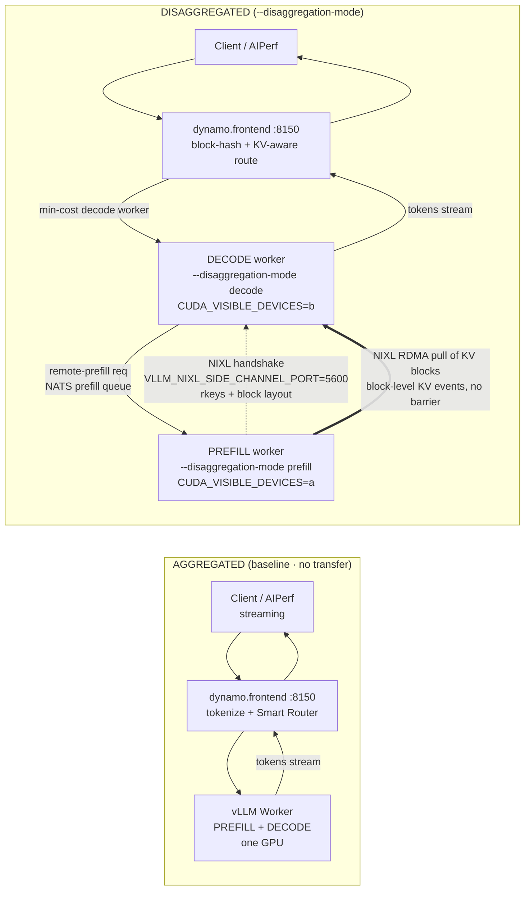

# The Ultimate NVIDIA Dynamo Interview Prep Guide
### High-Performance LLM Inference — Disaggregated Serving, KVBM, NIXL, LMCache
*Built from the HPE "NVIDIA Dynamo" Career-Preview benchmarking project (Llama-3.1-8B-Instruct on 8× A100-80GB, vLLM v0.12.0) and deep technical retrieval on the Dynamo ecosystem.*

---

## How to use this guide

- **Section 1** is what you *say* — memorize the 30-second pitch, internalize the 2-minute arc.
- **Section 2 (2A + 2B)** is the deep mechanics — read until you can teach it, not just recite it.
- **Section 3 (Tiers 1–4)** is the Q&A bank — practice out loud; the answers are model-answer quality, not scripts to parrot.
- **Sections 4–5** handle unknowns and project-specific curveballs — this is where interviews are won or lost.
- **Sections 6–7** are the rigor points and bonus systems-design questions that mark you as *senior*.
- **Section 8** is the one-page cheat sheet — review it last, right before you walk in.

> **Grounding note.** Every benchmark number in this guide is quoted from your actual deck. Where the deck flagged a caveat (host-wide GPU telemetry, ITL rising under KVBM), so does this guide — interviewers reward that honesty. Bandwidth/roofline figures and ecosystem mechanics are from public NVIDIA/vLLM/LMCache documentation and the P/D-disaggregation literature (DistServe, Splitwise, Mooncake).

---

## Table of Contents

1. **Project Executive Summary & Technical Elevator Pitch** — 30s + 2min pitch, results highlights, ownership claims
2. **Deep-Dive Technical Mechanics**
   - **2A.** Dynamo Architecture, P/D Disaggregation & End-to-End Request Flow
   - **2B.** KVBM, NIXL, LMCache & KV-Cache Mathematics
3. **Interview Question & Answer Bank**
   - **Tier 1** — Core Fundamentals & Definitions
   - **Tier 2** — Deep Systems & Architecture
   - **Tier 3** — HPE Benchmarking & Performance Trade-offs
   - **Tier 4** — Tricky / Edge-Case Technical Questions
4. **What to Say When You Don't Know**
5. **Curveballs About YOUR Project (and traps to avoid)**
6. **Benchmarking Rigor — The Details That Separate You From the Pack**
7. **Five Bonus Hard Questions (Systems-Design & Debugging)**
8. **One-Page Cheat Sheet**

---


## SECTION 1: Project Executive Summary & Technical Elevator Pitch

This section gives you three things you can say out loud, plus the numbers and ownership claims that back them up. Everything here is grounded in your real deck. Memorize the 30-second pitch verbatim; internalize the 2-minute version as a *story arc* (motivation → baseline → disaggregation → transport → memory tiers → measurement → tuning) so you can compress or expand it on demand.

---

### (a) The 30-Second Pitch — "Tell me about your HPE project"

> "During a career-preview program with HPE, I deployed and benchmarked **NVIDIA Dynamo** — a datacenter-scale LLM inference *orchestration* layer that sits above engines like vLLM — on an **8× A100-80GB** HPC cluster, serving **Llama-3.1-8B-Instruct** on **vLLM v0.12.0**. I started from a single-GPU aggregated baseline, then split **prefill and decode onto separate GPUs** (disaggregated serving) with the KV cache moved point-to-point over **NIXL** RDMA. From there I layered in two KV-cache memory strategies — **KVBM** tiered offload and **LMCache** prefix reuse — and measured everything with **AIPerf**: TTFT, inter-token latency, and throughput. Headline result: a balanced **2-prefill / 2-decode** layout won on both short- and long-prompt workloads, hitting **2037.5 output tokens/sec** on the short-input workload, and KVBM cut time-to-first-token by **up to 95.3%** under load. I also validated the KV-cache theory: my analytical estimate of **2.13 GB** matched the measured NIXL transfer of **2.147 GB** almost exactly."

*Delivery notes:* lead with **what Dynamo is** (orchestration, not an engine — a common interviewer misconception you preempt), name the **hardware and model** so they can calibrate, then hit **one throughput number, one latency number, one validation number**. Stop. Let them pick the thread.

---

### (b) The 2-Minute Version — the full arc

> **Motivation.** "The core problem in LLM serving is that the two phases of inference have *opposite* hardware profiles. **Prefill** — processing the whole prompt at once — is **compute-bound**: it's large matrix-matrix GEMMs that saturate Tensor Cores. **Decode** — generating one token at a time — is **memory-bandwidth-bound**: every step re-reads the model weights and the full KV cache from HBM to emit a single token. If you run both on the same GPU, a long prefill stalls in-flight decodes and spikes tail latency — head-of-line blocking. So the whole project was about *separating and independently optimizing* these phases with Dynamo."
>
> **Aggregated baseline.** "I first stood up **aggregated serving** — one vLLM worker doing prefill and decode on a single GPU. Client → Frontend → Worker → GPU. There's no KV-transfer overhead, so it's a clean, honest baseline. The Frontend is Dynamo's OpenAI-compatible gateway, `python -m dynamo.frontend`, and workers are `python -m dynamo.vllm`. I used file-based discovery since this was single-node."
>
> **Disaggregated P/D.** "Then I split prefill and decode onto **separate vLLM workers on distinct GPUs**, isolated with `CUDA_VISIBLE_DEVICES`, using `--disaggregation-mode prefill` and `decode`. This lets me scale the two pools independently and kills the prefill-decode interference."
>
> **NIXL KV transfer.** "The KV cache produced by the prefill worker has to reach the decode worker. That's **NIXL** — NVIDIA's point-to-point transfer library — via vLLM's `NixlConnector`. The decode worker connects to a side-channel port on the prefill worker and **pulls the KV blocks over one-sided RDMA** directly out of GPU memory — no CPU in the loop, no copies. And because block-level KV events fire as blocks land, decode can start before the entire transfer finishes — there's no full-transfer barrier."
>
> **KVBM + LMCache.** "Then two memory strategies. **KVBM**, the KV Block Manager, is a *tiered* memory manager — under heavy traffic it reactively evicts KV tensors from GPU VRAM down to CPU or disk instead of preempting or OOM-ing requests, which keeps the scheduler flowing. **LMCache** is different — it's *proactive prefix reuse*: it offloads prefill KV blocks to a big CPU DRAM pool and, on a prefix match, reloads them so recurring prompts skip GPU prefill entirely. In Dynamo I composed LMCache with NIXL under a **MultiConnector** on the prefill worker."
>
> **Benchmarking with AIPerf.** "I measured everything with **AIPerf**, which fires synthetic streaming requests at the OpenAI endpoint and captures TTFT, time-to-second-token, inter-token latency, output tokens/sec, and request throughput — plus GPU telemetry through pynvml and server-side metrics like KV-cache usage and batch size. I swept disaggregation ratios — 1P1D, 1P2D, 2P1D, 2P2D — across a **prefill-heavy** workload at ISL≈16,000 and a **balanced** one at ISL≈500."
>
> **AI Configurator.** "I also explored **AI Configurator**, NVIDIA's tool that *recommends* deployment configs from a model + hardware + workload — it estimates, it doesn't run inference. I ran it against `a100_sxm` with the empirical database mode to sanity-check my chosen configs."
>
> **Results & takeaways.** "**2P2D** — a balanced 1:1 ratio — was the winner on *both* workloads: **2037.5 tokens/sec** on short inputs and the best latency on long inputs. **KVBM cut TTFT by up to 95.3%** under memory pressure. **LMCache** turned an 87.9% token-hit-rate workload into a **418 ms** TTFT versus **756 ms** with no reuse — and moved 5× less data over NIXL. And my KV-cache math checked out: **2.13 GB predicted, 2.147 GB measured**. The one honest caveat: my GPU telemetry was **host-wide across all 8 GPUs**, so I can't cleanly attribute utilization to a specific prefill or decode worker — and KVBM's TTFT win sometimes came with a small **ITL increase** from the added KV-transfer overhead."

---

### (c) Results Highlights

| Metric | Number (quote exactly) | One-line interpretation |
|---|---|---|
| **2P2D throughput — long-input workload** (highISL ~16,000) | **59.6 output tok/s** (req/s 0.23, latency 401.7 s, TTFT 396.5 s, ITL 20.6 ms) | On extreme prefill-heavy prompts, the balanced 2P2D layout was still the best of the four ratios — but absolute throughput is low because each request is an enormous prefill; TTFT dominates end-to-end latency. |
| **2P2D throughput — short-input workload** (lowISL ~500) | **2037.5 output tok/s** (req/s 7.96, latency 11.8 s, TTFT 7.2 s, ITL 18.2 ms) | The headline number: ~34× the long-ISL throughput. Cheap prefills let the decode pool stay saturated, so system tokens/sec climbs and per-token latency stays low. |
| **KVBM TTFT reduction (max)** | **95.3%** (1P1D, ISL=500); also 90.6% (2P2D, ISL=500), 85.5% (1P1D, ISL=16000), 83.0% (2P2D, ISL=16000) | By spilling KV to CPU/disk instead of preempting on-GPU sequences, KVBM prevents queue deadlocks and OOM, so queued requests stop waiting behind recompute — a massive TTFT win. |
| **LMCache token hit rate** | **87.9%** (high reuse, NDE=50) vs **1.0%** (no reuse, NDE=500) | Fewer unique prompts → more prefix hits → more prefills skipped. Hit rate is the single leading indicator of whether prompt-reuse caching will pay off. |
| **LMCache TTFT** | **418.68 ms** (high reuse) vs **756.26 ms** (no reuse) | ~1.8× faster first token when prompts repeat, because matched prefixes are reloaded from the CPU pool instead of re-prefilled on the GPU. |
| **LMCache NIXL transfer volume** | **13.60 GB** (high reuse) vs **66.69 GB** (no reuse) | ~5× less data on the wire under reuse — reused KV is served locally rather than freshly produced and shipped prefill→decode. A direct, physical proof the cache is working. |
| **KV-cache theory vs measured** | Analytical **2.13 GB** (2·32·16256·8·128·2) ≈ measured NIXL **2.147 GB** max | The GQA KV-cache formula predicts the on-wire transfer to <1% — validating both my analytical model *and* that the NIXL path is genuinely zero-copy (bytes-on-wire ≈ exact KV size, only block-padding/framing overhead). |

---

### (d) System Achievements & What I Owned

Claim these in first person; each is directly supported by the deck.

- **Deployed NVIDIA Dynamo end-to-end on a real HPC cluster** — Frontend gateway (`dynamo.frontend`), vLLM workers (`dynamo.vllm`), file-based discovery — and validated the full path: request routing, worker execution, KV-cache management, and response generation.
- **Built and compared aggregated vs disaggregated serving** — stood up the single-GPU baseline, then split prefill/decode across GPUs via `--disaggregation-mode` + `CUDA_VISIBLE_DEVICES` isolation.
- **Wired up NIXL KV transfer** between prefill and decode workers (`NixlConnector`, side-channel port, block-level KV events) and confirmed one-sided RDMA pull semantics.
- **Evaluated two distinct KV-memory strategies** — KVBM tiered offload (CPU/disk) and LMCache proactive prefix reuse composed with NIXL under a MultiConnector — and characterized *when each helps*.
- **Designed and ran the benchmark methodology with AIPerf** — swept 4 disaggregation ratios across 2 workloads (500 req/run, concurrency 100, fixed OSL ~256), capturing TTFT/TTST/ITL/throughput plus GPU and server-side telemetry.
- **Validated the analytical KV-cache model** against measured NIXL transfer volume (2.13 GB predicted vs 2.147 GB measured) — i.e., I connected the *theory* to the *bytes on the wire*.
- **Explored AI Configurator** for config recommendation (empirical/hybrid/analytical database modes, `a100_sxm`, port-forwarded Gradio UI on the HPC login node).
- **Surfaced the limitations honestly** — host-wide (all-8-GPU) telemetry that can't be attributed per-worker, and the KVBM ITL/TTFT trade-off — rather than overclaiming.

---

### (e) "So What" — Business Impact Framings

Interviewers care about *why the numbers matter*. Have these ready:

1. **Cost-per-token / hardware efficiency.** "Reaching **2037.5 tokens/sec** on 8 A100s from a balanced 2P2D layout means more served throughput on the *same* fleet. Since $/token scales inversely with tokens/sec/GPU, choosing the right disaggregation ratio is a direct **infrastructure cost lever** — no new hardware required."

2. **User-perceived responsiveness (SLA/goodput).** "TTFT is what a user *feels* as responsiveness. Cutting it **up to 95.3%** with KVBM, or from **756 ms to 418 ms** with LMCache on repeated prompts, is the difference between meeting and missing a latency SLO — and goodput, the rate of *SLO-compliant* requests, is what actually matters in production, not raw throughput."

3. **Workload-aware provisioning.** "The 4-way ratio sweep shows the optimum is **workload-dependent**: balanced 2P2D was robust across both mixes, but at ISL≈16,000 a 2-prefill layout starts to bottleneck. That's an actionable **capacity-planning insight** — you size prefill vs decode pools to your actual ISL/OSL distribution, and it argues for autoscaling rather than a fixed ratio."

4. **Caching turns compute into memory — cheaply.** "LMCache moving **5× less data** (13.6 vs 66.7 GB) and skipping prefills on an 87.9%-reuse workload means repetitive traffic — shared system prompts, RAG preambles, agent templates — gets served far cheaper. The lesson I'd bring to a real deployment: **measure token hit rate and bytes-moved first**, because prompt-reuse caching only pays off when reuse is actually there — on unique, low-reuse traffic it can even regress."

---

# SECTION 2: Deep-Dive Technical Mechanics (Concept-by-Concept)

*The technical heart of the guide, split into architecture/flow (2A) and the memory-and-transport internals plus KV math (2B).*

---


## SECTION 2A: Dynamo Architecture, P/D Disaggregation & End-to-End Request Flow

> **How to open this in an interview (30-second version):** "vLLM, TensorRT-LLM, and SGLang are *engines* — they optimize the forward pass on one node: paged attention, CUDA graphs, continuous batching. **Dynamo is the orchestration tier that sits *above* them.** It's engine-agnostic and adds the four things a single engine structurally cannot do across a cluster: **disaggregated prefill/decode**, **KV-cache-aware routing**, **KV offload across memory tiers**, and **SLA-driven autoscaling**. In my HPE project I deployed Dynamo over **vLLM v0.12.0** serving **Llama-3.1-8B-Instruct** on **8× A100-80GB**, and benchmarked aggregated vs disaggregated serving with AIPerf." That sentence alone signals you understand the layering, which is the #1 thing interviewers probe.

---

### 1. What Dynamo is — and the problem it solves vs a monolithic engine

**Dynamo is a datacenter-scale, open-source (Apache-2.0), inference-*engine-agnostic* serving/orchestration framework** (`ai-dynamo/dynamo`, debuted GTC March 2025, "1.0" GA mid-2025). Its core is written in **Rust** (the `dynamo-runtime` / `dynamo-llm` crates) with Python bindings that wrap each backend — that's why your workers launch as `python -m dynamo.vllm`.

**The problem.** A monolithic engine like vLLM is superb at the *single-GPU / single-node* forward pass — PagedAttention, continuous batching, chunked prefill. But one engine instance has no notion of:

- **Cross-node system orchestration** — which of N worker replicas should get *this* request.
- **Disaggregated prefill/decode** — running the two phases on *separate* GPUs and shipping the KV cache between them.
- **Cluster-wide KV-cache-aware routing** — routing to the worker that already holds the prompt's prefix in its cache.
- **KV offload across memory tiers** and **SLA autoscaling** of phase-specific worker pools.

Dynamo adds *exactly that layer*. The tagline to memorize: **"system-level inference optimization, not kernel-level."**

> **Interview gotcha (say this proactively):** "Dynamo does **not replace** vLLM — it **wraps** it. The engine still runs paged attention and the actual GEMMs; Dynamo decides *which engine instance* gets the request, *whether prefill is remote*, and *where the KV lives*. On a single node with one worker, Dynamo adds little over the raw engine — its value is *distributed*." This is the honest framing interviewers reward, and it's true of your setup: you ran on one node with `--discovery-backend file`, so you were exercising Dynamo's *serving semantics* (roles, routing, NIXL transfer) rather than its multi-node scale-out.

**Three architectural pillars** (a clean way to enumerate on a whiteboard):
1. **Scheduling** — phase placement (prefill vs decode) without interference.
2. **Memory management** — KV offload across tiers (G1 HBM → G2 host → G3 disk → G4 remote). *(Deep-dive: Section 2B.)*
3. **Data transfer** — KV movement between GPUs/tiers via **NIXL**. *(Deep-dive: Section 2B.)*

---

### 2. The Components

| Component | What it is | Deck / flag anchor |
|---|---|---|
| **Frontend / API gateway** | Rust HTTP server exposing an **OpenAI-compatible** API; tokenizes, templates, hosts the router | `python -m dynamo.frontend` (`--http-port 8150` in your run) |
| **Smart Router** | KV-cache-aware request router; picks the min-cost worker | `--router-mode kv`, `--kv-overlap-score-weight`, `--router-temperature` |
| **KV event / indexer plane** | Global prefix tree fed by worker `KV stored`/`KV removed` events; tells the router what each worker has cached | `--kv-events-config {enable_kv_cache_events: …}` |
| **Planner (SLA autoscaler)** | Monitors TTFT/ITL vs SLOs; independently scales prefill and decode replica counts | (not exercised in deck — see §2.4) |
| **Distributed Runtime** | Rust/tokio async core: component/endpoint abstraction, discovery, the router/indexer | `dynamo-runtime`, `dynamo-llm` crates |
| **Discovery / event plane** | Worker registry + messaging | `--discovery-backend file` (your run) vs prod **etcd + NATS** |

#### 2.1 Frontend / OpenAI-compatible API gateway

`python -m dynamo.frontend --http-port 8150` is a **Rust-based HTTP server** exposing OpenAI-compatible endpoints (`/v1/chat/completions`, `/v1/completions`, `/v1/models`). It handles **tokenization and request templating**, and **hosts the Smart Router**. Crucially it is **stateless with respect to workers** — it discovers them through the discovery plane rather than being statically wired to them. This is why in your benchmarks the **AIPerf** client just points at the frontend's OpenAI endpoint (`--server-metrics …/metrics`, streaming) and never has to know how many prefill/decode workers exist behind it.

> **Say it like this:** "The frontend is the single stable ingress. Clients speak plain OpenAI protocol; everything about disaggregation, routing, and KV transfer is *invisible* to the caller. That decoupling is what let me A/B aggregated vs 1P1D/2P2D by only changing how workers launched — not the client."

#### 2.2 Smart Router — KV-aware routing and its cost function (the crux)

The router's job: **route each request to the worker that maximizes prefix-cache reuse (minimizing redundant prefill) while balancing decode load** — optimizing TTFT *and* throughput jointly, not one at a time.

Router modes (`--router-mode`): `kv` (KV-cache-aware), `round-robin`, `random`, plus a load-only mode.

**The cost function (memorize the shape).** For each candidate worker the router computes a **cost logit** and picks the **minimum**:

```
adjusted_prefill_blocks = max(
    prefill_blocks
      − overlap_credit · device_overlap_blocks
      − host_hit_weight · host_overlap
      − disk_hit_weight · disk_overlap
      − … ,
    0)

cost = prefill_load_scale · adjusted_prefill_blocks + decode_blocks
```

In words: **cost ≈ (new prefill blocks you'd have to compute *after* subtracting cache overlap) + (decode/active blocks already queued on that worker)**. Lower is better.

**Worked example (from the router design docs):**

| Worker | new-prefill blocks | decode blocks | cost | picked? |
|---|---|---|---|---|
| W1 | 8 | 10 | **18** | |
| W2 | 5 | 5 | **10** | ✅ min |
| W3 | 2 | 9 | **11** | |

W2 wins even though W3 has fewer prefill blocks, because W3 is more loaded on decode — the router balances *both* terms.

**How the router *knows* cache state:** incoming request tokens are **block-hashed**; the router maintains a **radix/prefix tree (KVIndexer)** that stores **worker IDs at each node**, so it can compute, per worker, an **overlap score** = how many of the request's blocks already sit in that worker's KV cache. The tree is kept live by **KV events** the workers emit — `KV stored` (block allocated) and `KV removed` (evicted). This is the plane you toggled with `--kv-events-config`.

**Two tuning knobs worth naming:**
- **`--kv-overlap-score-weight`** — weights prefix-overlap in the prefill term. **Higher → favors cache hits → better TTFT, but worse ITL** (it piles requests onto cache-warm workers, so decode there gets crowded). **0 → pure load balancing**, ignoring the prefix cache. This is *the* TTFT↔ITL trade-off knob.
- **`--router-temperature`** — `0` = deterministic argmin; `>0` = **softmax sampling over the normalized cost logits**, which spreads load and avoids a "thundering herd" all landing on one hot worker.

> **Interview line:** "KV-aware routing is a *cost-minimization* over two competing quantities: prefill work you can *avoid* via cache reuse, and decode load you'd *add*. The `kv-overlap-score-weight` literally dials where you sit on the TTFT–ITL frontier — crank it for TTFT-sensitive traffic, drop it toward pure load-balance when ITL smoothness matters." Baseten/NVIDIA report roughly **~2× TTFT** (up to ~3× on a 100k-query test) from KV-aware routing — treat as vendor figures.

#### 2.3 KV event plane vs "file discovery" — and what you actually ran

Two distinct planes often get conflated:

- **Discovery plane** = *which workers exist*, their endpoints, roles, and model. Production: **etcd**.
- **Event/messaging plane** = **KV events**, the remote-prefill queue, metrics. Production: **NATS** (JetStream).

Your deck ran **`--discovery-backend file`**: **file-based discovery that needs *no* etcd/NATS**, supported for single-node/dev. That's the honest caveat to volunteer:

> **Flag honestly:** "I used `--discovery-backend file`, which is the etcd/NATS-free dev/single-node path — perfect for a controlled benchmark on one 8-GPU node. Production multi-node Dynamo needs **etcd for the worker registry and NATS for KV events + the prefill queue**. My future-scope note — multi-node over **HPE Slingshot** — is exactly where you'd graduate off file discovery onto etcd+NATS."

#### 2.4 Planner — SLA-based autoscaling (what you'd add, stated honestly)

The **SLA Planner** monitors **TTFT and ITL/TPOT against targets** and **independently scales the prefill and decode worker replica counts**. Default targets **recalled from the Dynamo planner docs (not measured or run in this project)**: **TTFT SLA 500 ms**, **ITL SLA 50 ms**, throughput-adjustment interval **180 s**, load-adjustment **5 s** — quote these as illustrative doc defaults, not as something you benchmarked. It has two modes — **predictive/throughput** (uses pre-deployment profiling curves mapping ISL→TTFT and KV-util→ITL) and **load-based** (reactive, real-time per-worker metrics).

**Be honest about scope:** your project **did not run the Planner** — you **manually swept the disaggregation ratios** (1P-1D, 1P-2D, 2P-1D, 2P-2D). That's actually the perfect thing to say:

> **Say it like this:** "I swept the P:D ratio by hand and found **2P2D won both workloads** — e.g. at low-ISL 2P2D hit **7.96 req/s / 2037.5 out-tok/s** vs 1P1D's **3.78 req/s / 966.6 tok/s**. The **Planner is the production automation of that manual sweep**: instead of me picking a static ratio, it watches TTFT/ITL SLOs and rebalances prefill vs decode replicas as the traffic mix drifts. Given my finding that the optimal ratio is workload-dependent — 2 prefill workers get *dominated* at ISL≈16000 — a static ratio is fragile and the Planner is the right next step."

#### 2.5 Distributed Runtime (the Rust core)

The **Dynamo Distributed Runtime** is the Rust/**tokio** async core providing the component/endpoint abstraction, service discovery, and the router/indexer. Python bindings wrap it for each backend (`dynamo.vllm`, `dynamo.sglang`, `dynamo.trtllm`). Rust is chosen for **low-latency, high-concurrency** request handling — the frontend and router are on the hot path for every request, so GC pauses / GIL contention there would show up directly as TTFT jitter.

---

### 3. Why prefill and decode justify separate scaling *and* separate hardware

This is the conceptual bedrock of disaggregation. The two phases have **opposite hardware profiles**, straight from roofline analysis:

| Phase | Operation shape | Bottleneck | Arithmetic intensity | Latency metric it drives |
|---|---|---|---|---|
| **Prefill** | All *N* prompt tokens at once → big **GEMMs** ([N×d]·[d×d]) | **Compute-bound** (Tensor-Core FLOPs) | AI ≈ **O(N)** — weights read once, amortized over N tokens → *above* the A100 ridge (~153 FLOP/byte) | **TTFT** |
| **Decode** | 1 token/step → **GEMV** (matrix–vector) | **Memory-bandwidth-bound** (HBM) | AI ≈ **O(1)** — must re-read *all* weights + *full* KV cache from HBM per token → *far below* the ridge | **ITL / TPOT** |

Because they bottleneck on **different resources**, co-locating them on one GPU causes two failures your deck names explicitly:

1. **GPU contention** — a compute-bound prefill burst and bandwidth-bound decodes fight for the same SM/HBM resources.
2. **Head-of-line blocking** — under continuous batching, when a big prefill lands, **decode waits behind it**, spiking one **ITL** interval and **hurting tail latency**.

> **The deck's own rationale, verbatim to quote:** *"prefill is compute-bound, decode is memory-bandwidth-bound; co-locating causes GPU contention and head-of-line blocking (decode waits behind long prefill), hurting tail latency; disaggregation enables independent scaling."*

Splitting the phases lets you (a) put each on its own GPU pool, (b) give each its own **batch policy and parallelism** (prefill favors low TP since it's already compute-saturated; decode favors higher TP to split KV and add effective bandwidth), and (c) **scale the two counts independently** — which is precisely the P:D ratio you swept. The academic lineage to name-drop: **DistServe** (goodput, 7.4× more requests), **Splitwise** (heterogeneous prefill/decode pools), **Mooncake** (KVCache-centric) — all establish that **separating phases lifts *goodput*** (SLO-meeting request rate), at the price of one new cost: **KV-cache transfer on the critical path**, which adds to TTFT.

---

### 4. Aggregated vs Disaggregated — the trade-off, grounded in your numbers

**Aggregated serving (your baseline).** A **single vLLM worker does prefill + decode on one GPU**. Flow: `Client → Frontend → Worker → GPU → Response`. **No KV-cache transfer or sync overhead** — that's its whole advantage. Representative launch flags: `--gpu-memory-utilization 0.9`, `--kv-events-config {enable_kv_cache_events:false}` (events off — nothing to notify since there's no remote consumer).

**Disaggregated serving.** Prefill and decode run on **separate vLLM workers on distinct GPUs**, isolated via **`CUDA_VISIBLE_DEVICES`**, launched with **`--disaggregation-mode prefill`** and **`--disaggregation-mode decode`**. KV moves prefill→decode via **NIXL** (`NixlConnector`, point-to-point GPU-memory transfer). Flow: `Client → Frontend → Prefill Worker → KV Cache Transfer (NIXL) → Decode Worker → Response`.

| Dimension | **Aggregated** | **Disaggregated** |
|---|---|---|
| GPU assignment | 1 worker, prefill + decode co-located | Separate workers/GPUs per phase |
| KV transfer overhead | **None** | **NIXL transfer added to TTFT** |
| Prefill↔decode interference | Yes (HoL blocking, ITL spikes) | **Eliminated** — phases isolated |
| Independent scaling | No | **Yes** (P:D ratio) |
| Best for | Short prompts, low overhead, simple ops | Interference-hurting workloads; scale-out |
| Deck flags | `--kv-events-config {enable_kv_cache_events:false}` | `--disaggregation-mode prefill\|decode`, `CUDA_VISIBLE_DEVICES`, `VLLM_NIXL_SIDE_CHANNEL_PORT` |

**Your measured payoff (quote exactly):**

*Low-ISL (ISL≈500), concurrency 100, 500 req/run, OSL≈256:*

| Config | req/s | out tok/s | avg latency | TTFT | ITL |
|---|---|---|---|---|---|
| 1P-1D | 3.78 | 966.6 | 25.6 s | 20.2 s | 21.4 ms |
| 1P-2D | 4.13 | 1058.3 | 22.9 s | 17.0 s | 23.1 ms |
| 2P-1D | 6.31 | 1616.4 | 14.9 s | 7.8 s | 27.9 ms |
| **2P-2D** | **7.96** | **2037.5** | **11.8 s** | **7.2 s** | **18.2 ms** |

*High-ISL (ISL≈16000, prefill-dominated):*

| Config | req/s | out tok/s | avg latency | TTFT | ITL |
|---|---|---|---|---|---|
| 1P-1D | 0.10 | 25.6 | 927.8 s | 917.7 s | 39.3 ms |
| 1P-2D | 0.09 | 23.0 | 1032.1 s | 1026.0 s | 23.9 ms |
| 2P-1D | 0.21 | 53.5 | 449.3 s | 432.2 s | 67.1 ms |
| **2P-2D** | **0.23** | **59.6** | **401.7 s** | **396.5 s** | **20.6 ms** |

> **Reading the tables like an architect:** "**2P2D was Pareto-best in both workloads** — a balanced 1:1 ratio is robust across traffic mixes. Notice at high-ISL that **TTFT is ~99% of end-to-end latency** (396.5 s of 401.7 s at 2P2D) — the workload is *entirely* prefill-dominated, which is the textbook long-ISL regime where you'd *add prefill capacity* (shift toward 3P/4P) to stay on the goodput frontier. Going 1P→2P prefill roughly **doubled req/s** at high-ISL (0.10→0.21), confirming prefill was the bottleneck; adding the 2nd decode worker (2P1D→2P2D) barely moved throughput but **cut ITL from 67.1 ms to 20.6 ms**, smoothing the tail."

**Honest caveat you must surface** (interviewers reward it): the deck flags that **GPU utilization was NOT reported per-worker** — telemetry via **pynvml was host-wide across all 8 GPUs**, so it **cannot be cleanly attributed to a specific prefill or decode worker**. So you can prove the *end-to-end* effect of disaggregation but not isolate per-GPU utilization of a given prefill vs decode worker.

> **Say it like this:** "My throughput and latency numbers are solid because they're measured at the client. But my GPU-utilization telemetry is **host-wide over all 8 GPUs** — I can't cleanly say 'the prefill GPU ran at X% and the decode GPU at Y%.' If I redid it I'd scope pynvml per `CUDA_VISIBLE_DEVICES` device or pull vLLM's per-worker server metrics (running/waiting requests, KV-cache usage %, batch size) to attribute utilization to a phase."

---

### 5. Conditional / adaptive disaggregation (the nuance)

Disaggregation is **not always-on**. Dynamo decides **per-request at runtime** whether to send prefill remote, gated by **two conditions (both must hold)**:

1. **Prefill length threshold** — the prefill length *excluding prefix-cache hits* must exceed a preset threshold. **Short prefills stay local/aggregated** (folded into ongoing decode via chunked prefill), because the KV-transfer cost isn't worth it for a tiny prompt.
2. **Prefill queue not congested** — the global remote-prefill queue (a **NATS stream** in production) must be below its limit; if prefill workers are backed up, prefill runs locally instead.

The `--disaggregation-strategy` (`decode_first` vs `prefill_first`) controls which side owns the request entry point — in `decode_first`, the decode worker receives the request and *pushes* remote-prefill.

> **Interview gotcha:** "Disaggregation is **conditional/adaptive**, not a static switch. KV-transfer overhead only pays off for long prefills — which is *exactly* why the win is huge at ISL≈16000 and marginal at ISL≈500. Short prompts run aggregated even in a 'disaggregated' deployment." This ties your two workloads together into one coherent story.

---

### 6. Step-by-step annotated request lifecycle

#### 6.1 Aggregated (baseline) — the simple path

```
1. Client (AIPerf, streaming)  ──HTTP POST /v1/chat/completions──▶  Frontend :8150
2. Frontend  tokenizes + templates, router selects the single worker
3. Worker (python -m dynamo.vllm)  runs BOTH prefill and decode on its GPU
      • prefill: one big GEMM pass over all prompt tokens → produces KV in HBM
      • decode: autoregressive loop, KV stays in the SAME HBM (no transfer)
4. Tokens stream back  Worker ─▶ Frontend ─▶ Client  (SSE, token by token)
```
No NIXL, no side channel, no KV events — `enable_kv_cache_events:false`. This is why aggregated has **zero transfer overhead** and is the honest baseline against which disaggregation must justify its transfer cost.

#### 6.2 Disaggregated — the annotated handoffs (decode_first)

Name each handoff explicitly — this is where interviewers dig:

1. **Ingress + tokenization.** `Client → Frontend (:8150)`. Frontend tokenizes and **block-hashes** the prompt.
2. **KV-aware routing.** The **Smart Router** computes the cost logit per worker (`prefill_load_scale · adjusted_prefill_blocks + decode_blocks`) using the **global prefix tree** (fed by `KV stored`/`KV removed` events) and picks the **min-cost decode worker**. It applies the two-condition **conditional-disaggregation** check.
3. **Remote-prefill dispatch.** The decode worker pushes a remote-prefill request (via the **NATS prefill queue** in production) to a **prefill worker** launched with **`--disaggregation-mode prefill`** on its own GPU (`CUDA_VISIBLE_DEVICES`).
4. **Prefill compute.** The prefill worker runs the big compute-bound GEMM pass, producing the prompt's **KV blocks in its GPU HBM**. As blocks complete they are **registered** (KVBM/engine block registration → immutable, reusable), which **fires block-level `KV stored` events**.
5. **NIXL handshake over the side channel.** The prefill worker exposes its endpoint on **`VLLM_NIXL_SIDE_CHANNEL_PORT`** (default 5600). The decode worker connects to that port; over this **ZMQ side channel** they exchange the **NIXL handshake metadata** — the prefiller's agent info, remote memory keys (rkeys), and **KV block layout**. *(NIXL's zero-copy/RDMA internals are Section 2B.)*
6. **Block-level KV transfer (pull).** The decode worker issues a **NIXL point-to-point RDMA read**, pulling **only the needed KV blocks** directly from the prefiller's VRAM. Because **`enable_kv_cache_events`** gives **block-level notification**, **decode starts consuming blocks as they land — there is no full-transfer barrier**. Decode doesn't wait for the entire KV to arrive.
7. **Decode + stream.** The decode worker (its own GPU, `--disaggregation-mode decode`) runs the memory-bound autoregressive loop and **streams tokens** back `→ Frontend → Client`.
8. **Cleanup.** Once transfer completes (signaled via NIXL's notification, not payload polling), the prefiller can free/recycle those KV blocks; `KV removed` events update the router's tree.

> **The one sentence that proves you get it:** "The magic is step 6 — it's a **one-sided RDMA *pull* of pre-registered paged blocks**, and it's **pipelined with decode via block-level KV events**, so decode overlaps the transfer instead of blocking on a barrier. That's why disaggregation's added TTFT cost stays small — my measured NIXL transfer for ISL≈16000 was **2.10–2.15 GB (max 2.147 GB)** against an analytical KV size of **2.13 GB**, ~0.8% overhead, i.e. genuinely zero-copy." *(Transfer-volume math and the analytical KV formula are detailed in Section 2B / the KV-cache theory section.)*

---

### 7. Flow diagram

**Mermaid (aggregated vs disaggregated side by side):**



**ASCII (the disaggregated critical path, annotated):**

```
                       ┌──────────────────────────────────────────────────────┐
 Client (AIPerf) ──────▶  dynamo.frontend  :8150                                │
   streaming SSE  ◀─────  • tokenize + block-hash prompt                        │
                       │  • Smart Router: cost = load·adj_prefill + decode_blks │
                       └───────────────┬──────────────────────────────────────-┘
                                       │ route to MIN-cost DECODE worker
                                       ▼
                          ┌───────────────────────────┐
                          │  DECODE worker (GPU b)     │
                          │  --disaggregation-mode     │
                          │           decode           │
                          └─────┬───────────────▲──────┘
        remote-prefill req      │               │  (2) NIXL RDMA PULL of KV blocks
        (NATS prefill queue)    │               │      block-level events → no barrier
                                ▼               │      ≈2.147 GB vs 2.13 GB analytic
                          ┌───────────────────────────┐
                          │  PREFILL worker (GPU a)    │
                          │  --disaggregation-mode     │
                          │           prefill          │
                          │  big compute-bound GEMM →  │
                          │  KV blocks registered in   │
                          │  HBM, fire "KV stored"     │
                          └───────────────────────────┘
                    (1) side-channel handshake over
                        VLLM_NIXL_SIDE_CHANNEL_PORT (5600):
                        rkeys + KV block layout exchanged once
```

---

### 8. Deck-flag cheat sheet (map every flag to its role)

| Flag / env var | Role in the flow |
|---|---|
| `python -m dynamo.frontend --http-port 8150` | OpenAI-compatible gateway + Smart Router (ingress for all requests) |
| `python -m dynamo.vllm --model meta-llama/Meta-Llama-3.1-8B-Instruct` | Launches a vLLM worker under Dynamo |
| `--gpu-memory-utilization 0.9` | Aggregated baseline: how much HBM the single worker claims |
| `--kv-events-config {enable_kv_cache_events:false}` | Aggregated: no remote consumer → events off |
| `--disaggregation-mode prefill` / `decode` | Assigns the worker's **role**; router keeps separate pools |
| `CUDA_VISIBLE_DEVICES` | Pins prefill vs decode workers to **distinct GPUs** |
| `VLLM_NIXL_SIDE_CHANNEL_PORT` | Prefill endpoint the decode worker connects to for the **NIXL handshake** (rkeys + block layout) to then **pull KV blocks** |
| `enable_kv_cache_events` (disagg) | **Block-level notification** so decode starts as blocks land — **no full-transfer barrier** |
| `--discovery-backend file` | etcd/NATS-free single-node dev discovery (what you used); prod = **etcd + NATS** |

---

### 9. Rapid-fire talking points (rehearse these)

- **"Dynamo wraps, doesn't replace."** Engine = forward pass; Dynamo = routing, disaggregation, KV tiering, autoscaling.
- **"Prefill compute-bound, decode memory-bound"** → different resources → co-location causes **head-of-line blocking + ITL spikes** → disaggregate to lift **goodput** (SLO-meeting req/s, not raw throughput).
- **"2P2D was Pareto-best in both workloads"** (7.96 req/s low-ISL; 0.23 req/s / 20.6 ms ITL high-ISL) — a balanced ratio is robust; but at ISL≈16000, 2 prefill workers get *dominated* → shift toward 3P–4P.
- **"The KV transfer is a one-sided RDMA pull, pipelined via block-level KV events"** — ~0.8% overhead vs analytical KV (2.147 GB vs 2.13 GB), proving zero-copy.
- **Honest caveats:** (1) GPU telemetry was **host-wide over 8 GPUs**, not per-worker; (2) I used **`--discovery-backend file`** (single-node dev), so multi-node etcd+NATS + Slingshot is future scope; (3) I **manually swept** the P:D ratio — the **SLA Planner** (TTFT 500 ms / ITL 50 ms defaults) is the production automation of that sweep.

*(NIXL zero-copy/RDMA internals, KVBM tiered offload, and LMCache prefix reuse — including the TTFT-reduction and NIXL-volume tables — are covered in Section 2B.)*


---


## SECTION 2B: KVBM, NIXL, LMCache & KV-Cache Mathematics

This is the memory-and-transport substrate that makes everything else in the deck possible. Disaggregation (Section 2A) is only viable because a **transport layer** can move KV cache prefill→decode at wire speed with zero copies; KV offloading is only viable because a **tiered memory manager** can spill blocks off the GPU without corrupting the paging model; and repeated-prompt acceleration is only viable because a **reuse layer** can recompute a span once and serve it everywhere. In the deck's stack these are three concrete components — **KVBM** (the memory manager), **NIXL** (the transport), and **LMCache** (the reuse engine) — and all three are ultimately accounting for the same object: fixed-size paged KV blocks whose byte-size is fully determined by the model architecture. Subsection 4 derives that byte-size from first principles and shows why the deck's **measured 2.147 GB NIXL transfer** matched the **analytical 2.13 GB** to within ~0.8%. Get these four topics cold and you can answer essentially any "how does the memory actually move" follow-up.

A single framing sentence to open the whole section with in an interview:

> "vLLM's PagedAttention manages KV *inside one GPU*. Dynamo adds three things around it: **NIXL** moves KV *between* GPUs and tiers, **KVBM** decides *which tier* a block lives in (HBM → host → disk → remote), and **LMCache** decides *whether a block ever needs to be computed at all*. They're layered concerns — transport, capacity, reuse — but on vLLM they share one connector slot, so KVBM and LMCache are alternatives, not a stack."

---

### 2B.1 — KV Block Manager (KVBM): tiered memory as a first-class citizen

#### What it is

**KVBM** (KV Block/Buffer Manager) is Dynamo's Rust-based runtime component (PyPI `kvbm`) for **allocation, lifecycle management, and cross-node sharing of fixed-size KV blocks across heterogeneous memory**. The deck describes it precisely: a *tiered memory manager that reactively evicts excess KV tensors from GPU VRAM to external tiers under heavy traffic*. The central object is the **`KvBlockManager`** facade, which owns the per-tier pools and the onboard/offload APIs, and coordinates four storage tiers ("G-tiers").

The mental model to state out loud: **KVBM is PagedAttention generalized across a memory hierarchy.** PagedAttention paginates KV *within HBM*; KVBM keeps the same fixed-size paged blocks and logical block tables but lets the pool span **GPU HBM → host DRAM → local disk → remote storage**, and adds content-hash deduplication and reactive tiered offload on top.

#### The four tiers (G1–G4)

| Tier | Medium | Role | Filled by | Transport in / out | Sizing knob (deck) |
|------|--------|------|-----------|--------------------|--------------------|
| **G1 – Device** | GPU HBM | Hot tier; allocates **mutable** blocks, registers completed ones as **immutable** | Engine (vLLM) | — (native) | `--gpu-memory-utilization 0.9` (engine) |
| **G2 – Host** | CPU **page-locked/pinned** DRAM | Warm staging tier; receives Device→Host offloads, onboards back to Device | Reactive D2H offload | **CUDA D2H / H2D copy** over PCIe | `DYN_KVBM_CPU_CACHE_GB` (deck used **100**) |
| **G3 – Disk** | Local NVMe SSD | Cold tier; capacity/persistence | Reactive Host→Disk offload | **NIXL Write** (out), **NIXL Read / GDS** (in) | `DYN_KVBM_DISK_CACHE_GB`, `..._DIR` |
| **G4 – Remote** | Object/cloud storage | Opaque blob store; petabyte-scale capacity | Explicit / policy | **NIXL** (file/object backends) | — |

The deck's own phrasing for the two deployment shapes maps directly onto these tiers:

- **Vertical tiering** — "high-speed swap in aggregated setups." A single worker holds its KV in G1 and, under pressure, swaps cold blocks down to G2/G3 and back. This is the CPU/Disk offloading the deck benchmarked (Baseline = no offload / local VRAM only; **CPU offloading** = page-locked host memory over PCIe; **Disk offloading** = persistent disk for capacity).
- **Horizontal scaling** — "uses NIXL connector to stream tensors across network in disaggregated setups." Here KVBM's connector owns the block registry and hands the actual byte movement to NIXL for the prefill→decode hop.

**Interview-critical transport rule (a classic gotcha):** the *G1↔G2* hop uses **CUDA copies** (D2H/H2D over PCIe); the *G2↔G3↔G4* and *cross-node* hops use **NIXL**; and **GPUDirect Storage (GDS)** is the fast **Disk→Device** path that lets NVMe DMA straight into HBM, bypassing the CPU bounce buffer. If you say "NIXL moves everything," that's wrong — CUDA memcpy moves the HBM↔host leg.

Second rule to memorize: **each lower tier should be ≥ the tier above it.** If G2 is smaller than G1 you get *eviction thrash* — a block is evicted from HBM, immediately can't fit in host memory, and gets reloaded/recomputed. The deck sizing `DYN_KVBM_CPU_CACHE_GB=100` (100 GB host pool) is generous precisely to avoid this.

#### Block pool, layout, and where fragmentation lives

Each tier's pool holds two sub-pools:

- **`ActivePool`** — blocks in use by live sequences.
- **`InactivePool`** — recycled/free-list blocks ready to allocate.

Block memory layout is a 2D array **`[num_layers][page_size × inner_dim]`**, default **`FullyContiguous`**, with `block_stride_in_bytes = align_up(num_layers × layer_stride, alignment)`. That `align_up` is a **real internal-fragmentation source** — alignment padding wastes a few bytes per block. Worth naming because it's exactly the kind of "where does the theory-vs-measured gap come from" detail interviewers probe (and it's part of why the measured NIXL transfer in §2B.4 is slightly *above* the analytical size, not below).

#### Block lifecycle state machine

State the states in order — it shows you understand *when* a block becomes reusable:

| State | Meaning | Reusable? |
|-------|---------|-----------|
| **Reset** | Uninitialized/recycled, sits in InactivePool | No |
| **Partial** | Being filled token-by-token (`add_token(s)`) | No |
| **Complete** | Fully filled but **not yet visible** to other sequences | No |
| **Registered** | Finalized, **visible for reuse**, entered into dedup cache, carries a `RegistrationHandle` | **Yes** |

**Only Registered (immutable, complete) blocks are dedup'd, offloaded, and reusable.** Partial/trailing blocks are not — so a sequence's last, half-full block is never shared and never spilled. This is both a correctness fact and a fragmentation fact (partial-block waste persists). Lifecycle uses **RAII + an `EventManager`**: registration returns a `PublishHandle` that fires a **Store/Register** event; dropping it fires a **Remove** event; on eviction RAII invalidates all references cleanly, *including across nodes*.

#### Offload / onboard / eviction mechanics

The single most important property: **offload is asynchronous, reactive, and batched — it happens *off* the critical next-token path.** KVBM waits for memory pressure (HBM/host tier filling), then batches many blocks into large efficient writes, rather than trickling one block per token. Memorize the four transfer flows:

| Flow | Direction | Mechanism |
|------|-----------|-----------|
| **Offload** | Device→Host (D2H) | Allocate host block, **CUDA D2H copy**, host pool registers immutable block, dedup by sequence hash |
| **Offload** | Host→Disk | Allocate disk block, **NIXL Write** |
| **Onboard** | Host→Device (H2D) | **CUDA H2D copy** into caller-provided device targets |
| **Onboard** | Disk→Device | **NIXL Read**, possibly via **GDS** (bypasses CPU bounce buffer) |

**Eviction** is **LRU-style** over Registered/inactive blocks; on sequence commit/eviction, blocks are reset and returned to InactivePool. (NVIDIA documents the *reactive, pressure-driven* policy but does not publish the exact LRU algorithm — honest thing to flag.) External systems can drive **hot-block promotion / cold-block demotion** by subscribing to the `KvEvent` stream (~100-byte records with `sequence_hash`, `prefix_hash`, `block_size`, `storage_location`, `event_type ∈ {Store, Remove}`) — the same events the KV-aware router consumes.

**Dedup / reuse** is content-addressed via **sequence hash** (and `prefix_hash`): identical KV content — shared system prompts, few-shot preambles, multi-turn history — is matched against Registered blocks and *reused instead of recomputed*. This is Dynamo's cross-request prefix caching, extended across tiers and nodes.

#### PagedAttention vs KVBM — the head-to-head

This comparison is the heart of the KVBM question. Have this table in your head:

| Dimension | **vLLM PagedAttention** | **KVBM** |
|-----------|-------------------------|----------|
| **Scope** | Single GPU, single instance | Multi-tier (G1→G4), multi-node |
| **Block model** | Fixed-size blocks (default **16 tokens**), non-contiguous in HBM, per-seq **block table** | *Same* fixed-size paged blocks + logical block tables, pool spans all tiers |
| **Fragmentation** | **Near-zero**: only last partial block wastes space (<1 block/seq, measured **<4% waste** vs 60–80% naive contiguous); no external fragmentation | Inherits paging's low waste **but adds** new sources (below) |
| **Sharing** | Copy-on-write + refcounting → prefix/parallel-sample sharing (beam, `n>1`), intra-GPU only | **Content/sequence-hash dedup**, cross-request **and cross-node** |
| **Offload / overflow** | None — under pressure it **preempts/recomputes** | **Reactive tiered offload** to host/disk/remote prevents OOM & preemption |
| **Who owns what** | Owns G1 paging + attention kernel | Connector maps engine blocks → KVBM blocks; **still relies on the engine to page G1 and run attention** |

The one-liner: **"KVBM doesn't replace PagedAttention — it *extends* it below HBM. The engine still paginates G1 and runs the attention kernel; KVBM handles dedup, tiering, and everything colder than HBM."**

#### Where fragmentation still bites in KVBM

PagedAttention essentially solved fragmentation *in HBM*; KVBM reintroduces a few sources by spanning tiers. Name them — interviewers reward specificity:

1. **`align_up` padding** in `block_stride_in_bytes` (internal fragmentation per block).
2. **Partial/trailing blocks** aren't dedup'd or offloaded (only Complete/Registered are), so partial-block waste persists.
3. **TP-layout / `inner_dim` mismatches** across nodes require layout re-serialization before a block from a different tensor-parallel config can be onboarded.
4. **Tier-size inversion** (a lower tier smaller than the tier above) → eviction thrash.
5. **Disk allocator fragmentation** — mitigated via `DYN_KVBM_DISK_ALLOCATOR_TYPE=open-direct`, `O_DIRECT`, and a zerofill fallback.

#### KVBM in the deck: TTFT wins and the honest ITL caveat

The deck's **Result Table 2** is the KVBM payoff. TTFT reduction from enabling KVBM:

| Config | ISL | **TTFT reduction** |
|--------|-----|--------------------|
| 1P1D | 500 | **95.3%** |
| 2P2D | 500 | **90.6%** |
| 1P1D | 16000 | **85.5%** |
| 2P2D | 16000 | **83.0%** |

**Mechanism (state it exactly as the deck does):** KVBM *prevents queue deadlocks / OOM by reactively evicting KV tensors to CPU/disk, allowing continuous processing*. The deeper "why": without an overflow tier, when HBM fills, the scheduler must **preempt** running sequences (evict their KV and recompute later) or **stall** the queue. Queued requests then wait behind recompute, and TTFT — which is `queue_wait + prefill_compute` — explodes. By spilling cold KV to G2/G3 instead of preempting on-GPU sequences, KVBM keeps the pipeline flowing, so queued requests don't block. Note the pattern in the numbers: **the win is larger at short ISL (95.3% at 500 vs 85.5% at 16000)** and at the smaller 1P1D config — because those regimes are where HBM pressure and queue deadlock dominate; at ISL=16000 the prefill compute itself is so large that eliminating queue-wait is a smaller fraction of total TTFT.

**The caveat — surface it, don't hide it.** The deck flags: *ITL occasionally INCREASED due to overhead of transferring KV cache prefill→decode over NIXL.* The mechanism (from the research): **onboarding** cold blocks from G2/G3 injects H2D copies / NIXL reads *into the decode path*, and async offload **contends for PCIe bandwidth and GPU copy engines**, adding per-token jitter. Net trade: **big TTFT win, sometimes a small ITL/throughput cost.** The interview-grade framing:

> "KVBM is a **TTFT-for-ITL trade under memory pressure**. You spend a little per-token latency — because onboarding and async offload contend for PCIe and copy engines — to buy a large first-token latency win from not preempting or deadlocking. The deck saw up to 95.3% TTFT reduction but honestly reported ITL occasionally rising. That's the expected shape, not a bug."

(NVIDIA's own published figures are 2.2×–12× TTFT on Qwen3-8B/H100 multi-turn — vendor numbers, consistent in direction with the deck's.)

#### KVBM config to have memorized

```bash
# vLLM connector enablement (KV transfer config JSON)
"kv_connector":"DynamoConnector",
"kv_role":"kv_both",
"kv_connector_module_path":"kvbm.vllm_integration.connector"

# Env vars (deck used a 100 GB CPU pool)
DYN_KVBM_CPU_CACHE_GB=100
DYN_KVBM_DISK_CACHE_GB=...     DYN_KVBM_DISK_CACHE_DIR=...
DYN_KVBM_METRICS=true          # Prometheus → Grafana
DYN_KVBM_DISABLE_DISK_OFFLOAD_FILTER=true   # disables SSD-endurance write filter
```

Metrics to name-drop: `kvbm_offload_blocks_d2h`, `kvbm_onboard_blocks_h2d`, `kvbm_host_cache_hit_rate`, `kvbm_disk_cache_hit_rate`.

**KVBM ⟂ LMCache gotcha:** KVBM, LMCache, FlexKV, and HiCache all plug into the **same vLLM `KVConnector` slot — they are mutually exclusive alternatives, not stackable layers.** Pick one. KVBM's strength is **capacity/overflow** (prevent OOM/preemption, Dynamo-native, tightly integrated with KV-aware routing). LMCache's strength is **proactive cross-instance reuse** (§2B.3).

---

### 2B.2 — NIXL: the zero-copy transport under everything

#### What NIXL is and the Agent model

**NIXL (NVIDIA Inference Xfer Library)** is a high-throughput, low-latency **point-to-point** data-transfer library exposing *one uniform async API over heterogeneous memory and storage* — GPU VRAM, CPU DRAM, block devices, files, object stores. It is the transport layer beneath Dynamo, used directly by vLLM/TRT-LLM/SGLang connectors, by KVBM (for G2↔G3↔G4 and cross-node), and by LMCache. In the deck's disaggregated runs it is the `NixlConnector` that does the *point-to-point GPU memory transfer* of KV from prefill→decode.

The core abstraction is the **NIXL Agent** (`nixl_agent("name")`): **one instance per inference process**, with a unique global name. An agent owns three internal entities:

| Entity | Role |
|--------|------|
| **Memory Section** | The registered memory segments this agent exposes |
| **Backend Interface** | Loaded transport plugins (UCX, GDS, POSIX, …) |
| **Metadata Handler** | Exchange of connection info + memory keys (rkeys) |

**The single most important conceptual point:** agents are **named peers discovered dynamically**, *not ranks in a static world*. Any prefiller can transfer to any decoder; membership changes as workers autoscale. That "dynamic named-agent P2P" is exactly what NCCL/MPI cannot express (see below).

#### Zero-copy: memory registration & the two descriptor lists

NIXL's whole performance story is **register once (expensive), transfer many times (cheap)**. Two facts:

**Memory segment types** (`nixl_mem_t`) drive backend auto-selection:

| Enum | Memory |
|------|--------|
| `VRAM_SEG` | GPU HBM |
| `DRAM_SEG` | CPU DRAM |
| `BLK_SEG` | Block device |
| `FILE_SEG` | File |
| `OBJ_SEG` | Object / S3 |

**Two descriptor-list flavors — do not conflate them (a named gotcha):**

- **Registration dlist (`nixl_reg_dlist_t`)** — "fat": carries the per-segment metadata needed to *register/pin* memory. `register_memory(reg_dlist, backends)` pins it; for UCX this triggers `ibv_reg_mr`, producing an **rkey (remote memory key)**. The rkey + base address are packaged into the agent's exportable metadata.
- **Transfer dlist (`nixl_xfer_dlist_t`)** — "thin": just `{addr, len, devId}` triples referencing *already-registered* memory (`nixlBasicDesc`).

So the paged KV tensor is **registered once**; then *per request* the connector builds a cheap xfer dlist of only the needed **block addresses** and issues the transfer. **Zero-copy / one-sided RDMA:** because the remote's base addr + rkey are known from the metadata exchange, a peer issues `RDMA_READ`/`RDMA_WRITE` **directly into/out of registered VRAM — no bounce buffer, no remote-CPU involvement** (GPUDirect RDMA: the NIC DMAs GPU HBM directly). Registration is the up-front cost that makes the steady-state data path copy-free. This is *the* reason the deck's measured bytes-on-wire matched the analytical KV size (§2B.4).

#### Transport backends and auto-selection

A **Plugin Manager** discovers backends as shared objects (`libplugin_UCX.so`, …) and **lazy-loads on first use** to cut agent startup. You either name a backend or let NIXL pick from the *combination of local + remote memory types*:

| Backend | Path | Typical use |
|---------|------|-------------|
| **UCX** (default) | RDMA over InfiniBand/RoCE, NVLink, TCP fallback; GPUDirect RDMA | **VRAM↔VRAM cross-node** — the P/D KV hop |
| **UCX_MO** | Multi-device UCX | Multi-GPU orchestration |
| **GDS / GDS_MT** | GPUDirect Storage (multithreaded) | **VRAM↔FILE** at NVMe speed, bypass CPU |
| **POSIX** | Standard file I/O | **DRAM↔FILE** |
| **GPUNETIO / DOCA** | GPU-initiated networking | GPU-driven transfers |
| **OBJ** | S3-compatible object | **VRAM↔OBJ** |
| **LIBFABRIC** | AWS EFA | Cloud cross-node |
| **HF3FS / Mooncake** | DeepSeek 3FS / Mooncake store | External KV pools |

Auto-select examples to quote: **VRAM↔VRAM cross-node → UCX/GPUDirect RDMA; VRAM↔FILE → GDS; DRAM↔FILE → POSIX; VRAM↔OBJ → OBJ.** Rough bandwidth anchors that motivate the tiering: NVLink (A100) ~600 GB/s aggregate/GPU; InfiniBand NDR ~400 Gb/s ≈ 50 GB/s/port; PCIe Gen4 x16 ~32 GB/s/dir; NVMe-oF/GDS far lower. **Intra-node PCIe saturates first if traversed; cross-node the IB/Slingshot fabric (25–50 GB/s) is the ceiling** — which is why the KV cache byte-size (§2B.4) directly determines transfer *time*.

#### Async, one-sided, notified transfer semantics

- Ops: `nixl_xfer_op_t ∈ {NIXL_READ, NIXL_WRITE}` (plus notification-carrying variants).
- Flow: `initialize_xfer(op, local_dlist, remote_dlist, remote_agent, notif_msg)` → handle `nixlXferReqH`; `transfer(handle)` (post); poll `check_xfer_state()` → `NIXL_IN_PROG` / `NIXL_SUCCESS` / err. For hot paths, `prep_xfer_dlist()` + `make_prepped_xfer()` **pre-bake and reuse a descriptor list**, amortizing setup across requests.
- **One-sided by design:** the initiator drives the RDMA read/write; the target CPU is not in the loop. Completion is signaled by an optional **notification message** piggybacked on the transfer (RDMA-write-with-immediate style); the receiver drains via `get_notifs()` / `send_notif()`. In P/D this is exactly right: **the decoder pulls the KV, and the prefiller learns "done" (so it can free blocks) without polling the payload.** The deck's `enable_kv_cache_events` gives **block-level notification so decode starts as blocks land** — no full-transfer barrier.
- **Metadata exchange once, then tiny per-request control:** `get_local_metadata()` (name + conn info + rkeys) shared out-of-band; peer ingests via `load_remote_md()` / `add_remote_agent()`; `make_connection()`; teardown via `invalidate_remote_agent()`. Two modes: **side-channel/direct blob swap** or **centralized via etcd/Redis** (`NIXL_ETCD_ENDPOINTS`). After first contact, per-request messages carry only a small **buffer id**, not full addresses.

#### Why NCCL / MPI / plain CUDA IPC are the wrong tool for P/D KV transfer

This is a favorite interview question. The answer is a **shape mismatch**: P/D is *dynamic, asymmetric, one-sided, heterogeneous, elastic*; collectives are *static, symmetric, blocking, GPU-only*.

| Property P/D needs | **NCCL** | **MPI** | **CUDA IPC** | **NIXL** |
|--------------------|----------|---------|--------------|----------|
| Point-to-point, **asymmetric** (any prefiller → any decoder) | ✗ built for **collectives**, symmetric ranks | ✗ static rank world | partial | ✓ named-agent P2P |
| **Dynamic membership** (autoscaling) | ✗ static communicator; **re-init ~seconds** on topology change | ✗ `mpirun`-coupled, no elasticity | ✗ | ✓ elastic, lazy metadata |
| **One-sided** (target CPU idle) | ✗ `ncclSend/Recv` needs *matched* ranks, not one-sided | ✗ | ✓ but... | ✓ RDMA read/write |
| **Notification-based async completion** | ✗ | ✗ | ✗ | ✓ notifs |
| **Heterogeneous tiers** (VRAM/DRAM/file/object) | ✗ **GPU-only** | ✗ GPU-only | ✗ **single-node only, no RDMA, no storage** | ✓ one API over all |
| **No global barrier / collective init** | ✗ SPMD lock-step; ring/tree built at init | ✗ | n/a | ✓ per-pair, no barrier |

The compressed spoken version:

> "NCCL and MPI assume a **static, symmetric world of ranks in lock-step** — every rank participates in every collective, communicator init costs seconds, and re-init on a topology change is prohibitive. P/D is the opposite: **variable-size, per-request, point-to-point transfers between a changing set of prefill and decode workers**, and it needs to touch VRAM, host DRAM, *and* storage. CUDA IPC is single-node with no RDMA and no storage tiers. NIXL is purpose-built for that shape — dynamic named agents, one-sided RDMA pulls, notification-based completion, and one API across VRAM/DRAM/file/object."

#### vLLM `NixlConnector` in the deck

The deck's disaggregated flow — *Client → Frontend → Prefill Worker → KV Cache Transfer (NIXL) → Decode Worker → Response* — is implemented via:

```bash
--kv-transfer-config '{"kv_connector":"NixlConnector","kv_role":"kv_producer|kv_consumer|kv_both"}'
VLLM_NIXL_SIDE_CHANNEL_PORT=...   # prefill exposes endpoint; decode connects to PULL blocks
VLLM_NIXL_SIDE_CHANNEL_HOST=...   # set when P and D are on different hosts (default localhost)
```

- The **side channel** is a ZMQ REQ/REP socket carrying the **NIXL handshake**: the decoder GETs the prefiller's agent metadata (rkeys + KV block layout) via `get_handshake_metadata()`, then `add_remote_agent()`. Per-worker port = `base_port + dp_rank` (default base **5600**).
- **Block-level, event-keyed transfer:** the paged KV tensor is registered once; per request the connector builds an xfer dlist of only the needed block addresses (block IDs from KV events), the decoder allocates matching blocks and issues an **RDMA READ (pull) of only those blocks**, fully async. This is what lets decode *start as blocks land* rather than waiting for a whole-sequence barrier.
- vLLM logs a periodic **"KV Transfer" metrics line**: successful transfers, avg #descriptors (a **fragmentation proxy** — more descriptors = more partial blocks), transfer time, throughput MB/s. Tuning is via `UCX_TLS` / `UCX_NET_DEVICES` — note that **NCCL env vars like `NCCL_IB_HCA` do NOT apply** (NIXL isn't NCCL).

**The deck tie-in that pays off in §2B.4:** measured NIXL transfer ≈ **2.147 GB** vs analytical KV **2.13 GB** → ~0.8% overhead, and that delta is **block padding + notification/control framing, not protocol overhead** — direct evidence the path is genuinely zero-copy. The killer interview line:

> "If your P/D transfer volume is materially larger than the analytic KV size, you've lost zero-copy — something is staging or serializing. The deck's 0.8% gap proves the RDMA path is copy-free."

---

### 2B.3 — LMCache: prefill-once, reuse-everywhere

#### What it is and how it differs from native prefix caching

**LMCache** is a KV-cache *layer* (not an engine) that sits between the engine and heterogeneous storage/network. Its thesis: **compute the KV of any reusable text span once, then reuse it across requests, workers, and nodes.** Reuse is **content-addressed by token hash**, so a span computed for request A serves request B — a *different* sequence — as long as the token chunk hashes match. The deck describes it as a *proactive KV cache reuse strategy* that *offloads prefill KV blocks to a host-resident CPU DRAM pool* and, on a **prefix match, reloads blocks so recurring prompts bypass GPU prefill entirely.**

Contrast with **vLLM-native Automatic Prefix Caching (APC)**: APC is **GPU-HBM-only, single-instance, evicted under pressure**, and block-hash based. LMCache extends the cache **off-GPU and cross-instance** (CPU DRAM → disk → remote), so a prefill worker's KV becomes visible to others. Note LMCache **supersedes native APC for cross-instance reuse**, but native APC still runs intra-GPU as the first hit tier.

Two orienting distinctions vs the other two components:

- **KVBM vs LMCache** — both offload KV off-GPU and both use NIXL; **KVBM = capacity/overflow (reactive, prevent OOM), LMCache = proactive cross-instance reuse.** Same vLLM connector slot ⇒ **alternatives, not stacked.**
- **Prefix caching vs CacheBlend** — reuse the *front* vs reuse the *middle* (below).

#### Store / retrieve pipeline

Three internal stages (LMCache paper):

| Stage | On store | On retrieve |
|-------|----------|-------------|
| **KV connector** | Prepares metadata + GPU addresses of paged KV blocks | Same, in reverse |
| **Token processor** | Decides how many *new* tokens must be persisted | Identifies longest prefix/chunk-matched token run present |
| **Storage manager** | Moves KV through the transfer channel to the chosen tier | Streams matched chunks back into HBM paged blocks |

**Chunk granularity:** default **256 tokens/chunk** (`LMCACHE_CHUNK_SIZE=256`) — the deck used chunk size 256. The chunk is the atomic unit for hashing, storage, transfer, and eviction. Smaller = finer reuse but more metadata; larger = coarser. **Gotcha:** chunk boundaries + tokenizer determinism must line up — "tokenizing a concatenated string may produce different tokens than concatenating," so a mismatch produces false misses.

**PD-transfer buffering trick (elegant, worth citing):** rather than shipping vLLM paged blocks individually (bandwidth-starved tiny transfers), LMCache assembles matched blocks into **one contiguous GPU-resident buffer** and hands *that* to NIXL. This decouples network efficiency from vLLM page size — measured on a 7,500-token input over NVLink: 16-token pages ≈ **20 ms** vs 128-token pages ≈ **8 ms**, so buffering lets you keep small pages (good for prefix reuse) without the transfer penalty.

#### CacheGen — compression for slow-tier loads

Moving raw KV between tiers/nodes is bandwidth-bound; naive load from a slow tier can be *slower than recompute*. **CacheGen encodes KV into compact bitstreams** instead of shipping tensor shapes, exploiting KV structure: **token-locality** (delta-encode across adjacent tokens) + **layer-wise sensitivity** (deeper layers tolerate coarser quantization). Pipeline: *delta computation → per-layer/per-channel adaptive quantization → lossless arithmetic coding*. Result: **~3–4× smaller than plain quantization** at preserved quality; up to **~5× lower TTFT** vs vLLM+LMCache when loading from slow tiers. Its purpose in one phrase: **it moves the break-even point** (§ "when offloading hurts") — fewer bytes ⇒ retrieval beats recompute at a lower reuse threshold.

#### CacheBlend — reuse the *middle*, not just the prefix

The differentiator. **Prefix caching only reuses a contiguous prefix.** In RAG, doc-chunk order varies, so only the *first* chunk is a true prefix and chunks 2..N get full prefill every time. **CacheBlend reuses the KV of *all* chunks regardless of position** by feeding N independently-precomputed chunk KV caches to the model directly instead of concatenating text and re-prefilling.

Why quality survives: independently-computed chunks lack **cross-attention** to each other, so CacheBlend **selectively recomputes** the KV of a small set of *critical* tokens (those whose attention deviates most) to restore inter-chunk dependencies. **Recompute ratio ≈ 15%** (`LMCACHE_BLEND_RECOMPUTE_RATIOS=0.15`); a **check layer** picks which tokens deviate, and recompute is **pipelined with retrieval** to hide latency. Requires `LMCACHE_USE_LAYERWISE=True` and per-chunk pre-tokenization. Reported **~4.5× TTFT** on RAG. One-liner: **"Prefix caching reuses the front; CacheBlend reuses the middle by paying ~15% recompute to patch cross-attention."**

#### Multi-tier backends and MultiConnector composition

Backends, fast → cheap: **GPU HBM → CPU DRAM (default offload) → local disk/SSD → remote (Redis/Valkey, Mooncake, InfiniStore, S3-compatible)**, with **NIXL** and **GDS** as transports. CPU-tier sizing: `LMCACHE_LOCAL_CPU=True`, `LMCACHE_MAX_LOCAL_CPU_SIZE` = GB of pinned host DRAM (**deck used 100**; Dynamo default is 20).

**The composition question — how LMCache coexists with disaggregation.** Dynamo wires two connectors under a **MultiConnector**:

| Worker | Connector(s) | Role |
|--------|--------------|------|
| **Decode** (disaggregated) | **`NixlConnector` only** | Pulls KV from prefill over NIXL |
| **Prefill** (disaggregated) | **`MultiConnector { LMCacheConnectorV1 + NixlConnector }`**, each `kv_role="kv_both"` | Simultaneously (a) offloads/reuses its KV via LMCache **and** (b) ships KV to decode via NIXL |
| **Aggregated** | `LMCacheConnectorV1` only, `kv_both` | Single-worker reuse |

So the deck's prefill launch composes both:

```bash
DYN_KVBM_CPU_CACHE_GB=100 LMCACHE_MAX_LOCAL_CPU_SIZE=100 CUDA_VISIBLE_DEVICES=6 \
python -m dynamo.vllm --model meta-llama/Meta-Llama-3.1-8B-Instruct \
  --disaggregation-mode prefill \
  --kv-transfer-config '{"kv_connector":"MultiConnector", ...}' \
  --discovery-backend file
```

**State the division of labor:** *MultiConnector lives on the prefill worker; decode uses NIXL only.* LMCache handles reuse/offload; NIXL handles the P→D hop. (Constraint to know: **LMCache-in-Dynamo is x86-only, no ARM64.**)

#### When offloading ADDS latency — the honest part

Offloading is **only beneficial when retrieval latency < recompute cost.** It's net-negative when:

| Condition | Why it hurts |
|-----------|--------------|
| **Short prompts** | Recompute is already cheap; transfer/lookup overhead dominates |
| **Low reuse** | Mostly misses → you pay lookup *and* still prefill |
| **Slow tier** | Disk/remote round-trip > recompute |
| **Transfer/decode > recompute** | The break-even crossed the wrong way |

The metric is **token hit rate** (fraction of prompt *tokens* served from cache — *not* request-level; report per-token). CacheGen exists precisely to push the crossover point by shrinking bytes.

#### LMCache in the deck: Result Table 3

The deck's LMCache experiment (2P2D, ISL=1000) varies **NDE** (num-dataset-entries = number of distinct prompts):

| NDE | Regime | Token Hit Rate | TTFT | NIXL Transfer |
|-----|--------|----------------|------|---------------|
| **50** | High Reuse | **87.9%** | **418.68 ms** | **13.60 GB** |
| **500** | No Reuse | **1.0%** | **756.26 ms** | **66.69 GB** |

Read it out loud: **fewer unique prompts ⇒ more prefix hits ⇒ prefills skipped ⇒ lower TTFT and far less NIXL transfer.** Concretely, going from 50→500 distinct prompts drops hit rate 87.9%→1.0%, raises TTFT **~1.8×** (418→756 ms), and multiplies NIXL traffic **~4.9×** (13.6→66.7 GB) — because with no reuse, nearly every request full-prefills and fresh KV must be produced and transferred. **The takeaway to deliver:** *LMCache's value is a direct function of workload reuse.* High-cardinality, low-repetition traffic gets little benefit and can even regress once offload/transfer overhead exceeds recompute — exactly the "when offloading hurts" regime. The two headline health signals to watch: **token hit rate** and **bytes-moved (NIXL GB)**.

---

### 2B.4 — KV-cache mathematics: deriving the size that governs everything

Everything above — how much NIXL moves, how much HBM a request costs, how big G2/G3 must be, when offloading pays — reduces to one formula. Derive it from scratch; then plug in the deck's model.

#### Step 1 — what the cache stores, per token, per layer

At each transformer layer, attention caches a **Key** vector and a **Value** vector for every token, so later tokens can attend to earlier ones without recomputation. Per token, per layer, per attention-head-group:

- Store **K** and **V** → factor of **2**.
- Each is a vector of length `head_dim` (`D_head`), one per KV head (`N_KV`).
- Each element is `B` bytes (BF16 = 2).

$$\text{bytes per token per layer} = 2 \times N_{KV} \times D_{head} \times B$$

#### Step 2 — scale up over layers, sequence, batch

Multiply by number of layers `L`, sequence length `S` (= input + output tokens, because **KV grows with generated tokens too**, not just the prompt), and batch `B_batch`:

$$\boxed{\text{KV bytes} = 2 \times L \times S \times N_{KV} \times D_{head} \times B}$$

This is exactly the deck's formula. Note it is **linear in every term**: layers, sequence length, KV heads, head dim, precision, and batch.

#### Step 3 — the GQA reduction (why `N_KV`, not `N_heads`)

Under **MHA**, `N_KV = N_heads`. Under **GQA (Grouped-Query Attention)**, groups of query heads *share* one KV head, so `N_KV < N_heads` and the cache shrinks by the factor `N_heads / N_KV`:

| Attention | KV heads | KV size vs MHA |
|-----------|----------|----------------|
| **MHA** | `N_KV = N_heads` | 1× (baseline) |
| **GQA** | `N_KV < N_heads` | `N_heads / N_KV` smaller |
| **MQA** | `N_KV = 1` | extreme (max reduction) |

**Llama-3.1-8B** uses **32 query heads sharing 8 KV heads → a 4× KV reduction** vs full MHA. If you (wrongly) used all 32 heads in the formula, you'd overestimate the cache — and the measured NIXL transfer — by exactly 4×. That's the trap the formula is designed to avoid.

#### Step 4 — plug in the deck's exact numbers

| Symbol | Meaning | Value (Llama-3.1-8B) | Source |
|--------|---------|----------------------|--------|
| `L` | layers | **32** | deck |
| `hidden` | model dim | 4096 | deck |
| `N_heads` | query heads | 32 | deck |
| `D_head` | head dim = 4096/32 | **128** | deck |
| `N_KV` | KV heads (GQA) | **8** | deck |
| `S` | seq len = ISL 16000 + OSL 256 | **16256** | deck |
| `B` | bytes/elem (BF16) | **2** | deck |
| factor | K and V | **2** | deck |

The deck's tuple, in order: **(32, 16256, 8, 128, 2)** with the leading 2.

$$\text{KV} = 2 \times 32 \times 16256 \times 8 \times 128 \times 2$$

Compute it step by step so you can reproduce it on a whiteboard:

```
2 × 32          = 64
64 × 16256      = 1,040,384
1,040,384 × 8   = 8,323,072
8,323,072 × 128 = 1,065,353,216
× 2 (K and V)   = 2,130,706,432 bytes
```

Convert: **2,130,706,432 bytes ÷ 10⁹ = 2.13 GB** (decimal GB — which is the deck's stated **2.13 GB**). (In binary GiB it's ≈ 1.98 GiB; interviewers occasionally probe the GB-vs-GiB distinction — the deck uses decimal GB, matching how transfer volumes are reported.)

#### Step 5 — why 2.13 GB analytical matched the 2.147 GB measured

The deck reports the **measured NIXL transfer of 2.10–2.15 GB, max 2.147 GB**, and calls it a close match validating the analytical model. The reconciliation:

| Quantity | Value |
|----------|-------|
| Analytical KV size | **2.13 GB** |
| Measured NIXL max | **2.147 GB** |
| Delta | +0.017 GB ≈ **+0.8%** |

**Why they match — the deep point:** NIXL moves KV via **one-sided RDMA of pre-registered paged blocks with zero serialization and zero copies** (§2B.2). Bytes-on-wire therefore *equal* the exact KV-cache size — there's no framing, header, or staging tax on the payload itself. The formula for bytes moved is literally the KV formula:

```
bytes_on_wire ≈ num_layers × 2(K,V) × num_blocks × block_size × num_kv_heads × head_dim × dtype_bytes
```

**Why the +0.8%, not exactly zero:** the small excess is **block-padding / partial-block alignment** (the `align_up` stride padding from §2B.1, plus the trailing partial block that's a full block on the wire) **+ notification/control framing** — *not* protocol overhead. In other words, the delta comes from the paging granularity, not from copies.

**The interview-grade closing argument** (this ties §2B.2 and §2B.4 together and is the single most impressive thing to say about this whole section):

> "The fact that measured transfer (**2.147 GB**) matched the analytical KV size (**2.13 GB**) to within **0.8%** is *proof the path is genuinely zero-copy*. If NIXL were staging through a bounce buffer or serializing tensors, bytes-on-wire would be materially larger than the analytic size. The tiny gap is block padding and control framing — the paging granularity — not protocol tax. So the KV formula isn't just a memory-budgeting tool; it's a **transfer-time predictor**: divide 2.13 GB by your fabric bandwidth and you get the P→D hop's contribution to TTFT."

#### Why this math is the through-line of the whole section

Every earlier subsection is an application of this one formula:

- **NIXL (§2B.2):** transfer volume and transfer time = KV bytes ÷ fabric BW. At ISL 16000 the KV is 2.13 GB *per request* — over a 50 GB/s IB port that's ~43 ms of pure transfer added to TTFT, which is precisely the cost disaggregation must justify.
- **KVBM (§2B.1):** how much you must spill to G2/G3, and how to size `DYN_KVBM_CPU_CACHE_GB`, is set by KV-bytes × concurrent sequences. Because KV is **linear in `S` and grows with generated tokens**, long-output requests blow the HBM budget mid-flight — the exact OOM/preemption pressure KVBM's offload relieves.
- **LMCache (§2B.3):** a cache "hit" is worth exactly the KV bytes you *didn't* recompute or transfer — which is why Table 3's NIXL volume collapses from 66.69 GB to 13.60 GB as hit rate rises to 87.9%.

Deliver it as: **"KV size is `2·L·S·N_KV·D_head·B`. It sets your HBM budget, your max batch, your offload volume, and your P/D transfer time — one formula, four systems."**


---


## SECTION 3: Interview Question & Answer Bank

This bank is written to be spoken. For each question you get the mechanism (so you actually understand it), a model answer at the level a Principal engineer would want to hear, and — on the tricky ones — a **"Interviewer is probing for:"** line that tells you what they're really testing. Every number is from your own runs (DECK FACTS) or from the research notes; where your deck flagged a caveat, say the caveat out loud — interviewers reward intellectual honesty far more than a clean-sounding overclaim.

---

### Tier 1: Core Fundamentals & Definitions

---

**Q1.1 — Explain prefill/decode (P/D) disaggregation. What is it, and why would you split them?**

**Answer.** LLM inference has two phases with *opposite* hardware profiles, and disaggregation puts them on separate GPUs so each can be sized, batched, and scaled independently.

- **Prefill** processes the entire prompt in one forward pass. Because all N prompt tokens go through the layers together, the per-layer projections and FFN are large **matrix–matrix GEMMs**; the model weights are read from HBM once but amortized across N tokens, so arithmetic intensity is high (**≈ O(N)**). Prefill is therefore **compute-bound** — it saturates Tensor Core FLOPs — and it determines **TTFT**.
- **Decode** is autoregressive: one token per step. That collapses the GEMMs into **GEMVs** (matrix–vector, effectively batch-1 per sequence). Every single step must re-read the *entire* model's weights **and** the *entire* KV cache from HBM just to emit one token, so bytes-moved dwarfs FLOPs (**AI ≈ O(1)**). Decode is **memory-bandwidth-bound**, and it determines **ITL/TPOT**.

When you **co-locate** both phases on one GPU (the aggregated baseline), continuous batching mixes them, and a long prefill lands in the same step as ongoing decodes. The prefill burst hogs the compute and **stalls the decodes behind it** — classic head-of-line blocking — which spikes inter-token latency and wrecks tail latency. Disaggregation removes that interference: prefill workers do only prefill, decode workers do only decode, and you can give each pool its own parallelism and replica count. The **price** you pay is that the KV cache computed on the prefill worker must now be **transferred over the fabric** to the decode worker (in Dynamo, via NIXL) — and that transfer sits on the critical path, adding to TTFT. So disaggregation is a *trade*: you accept KV-transfer cost to buy back the ability to scale phases independently and to protect decode latency.

In your project this was concrete: a single **vLLM v0.12.0** worker on one **A100-SXM4-80GB** ran prefill+decode as the aggregated baseline, and the disaggregated mode split them across distinct GPUs isolated with `CUDA_VISIBLE_DEVICES`, launched with `--disaggregation-mode prefill` and `--disaggregation-mode decode`, with the KV cache moved prefill→decode over the NIXL `NixlConnector`.

**Interviewer is probing for:** whether you can name the *asymmetry* (compute-bound vs memory-bound) as the root cause, and whether you know disaggregation isn't free — the KV transfer is the cost. Bonus points for saying the win is measured in **goodput**, not raw throughput.

---

**Q1.2 — Define TTFT, TPOT, and ITL. What's the subtle difference between TPOT and ITL, and what is TTST?**

**Answer.** These are the four latency metrics you captured with AIPerf, and the trap here is treating TPOT and ITL as synonyms — they are not.

| Metric | Definition | What it measures |
|---|---|---|
| **TTFT** (Time To First Token) | Request submission → first output token | Responsiveness; dominated by **prefill + queue wait** |
| **TPOT** (Time Per Output Token) | *Mean* steady-state per-token time, `(E2E − TTFT) / (output_tokens − 1)` | An **average** — a throughput-flavored number |
| **ITL** (Inter-Token Latency) | The *individual* gap between two consecutive tokens | The **distribution** — exposes jitter, p95/p99 tails |
| **TTST** (Time To Second Token) | Time to the second token specifically | Isolates the prefill→first-decode transition |

The key insight: **TPOT is the mean of the ITL distribution; ITL is the per-interval series.** A single stall — say a big prefill preempting decode, or a scheduler bubble — spikes *one* ITL sample dramatically but barely moves the *mean* TPOT. So if your SLO is about *smoothness* (does the stream feel laggy?), you set it on **ITL p99**; if it's about *aggregate generation speed*, you set it on TPOT. Saying "TPOT and ITL are the same" is a red flag to an interviewer. Also note many benchmark tools deliberately **strip TTFT out of TPOT** so the decode-rate number isn't polluted by the one-time prefill cost.

**TTST** is less standardized — quoting it signals you know the **first ITL is usually an outlier** (it includes the prefill→decode handoff, and in disaggregation the KV-transfer completion), so isolating "time to second token" separates that warm-up spike from the steady-state stream.

End-to-end, for a non-streaming caller: `E2E ≈ TTFT + (output_tokens − 1) × TPOT`.

Grounding in your numbers: in the **highISL** workload (ISL≈16000), 1P-1D had TTFT **917.7 s** out of **927.8 s** total latency — i.e., prefill utterly dominated; only ~10 s was decode. In **lowISL** (ISL≈500), 1P-1D TTFT was **20.2 s** of **25.6 s**. That contrast *is* the "TTFT tracks prefill/prompt length" story in one table.

**Interviewer is probing for:** the mean-vs-distribution distinction (TPOT = average, ITL = series with tails). If you nail that, you've shown you understand *why* a system can have a fine TPOT and still feel janky.

---

**Q1.3 — What is a KV cache, why does it exist, and how big does it get?**

**Answer.** During decode, each new token must attend to the Keys and Values of *all previous tokens*. Without a cache you'd recompute K and V for the entire sequence at every step — quadratic waste. The **KV cache** stores the per-layer Key and Value tensors for every token already processed, so each decode step only computes K/V for the *one* new token and reads the rest from memory. It trades **HBM capacity for compute**, and it's exactly why decode is memory-bound: that cache has to be re-read from HBM every step.

The size, for a GQA model, is:

```
KV_bytes = 2 × L × S × N_KV × D_head × B
```

where `L` = layers, `S` = sequence length (input+output), `N_KV` = KV heads, `D_head` = head dim, `B` = bytes/element (BF16 = 2), and the leading **`2`** is for **K and V**. **GQA** (grouped-query attention) is the memory lever here: query heads share a smaller set of KV heads, shrinking the cache by `n_heads / n_kv_heads`.

For **Llama-3.1-8B**: `L=32`, hidden 4096, 32 attention heads, head dim `4096/32 = 128`, and GQA has **32 query heads sharing 8 KV heads** (~4× KV reduction). Plugging in ISL=16000, OSL=256 → S=16256, BF16:

```
2 × 32 × 16256 × 8 × 128 × 2 = 2.13 GB
```

The beautiful part of your project: the **measured NIXL transfer was 2.10–2.15 GB (max 2.147 GB)** — a near-exact match to the 2.13 GB analytical prediction. That ~0.8% delta is block-padding/alignment and control framing, not protocol overhead. You can say: *"The bytes-on-wire matching the analytic KV size to under 1% is the proof the transfer path is genuinely zero-copy — if it were materially larger, we'd have lost zero-copy to staging or serialization."*

Two gotchas worth volunteering: (1) the cache grows with **generated** tokens too, not just the prompt, so long outputs can blow the memory budget mid-generation and trigger preemption; (2) because decode step-time scales with KV bytes read, **ITL degrades over a long generation** even at fixed batch size.

**Interviewer is probing for:** that you know *why* it exists (avoid recompute), can reproduce the GQA formula including the factor-of-2, and understand that **max decode batch is KV-memory-bound, not FLOP-bound**.

---

**Q1.4 — Aggregated vs disaggregated serving: contrast the two request flows and when you'd use each.**

**Answer.** These were your two experimental configurations.

**Aggregated** — a single vLLM worker does prefill + decode on one GPU:

```
Client → Frontend → Worker → GPU → Response
```

There is **no KV-cache transfer and no sync overhead** — the KV the prefill produces is already resident on the same GPU the decode runs on. This is the natural **baseline**, and for **short prompts it's often the right answer**: the prefill is cheap, so paying to ship KV to another GPU would be pure overhead. (This is also why Dynamo's real deployments make disaggregation *conditional* — short prefills stay aggregated via chunked prefill.) Example flag: `--gpu-memory-utilization 0.9`, with `enable_kv_cache_events:false` since there's no consumer to notify.

**Disaggregated** — prefill and decode on separate GPUs:

```
Client → Frontend → Prefill Worker → KV Cache Transfer (NIXL) → Decode Worker → Response
```

Here the prefill worker computes the KV, and it's pulled to the decode worker over NIXL point-to-point GPU memory transfer. `VLLM_NIXL_SIDE_CHANNEL_PORT` on the prefill worker exposes the endpoint the decode worker connects to, and `enable_kv_cache_events` gives block-level notification so decode can start consuming *as blocks land* rather than waiting for a full-transfer barrier.

**When to use which:** aggregated for low-latency single-node, short-prompt, or simple workloads where interference isn't hurting you. Disaggregated when prefill/decode contention is degrading tail latency, or when you need to **scale the phases independently** — e.g., a long-context, prefill-heavy workload wants more prefill workers than decode workers.

Your data backs this up: **2P-2D was the best config in both workloads**. In lowISL it hit **7.96 req/s, 2037.5 out tok/s, 11.8 s latency**, vs the 1P-1D baseline's **3.78 req/s, 966.6 tok/s, 25.6 s** — roughly a 2× throughput and 2× latency improvement from balanced disaggregation.

**Interviewer is probing for:** that disaggregation is *not* universally better — you should say aggregated wins for short prompts because KV transfer overhead exceeds the interference it removes.

---

**Q1.5 — What problem does NVIDIA Dynamo actually solve? Isn't it just vLLM?**

**Answer.** No — and this is the single most important framing to get right. **Dynamo does not replace vLLM; it wraps it.** vLLM, TRT-LLM, and SGLang are *engines*: they optimize the **single-GPU / single-node forward pass** — PagedAttention, continuous batching, CUDA graphs. What they *cannot* do is **cross-node system orchestration**. Dynamo is the **datacenter-scale distributed inference serving layer** that sits *above* the engine and is engine-agnostic. The engine still runs the actual attention kernels; Dynamo decides *which worker* gets the request and *whether* prefill runs remotely.

Dynamo adds four composable levers that a single engine has no notion of:

1. **Disaggregated serving** — splitting prefill/decode across GPU pools (what you benchmarked).
2. **KV-cache-aware routing** — a Smart Router that routes to the worker with the best prefix-cache overlap to avoid redundant prefill.
3. **KV offloading across memory tiers** — KVBM spilling KV from GPU HBM → CPU → disk → remote (which you tested, and which cut TTFT up to **95.3%**).
4. **SLA autoscaling** — the Planner independently scaling prefill and decode replicas to hit TTFT/ITL targets.

The transport underneath all of it is **NIXL**, which moves KV between GPUs and tiers.

Your deck touched all four pillars: you deployed the frontend as an OpenAI-compatible gateway (`python -m dynamo.frontend`), ran `dynamo.vllm` workers, moved KV over NIXL, tiered memory with KVBM, and explored the AI Configurator for config recommendation.

**The honest caveat to volunteer:** Dynamo's value is *distributed*. On a single node with one engine it adds little over raw vLLM — its payoff is multi-node routing, disaggregation, and KV tiering. Saying this shows you understand *scope*, not just features.

**Interviewer is probing for:** the "wraps, doesn't replace" mental model. Candidates who think Dynamo competes with vLLM have misunderstood the entire stack.

---

**Q1.6 — What is PagedAttention, and what is continuous batching? Why do they matter for serving?**

**Answer.** These are the two vLLM mechanisms that make everything above possible, and they solve *different* problems — a common interview conflation.

**PagedAttention is a memory-layout technique.** Naive serving stores each sequence's KV cache in one contiguous HBM block sized for the max sequence length, which wastes 60–80% of memory to internal + external fragmentation. PagedAttention borrows OS virtual-memory paging: it splits the KV cache into **fixed-size blocks (vLLM default 16 tokens/block)** that are **non-contiguous** in physical HBM, with a per-sequence **block table** mapping logical → physical blocks. Result: near-zero fragmentation (only the last partial block wastes space, **<4% waste**), plus **copy-on-write + reference counting** so shared prefixes (system prompts, `n>1` samples, beam search) are stored once. This is what pushes KV utilization toward ~100% and lets you fit far bigger batches.

**Continuous (in-flight) batching is a scheduling technique.** Static batching waits for the slowest sequence in the batch to finish before starting new work. Continuous batching rebuilds the batch composition **every decode iteration** — finished sequences leave, new ones join mid-flight. This keeps the GPU occupied and is the main lever for high concurrency without head-of-line blocking.

Why both matter: PagedAttention gives you the *memory* to hold many concurrent sequences; continuous batching gives you the *scheduling* to actually keep them all moving. They're **orthogonal** — one is about where KV lives, the other about when work runs. And they're the foundation Dynamo builds on: KVBM is literally "PagedAttention generalized across memory tiers," and KV-aware routing exploits the same block-hashing PagedAttention uses for prefix sharing.

**Interviewer is probing for:** that you don't blur "memory layout" and "scheduling" together. The clean one-liner: *PagedAttention = where the KV lives; continuous batching = when each sequence runs.*

---

### Tier 2: Deep Systems & Architecture

---

**Q2.1 — Walk me through how NIXL does zero-copy RDMA. What actually happens at memory registration, and why can't you just use NCCL?**

**Answer.** NIXL (NVIDIA Inference Xfer Library) is a **point-to-point** transfer library that gives a uniform async API over heterogeneous memory (VRAM, DRAM, block, file, object). The unit of participation is a **NIXL Agent** — one per inference process, a named peer (not a rank in a static world). Each agent owns a **Memory Section** (registered segments), a **Backend Interface** (transport plugins like UCX), and a **Metadata Handler**.

**The zero-copy mechanism hinges on registration.** You call `register_memory(reg_dlist, backends)` on the paged KV cache tensor **once** (this is the heavy, up-front cost). For the UCX backend that triggers `ibv_reg_mr`, which **pins the GPU memory and produces an rkey (remote memory key)**. The rkey plus the base address get packaged into the agent's exportable metadata. Now the crucial distinction: there are **two** descriptor-list flavors —

- the **registration dlist** (`nixl_reg_dlist_t`, "fat" — carries per-segment metadata needed to register), and
- the **transfer dlist** (`nixl_xfer_dlist_t`, "thin" — just `{addr, len, devId}` referencing already-registered memory).

You **register once (expensive), then issue many cheap transfer dlists.** Conflating these two is a known interview gotcha.

Once the decode worker has the prefiller's base address + rkey (from the metadata exchange), it can issue a **one-sided `RDMA_READ`** — a *pull* — directly into/out of registered VRAM with **no bounce buffer and no remote CPU involvement**. With **GPUDirect RDMA**, the NIC DMAs GPU HBM directly. That's the "zero-copy": the up-front registration is what makes the steady-state data path copy-free. Per request, the connector builds a transfer dlist of just the needed **block addresses** and reads only those blocks; the KV tensor was registered a single time.

**Why not NCCL/MPI/CUDA IPC?**
- **NCCL** is built for **collectives** (all-reduce/all-gather) with **symmetric ranks in a static communicator** — SPMD, blocking, all ranks in lock-step. P/D is **dynamic, asymmetric, point-to-point**: any prefiller → any decoder, per-request variable sizes, membership changing as instances autoscale. NCCL comm init is ~seconds; re-init on topology change is prohibitive. Even `ncclSend/ncclRecv` needs matched ranks, isn't one-sided, has no notification-based completion, and is **GPU-only** (no file/object tiers).
- **MPI** — same static-world/rank model, launcher coupling, no elasticity, no storage tiers.
- **CUDA IPC** — single-node only, no cross-node RDMA.

NIXL is exactly the shape P/D needs: dynamic named-agent P2P, one-sided pull, heterogeneous tiers in one API, lazy metadata exchange (no global barrier), notification-based completion, elastic membership.

**The deck proof:** measured NIXL transfer **2.147 GB** vs theoretical KV cache **2.13 GB** ≈ 0.8% overhead — bytes-on-wire ≈ exact KV size, which is only possible if the path is genuinely zero-copy (one-sided RDMA of pre-registered paged blocks, no serialization).

**Interviewer is probing for:** the reg-dlist-vs-xfer-dlist split, the rkey/one-sided-pull mechanic, and — the big one — *why P/D's dynamic asymmetric shape breaks NCCL's static-collective model*. That comparison is what separates a memorizer from someone who understands the design.

---

**Q2.2 — How does KV-aware routing pick a worker? Show me the cost function and the tradeoff knob.**

**Answer.** The Smart Router's goal is to route each request to the worker that **maximizes prefix-cache reuse** (minimizing redundant prefill → better TTFT) **while balancing decode load**. It optimizes TTFT and throughput *jointly*, not either alone.

**The mechanism:** incoming request tokens are **block-hashed** (each token block → a unique ID; the **LoRA adapter name is folded into the hash** so adapters don't collide). The router maintains a **KVIndexer** — a radix/prefix tree modified to store **worker IDs at each node**, giving per-worker match counts, i.e., a cluster-wide global prefix tree. For each candidate worker it computes an **overlap score**: how many of the request's blocks already sit in that worker's KV cache.

**The cost function** (router picks **minimum cost**):

```
adjusted_prefill_blocks = max(prefill_blocks
        − overlap_credit · device_overlap_blocks
        − host_hit_weight · host_overlap
        − disk_hit_weight · disk_overlap
        − …, 0)

cost = prefill_load_scale · adjusted_prefill_blocks + decode_blocks
```

In words: **cost ≈ (new prefill blocks to compute, after subtracting cache overlap) + (active decode blocks already on that worker).** Lower is better. Worked example from the design docs — three workers scoring `W1: 8+10=18`, `W2: 5+5=10 ← chosen`, `W3: 2+9=11`. W2 wins because it has decent overlap *and* isn't overloaded.

**The critical tradeoff knob is `kv_overlap_score_weight`** (`--kv-overlap-score-weight`), which weights prefix overlap in the prefill term:
- **Higher → favors cache hits → better TTFT, but worse ITL** — because it piles requests onto already-cache-warm workers, congesting their decode.
- **0 → pure load balancing**, ignoring the prefix cache entirely.

That is the **TTFT ↔ ITL tension in one parameter**, and calling it out is exactly the kind of nuance interviewers want. A second knob, `--router-temperature`, turns the deterministic argmin into a **softmax over cost logits** (temperature > 0) to spread load and avoid a thundering herd onto one hot worker.

**How the router stays correct:** it relies on the KV-event plane (next question). With events it maintains an **exact** global tree; `--no-router-kv-events` / `ApproxKvIndexer` falls back to **approximate** routing (predict cache state locally from request hashes) — cheaper, less accurate. Reported gains from this routing: **~2× TTFT (up to 3× on a 100k-query test), ~2× average latency reduction**; on Qwen3-480B-Coder, **−50% TTFT, −34% TPOT, −48% P95, +61% RPS**.

**Interviewer is probing for:** the two-term structure of the cost (cache overlap *minus* credit, *plus* decode load) and that `kv_overlap_score_weight` trades TTFT against ITL. If you can say "higher weight helps TTFT but hurts ITL by overloading warm workers," you've demonstrated systems judgment.

---

**Q2.3 — How does the decode worker know the KV blocks have actually arrived? Explain the event/side-channel path.**

**Answer.** This is the synchronization heart of disaggregation, and it has two distinct planes: a **control/handshake plane** and a **notification plane**. Don't conflate them.

**1. Handshake (side channel) — establishing the connection.** The prefill worker exposes `VLLM_NIXL_SIDE_CHANNEL_PORT` (default **5600**; `VLLM_NIXL_SIDE_CHANNEL_HOST` when P and D are on different hosts). This is a **ZMQ REQ/REP socket** carrying the NIXL handshake — the decoder *GETs* the prefiller's agent metadata (its **rkeys + KV block layout**) via `get_handshake_metadata()`, then calls `add_remote_agent()`. Per-worker ports are derived from the base (e.g., `base_port + dp_rank`). This exchange happens **once at first contact**; thereafter per-request control messages carry only a small **buffer/block id**, not full addresses. Connection coordinates flow request-to-request via `KVTransferParams` from prefiller → decoder through the router.

**2. Block-level notification (KV events) — knowing blocks are ready.** This is where `enable_kv_cache_events` matters. Workers emit **KV events** — `KV stored` (block allocated/filled) and `KV removed` (evicted) — over **NATS** (production) or **ZMQ**. Block IDs from these events tell the decoder exactly *which* blocks to pull. The payoff, in your deck's words: block-level notification means **decode starts as blocks land — there's no full-transfer barrier.** Instead of waiting for the entire KV to copy, the decoder begins consuming the earliest-ready blocks while later ones are still in flight. For a long-context prefill (2+ GB of KV) that overlap is a real TTFT saving.

**3. Transfer completion — the RDMA notification.** Because NIXL transfers are **one-sided pulls**, the target CPU is out of the loop. Completion is signaled by an optional **notification message piggybacked on the transfer** (RDMA write-with-immediate style); the peer drains them with `get_notifs()`. So the decoder pulls, and the prefiller learns "done" (and can free/lease-expire its blocks) **without polling the payload**. The router also participates in consistency: it tracks in-flight decode blocks not yet reflected in KV events, and does **gap detection** — if it notices missing event sequence numbers, it re-queries the worker.

Put together as an interview narrative: *"The decoder handshakes once over the ZMQ side channel to learn the prefiller's rkeys and block layout. Then, driven by block-level KV events, it issues one-sided RDMA reads of just the ready blocks — starting decode as blocks arrive rather than waiting for a full-transfer barrier — and an RDMA notification tells the prefiller the pull completed so it can release the memory."*

**Interviewer is probing for:** separating the **one-time handshake** (side channel, rkeys) from the **per-block readiness signal** (KV events) from **transfer completion** (RDMA notification). Muddling them into "it just copies the KV over" misses the entire point of why disaggregation doesn't tank TTFT.

---

**Q2.4 — How does KVBM tiering work, and how is it different from PagedAttention? Include the tradeoff you actually observed.**

**Answer.** **KVBM (KV Block Manager) is PagedAttention generalized across memory tiers.** PagedAttention keeps the entire KV cache in **GPU HBM only**: fixed-size paged blocks, a block table, near-zero fragmentation, prefix sharing via ref-counting. KVBM keeps the *same* fixed-size paged-block model and logical block tables, but the pool now spans **four tiers**:

- **G1 – Device (GPU HBM)** — hot, fastest, smallest.
- **G2 – Host (CPU pinned DRAM)** — warm staging (`DYN_KVBM_CPU_CACHE_GB`, e.g. **100** in your prefill launch).
- **G3 – Disk (local NVMe)** — cold, capacity.
- **G4 – Remote/object storage** — opaque blob store, NIXL-transported.

On top of paging it adds **content/sequence-hash dedup** (identical KV — shared system prompts, multi-turn history — reused, not recomputed), **cross-node sharing**, and **reactive tiered offload**. Critically, **KVBM does not replace PagedAttention** — the engine still owns G1 paging; KVBM's connector maps engine blocks to KVBM blocks and manages everything *below* HBM.

**The data-movement rules** (a classic gotcha to memorize): **CUDA copies move G1↔G2** (D2H offload, H2D onboard); **NIXL moves G2↔G3↔G4 and cross-node**; **GDS (GPUDirect Storage) is the Disk→Device fast path**, bypassing the CPU bounce buffer. Offload is **asynchronous, reactive, and batched** — triggered under memory pressure, deliberately kept **off the critical next-token path**, and coalesced into efficient large writes. Only **Registered (complete, immutable)** blocks are dedup'd/offloadable — partial trailing blocks are not.

**Why this cuts TTFT — the mechanism in your deck:** under heavy traffic, without tiering the scheduler must **preempt/evict on-GPU sequences** or OOM, causing queue deadlocks and recompute; queued requests wait behind that. KVBM instead **reactively evicts excess KV tensors to CPU/disk**, so processing continues and requests don't stall. Your measured **TTFT reductions**:

| Config | ISL | TTFT reduction |
|---|---|---|
| 1P1D | 500 | **95.3%** |
| 2P2D | 500 | **90.6%** |
| 1P1D | 16000 | **85.5%** |
| 2P2D | 16000 | **83.0%** |

**The honest caveat — say this out loud:** your deck flagged that **ITL occasionally *increased*** with KVBM, due to the overhead of transferring KV cache prefill→decode over NIXL. The general mechanism: **onboarding** cold blocks from G2/G3 injects H2D copies / NIXL reads into the decode path, and async offload **contends for PCIe bandwidth and GPU copy engines**, adding per-token jitter. So the net is a *big TTFT win for a sometimes-small ITL cost* — a genuine tradeoff, not a free lunch. NVIDIA's own published range is 2.2×–12× TTFT depending on QPS, and there are known regressions (e.g., TTFT degradation with KVBM+MTP on DeepSeek-R1). Naming the ITL cost is exactly what a senior interviewer wants; hiding it looks naive.

**Interviewer is probing for:** "generalized across tiers, not a replacement for PagedAttention," the CUDA-vs-NIXL movement split, and — most of all — that you can articulate the **TTFT-win / ITL-cost tradeoff** with your own numbers backing it.

---

**Q2.5 — From first principles, why is decode memory-bandwidth-bound? Use the roofline model.**

**Answer.** Roofline says achievable throughput = `min(peak_FLOPs, arithmetic_intensity × peak_mem_BW)`, where **arithmetic intensity (AI)** = FLOPs per byte moved from HBM. The **ridge point** is `peak_FLOPs / peak_BW`. For an **A100-80GB**: `312 TFLOP/s (BF16) / 2.039 TB/s ≈ 153 FLOP/byte`. Below that AI you're on the sloped roof → **memory-bound**; above it → **compute-bound**.

**Decode sits far below the ridge.** It generates **one token per step**, so the per-layer operations are **GEMVs** (matrix–vector, effectively batch-1). Every step must re-read from HBM: (a) the **entire model's weights** and (b) the **full KV cache** — all to produce a *single* token. Bytes-moved is enormous relative to the handful of FLOPs, so **AI ≈ O(1)**. You're pinned to the sloped roof — **HBM bandwidth**, not Tensor Core FLOPs, is the ceiling.

Concretely, the per-step lower bound is roughly `model_bytes / HBM_BW`. Llama-3.1-8B in BF16 ≈ 16 GB of weights; `16 GB / 2.039 TB/s ≈ 7.8 ms/token` single-stream **before even counting KV reads**. You cannot go faster than your memory system lets you read the weights — that's the whole story.

**Contrast with prefill:** prefill processes all N prompt tokens at once → large **GEMMs**, weights read once but **amortized over N tokens** → **AI ≈ O(N)**, well above the 153 ridge → **compute-bound**, saturating FLOPs. That's why TTFT ∝ prompt length and why prefill benefits from FP8 (more FLOPs), while decode benefits from *bandwidth* and *batching*.

**The batching subtlety (the part that impresses):** with batch B, weights are read once but reused across B tokens → **decode AI scales ∝ B**. Increasing batch walks decode *up the sloped roof toward the ridge*; past the crossover it becomes compute-bound again. This is the mechanistic reason decode throughput scales with batch — **until KV-cache memory, not FLOPs, runs out.** So the binding constraint on max decode batch/context is usually **HBM capacity for KV**, not compute.

**Tie back to disaggregation:** because prefill (compute-bound) and decode (bandwidth-bound) stress *different* resources, co-locating makes prefill bursts stall decodes → ITL spikes → lost goodput. Splitting them (DistServe/Splitwise/Dynamo) lets each phase get its own parallelism and hardware, at the cost of KV transfer over the fabric.

**Interviewer is probing for:** AI = FLOPs/byte, the A100 ridge (~153), decode = GEMV re-reading weights+KV every step → AI≈O(1), and the batching insight that raising B walks decode up toward the ridge until KV memory caps it. That last point is what earns the senior signal.

---

**Q2.6 — In LMCache disaggregated deployment, why does the MultiConnector live on the prefill worker, and how does workload reuse drive the numbers you saw?**

**Answer.** In Dynamo, LMCache is wired into vLLM through three connectors:

- **LMCacheConnectorV1** — the cache *layer*: offloads/reuses KV across tiers (CPU DRAM pool, disk, remote), content-addressed by **token hash** so a prefix computed for request A serves request B — even a *different* sequence — if the chunks hash-match. Default chunk size **256 tokens**; CPU pool sized by `LMCACHE_MAX_LOCAL_CPU_SIZE` (your launch used **100** GB).
- **NixlConnector** — the point-to-point KV transfer between prefill and decode workers.
- **MultiConnector** — *composes* both.

**Why MultiConnector is on the prefill worker specifically:** the prefill worker is the one that (a) *produces* KV and can offload/reuse it via LMCache, **and** (b) must *ship* KV to the decode worker via NIXL. It needs both jobs simultaneously, each with `kv_role="kv_both"`. The **decode worker only pulls** — so it uses **NixlConnector only**. Your prefill launch reflects exactly this: `DYN_KVBM_CPU_CACHE_GB=100 LMCACHE_MAX_LOCAL_CPU_SIZE=100 ... --disaggregation-mode prefill --kv-transfer-config {kv_connector: MultiConnector ...}`. The interview one-liner: *"MultiConnector lives on prefill because prefill both makes KV (offload/reuse via LMCache) and sends KV (to decode via NIXL); decode only receives, so it's NIXL-only."*

**How reuse drives the numbers.** The health metric is **token hit rate** (fraction of *prompt tokens* served from cache — per-token, not per-request). Your Table 3 (2P2D, ISL=1000) varied NDE (number of dataset entries = distinct prompts):

| NDE | Reuse | Token Hit Rate | TTFT | NIXL Transfer |
|---|---|---|---|---|
| 50 | High | **87.9%** | **418.68 ms** | **13.60 GB** |
| 500 | None | **1.0%** | **756.26 ms** | **66.69 GB** |

The mechanism: **fewer unique prompts → more prefix hits → prefills skipped → lower TTFT and far less bytes moved.** At NDE=50, 87.9% of prompt tokens are served from the LMCache CPU pool, so most requests barely prefill — TTFT drops to ~419 ms and NIXL moves only 13.6 GB. At NDE=500, a 1% hit rate means nearly every request full-prefills → TTFT ~**1.8× higher** (756 vs 419 ms) and ~**4.9× more NIXL traffic** (66.7 vs 13.6 GB) because fresh KV must be produced and shipped.

**The senior caveat:** LMCache's value is a *direct function of workload reuse*. High-cardinality, low-repetition traffic gets little benefit — and can even **regress**, because for short or low-reuse prompts you pay the lookup/transfer overhead but still prefill. The rule is: **offloading only wins when retrieval latency < recompute cost.** So you watch two headline signals: **token hit rate** and **bytes-moved (NIXL GB)**.

**Interviewer is probing for:** why prefill (not decode) owns MultiConnector, that hit rate is measured per-token, and that you understand LMCache can be net-negative on low-reuse workloads — the "when offloading hurts" regime.

---


---


## SECTION 3: Interview Question & Answer Bank (continued)

### Tier 3: HPE Benchmarking & Performance Trade-offs

These questions test whether you *understand your own numbers* — not just that you ran the benchmark. The interviewer wants to see you decompose a latency number into its parts and attribute it to a hardware phase. Every answer below is anchored to **Result Tables 1–3** from the deck; quote the figures exactly and always say *which metric moved and why*.

---

#### Q3.1 — "You tested four disaggregation ratios. Why did 2P2D win in *both* the short- and long-input workloads? Quantify it."

**Short answer:** 2P2D beat 1P1D by roughly **2.1×–2.3× on throughput** in both workloads, and it did so by removing prefill queueing (the dominant latency term) while keeping decode uncontended.

**The numbers, exactly:**

| Metric | highISL (ISL≈16000) 1P1D → 2P2D | lowISL (ISL≈500) 1P1D → 2P2D |
|---|---|---|
| Request throughput (req/s) | 0.10 → **0.23** (2.3×) | 3.78 → **7.96** (2.11×) |
| Output tok/s | 25.6 → **59.6** (2.33×) | 966.6 → **2037.5** (2.11×) |
| Avg latency | 927.8s → **401.7s** (−56.7%) | 25.6s → **11.8s** (−53.9%) |
| TTFT | 917.7s → **396.5s** (−56.8%) | 20.2s → **7.2s** (−64.4%) |
| ITL | 39.3ms → **20.6ms** (−47.6%) | 21.4ms → **18.2ms** (−15.0%) |

**Why it wins — the mechanics:**
- **Both phases got dedicated silicon.** In 1P1D, one prefill and one decode worker each sit on their own GPU (isolated via `CUDA_VISIBLE_DEVICES`), so 1P1D is *already* disaggregated — the gain from 2P2D is pure **capacity doubling on each pool**, not a topology change.
- **TTFT is the lever.** In the long-input run, TTFT is **917.7s of 927.8s total latency — 98.9% of the wall clock is prefill/queue**. Doubling prefill capacity (1P→2P) is what collapses that term. In the short-input run TTFT is still 20.2s of 25.6s (78.9%).
- **ITL improved too, but for a different reason:** the second *decode* worker halves the decode batch each worker carries, so inter-token latency drops (39.3→20.6ms long-input; 21.4→18.2ms short-input). Decode is memory-bandwidth-bound, so a smaller per-worker batch reads less KV from HBM per step.

**Interview soundbite:** *"2P2D is the robust 1:1 choice because a balanced ratio never badly over-provisions either phase. It gave ~2.1–2.3× throughput over 1P1D in both mixes. But 'balanced' is not the same as 'optimal' — I'll show in Tier 4 that at ISL≈16000 the analytics actually want more prefill than decode."*

---

#### Q3.2 — "Isolate the marginal contribution of the *second prefill* worker versus the *second decode* worker at ISL≈16000. Which one carried the win?"

**This is the single best data point in the whole deck.** Compare the two ways to spend the 2nd GPU:

| Step (highISL) | req/s | TTFT | ITL | Read as |
|---|---|---|---|---|
| 1P1D (baseline) | 0.10 | 917.7s | 39.3ms | — |
| **1P2D** (add a *decode* worker) | **0.09** | **1026.0s** | 23.9ms | **regression** |
| **2P1D** (add a *prefill* worker) | **0.21** | **432.2s** | 67.1ms | **2.1× throughput, −52.9% TTFT** |
| 2P2D (add both) | 0.23 | 396.5s | 20.6ms | best |

**The killer observation:** at ISL≈16000, adding a **decode** worker made things *worse* — throughput fell 0.10 → 0.09 req/s and TTFT *rose* 917.7s → 1026.0s. Adding a **prefill** worker more than doubled throughput. The 2nd prefill worker carried essentially the entire win; the 2nd decode worker only mattered for smoothing ITL (23.9ms), which nobody feels when TTFT is 15+ minutes.

**Why — roofline reasoning:** With ISL≈16000 and OSL≈256, each request is a **62.5:1 prefill-to-decode token ratio**. Prefill is a large **GEMM** (compute-bound, arithmetic intensity ∝ N tokens, well above the A100 ridge of ~153 FLOP/byte), so the single prefill worker is pinned at 100% Tensor-Core utilization and every other request **queues behind it**. Decode was never the bottleneck — it was starved, waiting on KV to arrive. Spending your marginal GPU on decode adds a mouth to feed and more prefill→decode NIXL coordination while leaving the actual bottleneck (prefill compute) untouched — hence the small regression.

**Even in the short-input run, prefill scaling dominated:**
- 1P1D→1P2D (add decode): 3.78 → 4.13 req/s (**+9.3%**)
- 1P1D→2P1D (add prefill): 3.78 → 6.31 req/s (**+67%**)

**Interview soundbite:** *"The second prefill worker did the heavy lifting. At ISL≈16000, TTFT was 98.9% of latency and prefill is compute-bound, so the workload was prefill-bound by definition. Adding decode capacity to a prefill-bound system is spending money on the wrong pool — my data literally shows 1P2D regressing versus 1P1D."*

---

#### Q3.3 — "Throughput and latency don't always improve when you add workers or raise concurrency. Show me a case in your own data where latency got *worse*, and explain the mechanism."

Two cases, both grounded:

**Case A — decode oversubscription (the ITL spike).** Compare the ITL of the two "2-prefill" configs:

| Config | ITL (highISL) | ITL (lowISL) |
|---|---|---|
| 2P1D | **67.1ms** | **27.9ms** |
| 2P2D | 20.6ms | 18.2ms |

In **2P1D**, two prefill workers stream KV into a **single** decode worker. That decode worker's running batch swells, so each decode step must read a larger aggregate KV cache from HBM per token — decode is memory-bandwidth-bound, so ITL inflates to **67.1ms** (the worst ITL in the entire table). Adding the second decode worker (2P2D) halves that batch and ITL falls to **20.6ms**. This is the textbook *"batch↑ → per-token latency↑"* Pareto trade, visible directly in your numbers.

**Case B — the concurrency=100 queue.** All runs are at `--concurrency 100`. TTFT decomposes as `queue_wait + prefill_compute`. As concurrency rises against a fixed prefill pool, `queue_wait` grows roughly linearly — which is exactly why the *long-input, single-prefill* configs (1P1D, 1P2D) show TTFT of **917.7s and 1026.0s**: those are almost entirely queue, not compute. Throughput can also *fall* once KV memory (not FLOPs) becomes the binding constraint: the scheduler starts preempting/recomputing sequences, and you spend cycles redoing work instead of finishing requests.

**The general framing (say this):** *"System throughput and per-request latency trade off along a Pareto frontier. Raising batch/concurrency walks decode up the sloped roofline — good for tokens/s — until you hit the KV-memory wall or an SLO breaks. My 2P1D ITL of 67.1ms versus 2P2D's 20.6ms is that trade-off in one comparison: same total GPUs, but concentrating decode load onto one worker doubled-plus the inter-token latency."*

---

#### Q3.4 — "Interpret your LMCache table. Why is the hit rate 87.9% in one run and 1% in the other, and why did NIXL transfer volume swing 13.6 GB → 66.7 GB?"

**The table (2P2D, ISL≈1000, varying `--num-dataset-entries` = NDE = number of *distinct* prompts):**

| Run | NDE | Token Hit Rate | TTFT | NIXL Transfer |
|---|---|---|---|---|
| High Reuse | 50 | **87.9%** | **418.68 ms** | **13.60 GB** |
| No Reuse | 500 | **1.0%** | **756.26 ms** | **66.69 GB** |

**Read it as a direct function of workload reuse:**
- **NDE=50** means only 50 unique prompts are cycled across the 500 requests → heavy prefix repetition. LMCache's **prefix matching** (content-addressed by token hash, 256-token chunks) finds that **87.9% of prompt tokens are already in the CPU DRAM pool**, so those prefills are *skipped entirely* — the KV is reloaded instead of recomputed. Result: TTFT collapses to **418.68 ms** and only **13.60 GB** of fresh KV has to move over NIXL to the decode workers.
- **NDE=500** means (nearly) every prompt is unique → **1.0% hit rate**. Almost every request pays a **full prefill**, so TTFT rises to **756.26 ms (≈1.8× higher)** and fresh KV production forces **66.69 GB over NIXL (≈4.9× more traffic)**.

**Token hit rate ≠ request hit rate** — always report it per-token; that's what determines how much prefill compute you actually skip.

**When does LMCache offloading make things *worse* (net latency)?** The **NDE=500 case is the warning shot.** Offloading is only beneficial when **retrieval latency < recompute cost**. It goes net-negative when: (a) prompts are short (recompute is already cheap), (b) **reuse is low** (mostly misses → you still pay lookup + full prefill), or (c) the tier is slow (disk/remote round-trip > recompute). At NDE=500 you're paying LMCache's lookup and CPU-pool management overhead for a **1% hit** — the cache is nearly pure overhead. That is precisely the regime where you'd disable offload or lean on compression (CacheGen shrinks bytes-on-wire to push the break-even point).

**Interview soundbite:** *"LMCache's value is a linear function of the token hit rate. 87.9% hit → 418 ms and 13.6 GB moved; 1% hit → 756 ms and 66.7 GB moved. Same model, same ISL — the only variable is prompt cardinality. High-cardinality traffic gets little benefit and can regress, so I'd gate LMCache on measured reuse, not enable it blindly."*

---

#### Q3.5 — "KVBM cut TTFT by up to 95.3%. That's enormous. What's the mechanism, why is the reduction bigger for ISL=500 / 1P1D, and why did you honestly report ITL *rising*?"

**The table (TTFT reduction %):**

| Config | ISL=500 | ISL=16000 |
|---|---|---|
| 1P1D | **95.3%** | 85.5% |
| 2P2D | 90.6% | 83.0% |

**Mechanism — this is not "faster prefill," it's "no queueing."** KVBM is a **tiered KV block manager** (G1 HBM → G2 pinned CPU DRAM → G3 disk). Under heavy traffic, instead of the scheduler **preempting and recomputing** on-GPU sequences when HBM fills, KVBM **reactively evicts** cold KV tensors to CPU/disk (`DYN_KVBM_CPU_CACHE_GB=100` in the deck). This **prevents OOM, request preemption, and scheduler queue deadlock**, so queued requests keep flowing instead of waiting behind recompute. The 85–95% TTFT reduction is almost entirely *eliminated queue-wait and eliminated recompute*, not a faster forward pass.

**Why the reduction is larger at ISL=500 and at 1P1D:** the % is measured against a baseline whose TTFT is dominated by queueing.
- At **ISL=16000**, the prefill *compute itself* is irreducibly large (~15+ min of GEMM), so the queue component KVBM removes is a **smaller fraction** of total TTFT → 85.5% < 95.3%.
- At **2P2D** you already have more prefill capacity, so there's **less queueing/preemption to remove** in the first place → 90.6% < 95.3%.

So the largest win is where the baseline was *most* memory-starved and queue-bound: **1P1D at ISL=500 → 95.3%**.

**The honest ITL caveat (say this unprompted — interviewers reward it):** the deck flags that **ITL occasionally *increased*** with KVBM. Reason: in disaggregated serving, KVBM **onboards** cold blocks back from CPU/disk (CUDA H2D copies, and NIXL reads for the disk tier) and streams KV prefill→decode over NIXL — and that async traffic **contends for PCIe bandwidth and the GPU copy engines** on the decode path, injecting per-token jitter. Net: a huge TTFT win, sometimes paid for with a small ITL/throughput cost. That's the classic KVBM trade-off, and it's the same PCIe-contention story behind NVIDIA's own KVBM+MTP ITL regression reports.

**Interview soundbite:** *"KVBM didn't speed up my matmuls — it stopped the scheduler from thrashing. It trades a small, bounded ITL jitter from onboarding traffic over PCIe for an 83–95.3% TTFT reduction by never preempting a live sequence. That's a great trade for a responsiveness-sensitive SLO."*

---

#### Q3.6 — "Your GPU telemetry was host-wide. Doesn't that undercut your bottleneck claims? Walk me through the limitation honestly."

**Yes, and I'd flag it before you ask.** The deck states plainly that **`pynvml` GPU utilization was captured host-wide across all 8 A100s and could *not* be cleanly attributed to a specific prefill or decode worker.** So when I say "the prefill worker was saturated," that's an **inference from the latency decomposition, not a direct per-GPU measurement.**

**Why the inference still holds despite the caveat:** I attribute the bottleneck from *phase-resolved latency*, which the benchmark *does* measure per-request:
- TTFT ↔ prefill/queue; ITL ↔ decode. At ISL≈16000, TTFT is 98.9% of latency, and adding a prefill worker (1P1D→2P1D) cut TTFT 917.7s→432.2s while adding a decode worker (1P1D→1P2D) *regressed* it. That asymmetry pinpoints prefill as the bottleneck **without** needing per-GPU util.

**What host-wide telemetry cannot tell me (the honest gaps):**
- Whether the **prefill GPUs** were at 100% while **decode GPUs** idled (the util number is an average over all 8, so a saturated prefill pair can hide behind idle decode/spare GPUs).
- Per-phase **power/thermal** attribution, or per-worker HBM pressure that would confirm the KV-memory wall.

**How I'd fix the methodology:**
- Pin each worker with `CUDA_VISIBLE_DEVICES` (already done) and map **device index → role**, then query **per-GPU** metrics with `nvidia-smi --query-gpu=utilization.gpu,memory.used,power.draw --id=<idx>` or, better, **DCGM per-GPU / per-PID** counters, tagging each sample with the worker role.
- Correlate `DYN_KVBM_METRICS` (offload/onboard block counts, host/disk hit rate) and vLLM's KV-transfer metrics line (successful transfers, avg descriptors, MB/s) to the specific prefill/decode PID.

**Interview soundbite:** *"I'd rather state the limitation than over-claim. My util number is host-wide across eight GPUs, so my bottleneck story rests on phase-resolved latency — TTFT versus ITL — which is measured per request, plus the marginal-worker experiment. To make it airtight I'd re-run with per-GPU DCGM keyed to each worker's device index."*

---

### Tier 4: Tricky / Edge-Case Technical Questions

These separate a candidate who *ran* the benchmark from one who could *architect* the system. They're about failure modes, break-even math, and design decisions. Stay numeric.

---

#### Q4.1 — "Under high concurrency with *dynamic* context lengths, KV memory gets churned hard. How does KVBM avoid fragmentation, and where does fragmentation still bite?"

**KVBM is PagedAttention generalized across tiers, so it inherits paging's anti-fragmentation property.** KV is stored as **fixed-size blocks** (tokens-per-block / page_size) indexed by a per-sequence block table; blocks are non-contiguous in HBM. This gives **near-zero external fragmentation** and bounds internal waste to the **trailing partial block — under one block per sequence, measured ~<4% waste** versus 60–80% for naive contiguous KV. Crucially, that guarantee is *independent of how variable the context lengths are*: a 200-token request and a 16,000-token request both waste at most one partial block.

**Where fragmentation still bites (name these five — it shows depth):**
1. **`align_up` padding** in `block_stride_in_bytes = align_up(num_layers × layer_stride, alignment)` — a real, if small, internal fragmentation source in the `FullyContiguous` layout.
2. **Partial/trailing blocks are not dedup'd or offloaded** — only **Complete/Registered** (immutable) blocks enter the dedup cache, so with many short-lived dynamic sequences the aggregate partial-block waste accumulates.
3. **TP-layout / `inner_dim` mismatch** across workers forces layout re-serialization (`SerializedNixlBlockLayout`) on transfer.
4. **Tier-size inversion** — if a lower tier is smaller than the one above it (e.g., `DYN_KVBM_CPU_CACHE_GB` set too small relative to HBM), you get **evict→reload thrash**. The deck sized CPU cache at **100 GB**, respecting the *"each lower tier ≥ the tier above it"* rule.
5. **Disk allocator fragmentation** on the G3 tier — mitigated by `DYN_KVBM_DISK_ALLOCATOR_TYPE=open-direct` and `O_DIRECT`.

**How to prevent it in practice:** keep tiers monotonically sized (G1≤G2≤G3), pick a block size that matches your length distribution (small blocks = finer reuse but more metadata), and watch `kvbm_host_cache_hit_rate` / `kvbm_disk_cache_hit_rate` — a collapsing hit rate under load is the fingerprint of tier-inversion thrash.

**Soundbite:** *"Paging makes fragmentation a non-issue for the hot tier — worst case one partial block per sequence. The real risks are alignment padding, un-dedup'd partial blocks, and tier-size inversion causing offload thrash. I'd size CPU/disk tiers to never invert, exactly as the deck did with 100 GB of CPU cache."*

---

#### Q4.2 — "Describe the deadlock/OOM path this system is designed to avoid, and what actually prevents it."

**The failure mode:** at high concurrency with growing KV (remember KV grows with *generated* tokens too, not just prompt), HBM fills mid-flight. A naive scheduler then **preempts** live sequences and **recomputes** them later; under sustained pressure this becomes a **livelock** — the system spends all its cycles evicting and recomputing the same blocks and no request makes forward progress, while new arrivals pile into the queue (effective **deadlock**).

**What prevents it, layer by layer:**
- **KVBM reactive spill (the primary defense):** instead of preempting, KVBM **evicts cold KV to CPU/disk off the critical next-token path**, batched into efficient writes. This is *the* mechanism the deck credits for the 83–95.3% TTFT reduction — "prevents queue deadlocks / OOM by reactively evicting KV tensors to CPU/disk, allowing continuous processing."
- **Continuous / in-flight batching:** finished sequences leave the batch every decode step, freeing KV promptly so the batch composition self-heals.
- **Chunked prefill** (co-located alternative): caps a long prompt's prefill into token-budget chunks so one 16,000-token prefill can't freeze all decodes (an ITL-spike / head-of-line form of the same problem).
- **Lease/TTL hygiene on the transfer path:** producer KV leases (~30s) and decode-block TTLs prevent orphaned KV from permanently pinning memory after a peer dies.
- **Disaggregation itself** removes the prefill↔decode batch interference that co-location creates — a big prefill can't preempt decodes because they're on different GPUs.

**Soundbite:** *"The deadlock you're avoiding is preempt-recompute thrash under HBM pressure. KVBM's answer is 'spill, don't preempt' — demote cold KV to CPU/disk so the scheduler queue never stalls. Continuous batching and chunked prefill handle the interference and per-step versions of the same risk."*

---

#### Q4.3 — "What happens if the NIXL prefill→decode transfer is *slower* than just recomputing the KV on the decode worker? How do you reason about the break-even?"

**Then disaggregation is a net loss for that request, and a well-designed system should decline to disaggregate it.** The whole premise of moving KV over the fabric is that **transfer time < recompute time**. Dynamo actually gates this: it disaggregates **conditionally**, only when (1) the prefill length (excluding prefix-cache hits) exceeds a threshold, and (2) the remote-prefill queue isn't congested. Short prompts stay **local/aggregated** via chunked prefill precisely because their KV isn't worth shipping.

**The break-even math (be concrete):**
- **KV bytes to move** for Llama-3.1-8B follows `2 × L × S × N_KV × D_head × B`. For ISL=16000, OSL=256, S=16256, BF16: `2 × 32 × 16256 × 8 × 128 × 2 = 2.13 GB`. The deck **measured 2.10–2.15 GB (max 2.147 GB)** over NIXL — a ~0.8% overhead confirming genuine zero-copy RDMA.
- **Transfer time** = bytes / effective link BW. Intra-node over **NVLink 3 (~600 GB/s aggregate = ~300 GB/s per direction)**, a one-way KV pull of 2.13 GB ≈ **~7 ms** — trivially cheaper than recompute. But cross-node over **HPE Slingshot 11 (~25 GB/s)** or **IB NDR (~50 GB/s)**, the same 2.13 GB is **~85 ms / ~43 ms**, and over **PCIe Gen4 (~32 GB/s/dir)** ~67 ms.
- **Recompute time** = prefill compute for those tokens, which at ISL≈16000 is *seconds* (it's compute-bound GEMM). So even at Slingshot speeds, transfer (~85 ms) ≪ recompute (seconds) → **disaggregation wins big for long prompts**.
- **The crossover flips for short prompts:** at ISL≈500, KV is ~32× smaller (~0.067 GB) and recompute is cheap, so transfer + handshake overhead can exceed recompute → **keep it aggregated**.

**Signals it's gone wrong:** if measured NIXL volume is *materially larger* than the analytic KV size, you've lost zero-copy (extra staging/serialization) — the deck's 0.8% delta proves they hadn't. And vLLM's bidirectional path exposes a literal knob for this decision: **`kv_recompute_threshold` (e.g. 64)** — below it, recompute; above it, pull.

**Soundbite:** *"You disaggregate only when transfer beats recompute. My KV was 2.13 GB analytic, 2.147 GB measured — ~7 ms over NVLink (300 GB/s per direction) versus seconds to recompute at ISL 16000, so it's a landslide. The danger zone is short prompts on a slow fabric, which is exactly why Dynamo disaggregates conditionally and keeps small requests aggregated."*

---

#### Q4.4 — "With KV shared and offloaded across workers and tiers, how do you guarantee cache coherence? Where could a stale-KV bug creep in?"

**Coherence is by construction, because the cache is content-addressed and immutable.** KVBM/LMCache key blocks by **`sequence_hash` / `prefix_hash`** (content), and only **Complete → Registered (immutable)** blocks are ever shared. Given fixed model weights and precision, **identical tokens deterministically produce identical KV**, so a hash hit *cannot* be stale — there's no mutable state to go out of date. Partial blocks (still being filled) are deliberately excluded from dedup, which removes the one window where content could differ.

**How consistency is maintained across workers/tiers:**
- **RAII lifecycle events:** registration fires a **Store/Register** event; dropping the handle fires a **Remove** event — and RAII invalidation propagates *across nodes*, so an evicted block's references are cleaned up everywhere.
- **Router gap detection:** the KV-aware router subscribes to these events; if it notices **missing event sequence numbers**, it re-queries the worker rather than routing on a stale view.
- **In-flight tracking:** the router also tracks decode blocks *not yet in the event stream* via `AddRequest` / `MarkPrefillCompleted` / `Free`, so multiple router replicas keep a consistent picture.

**Where a real bug could creep in (the interesting part):**
1. **Hash collisions** — mitigated by requiring **exact token match** on a hit, not just hash equality.
2. **LoRA / adapter aliasing** — different adapters produce different KV for the same tokens; Dynamo **folds the adapter name into the block hash** so they don't collide. Forget that, and you'd serve one adapter's KV to another — a genuine staleness bug.
3. **Precision/config mismatch** — a block computed in BF16 vs FP8, or under a different TP layout, is *not* interchangeable; layouts must be re-serialized (`SerializedNixlBlockLayout`) and precision must match, or you'd blend incompatible KV.
4. **A "hit" in a remote tier still costs a fetch** — coherent, but not free; that latency is what pushes low-reuse workloads (NDE=500) net-negative.

**Soundbite:** *"There's no coherence protocol needed because there's nothing mutable — KV is a pure function of (tokens, weights, precision, adapter). The subtle bugs are all *aliasing*: hash collisions, LoRA folded into the hash, and precision/TP-layout mismatches. Get the key wrong and you serve stale KV; get it right and immutability guarantees coherence."*

---

#### Q4.5 — "Forget the four ratios you tested. Derive the *analytically* optimal prefill:decode ratio for a given ISL/OSL, and apply it to your ISL≈16000, OSL≈256 workload."

**Set up a balance equation** so neither pool starves the other. Let each **prefill** worker process `P` tokens/s and each **decode** worker sustain `D` tokens/s.

- With `x` prefill workers, requests *finish prefill* at rate `x · P / ISL` req/s.
- With `y` decode workers, requests *finish decode* at rate `y · D / OSL` req/s.

Balance the pipeline (`x·P/ISL = y·D/OSL`) and solve:

```
x / y  =  (ISL / OSL) × (D / P)
```

So the ratio is **driven by ISL/OSL**, scaled by the hardware throughput ratio of the two phases. Long ISL / short OSL ⇒ more prefill workers; short ISL / long OSL ⇒ more decode workers.

**Apply it to the deck:** ISL≈16000, OSL≈256 ⇒ **ISL/OSL = 62.5**. Even if a decode worker feeds several times faster than a prefill worker completes (say `D/P ≈ 5–10×` in tokens/s terms), `x/y` stays **well above 1** — the analytics call for a **prefill-heavy** deployment, something like **3P–4P per 1–2D**, not the balanced 2P2D that happened to win among the four tested.

**Reconcile with the data (the honest bit):** 2P2D was the **best config *available*** — but the deck only swept up to 2 prefill workers, and the marginal-worker experiment (Q3.2) showed the single/dual prefill pool was the bottleneck (1P2D even regressed). So **2P2D was Pareto-inferior to an untested 3P–4P config**. This is the textbook *long-ISL → prefill-heavy → increase x* rule from DistServe/Splitwise, and it's exactly why NVIDIA ships the **SLA Planner** to rebalance prefill/decode pools dynamically rather than freezing a static ratio.

**Second-order refinements to mention:**
- Per-phase parallelism differs: **prefill favors lower TP** (already compute-bound, less collective overhead); **decode favors higher TP/EP** (splits KV, raises effective HBM bandwidth, enables bigger batch).
- The optimum **drifts with traffic mix**, which is the whole argument for autoscaling over a fixed ratio.
- Very long ISL also inflates KV transfer size (2.13 GB here), so at the extreme you may prefer larger prefill chunks or even co-location for tiny requests.

**Soundbite:** *"x/y ≈ (ISL/OSL)·(D/P). At ISL 16000 / OSL 256 that's a factor of 62.5 pushing hard toward prefill — the true optimum is prefill-heavy, maybe 3P–4P. 2P2D won my sweep only because I didn't test past two prefill workers, which the marginal-worker data flags as the bottleneck. That gap is precisely what the SLA Planner exists to close."*

---

#### Q4.6 — "How would moving KV to FP8 change your KV-cache footprint and where the workload sits on the roofline?"

**Footprint — it halves, linearly.** The KV formula `2 × L × S × N_KV × D_head × B` is linear in the **bytes/element `B`**: BF16 uses `B=2`, **FP8 uses `B=1`**. So for the deck's ISL=16000, OSL=256, S=16256 case:

| Precision | KV cache size | NIXL transfer |
|---|---|---|
| BF16 (measured) | `2×32×16256×8×128×2` = **2.13 GB** (measured max 2.147 GB) | ~2.147 GB |
| **FP8** | `2×32×16256×8×128×1` = **~1.065 GB** | ~**halved** |

Two immediate systems wins fall out: (1) prefill→decode **NIXL transfer volume halves** → transfer time halves (the 2.147 GB → ~1.07 GB), widening the disaggregation break-even margin from Q4.3; (2) since **max decode batch is KV-memory-bound, not FLOP-bound**, FP8 KV **~doubles the sequences/context** you can hold in 80 GB of HBM before spilling to KVBM tiers.

**Roofline — it moves *both* phases, in different ways.** The A100 ridge is `312e12 / 2.039e12 ≈ 153 FLOP/byte`.
- **Prefill (compute-bound):** FP8 doubles Tensor-Core throughput (more FLOP/s on the flat roof), so prefill compute — and thus TTFT at long ISL — speeds up directly. This is why the long-input workload benefits most from low precision.
- **Decode (memory-bandwidth-bound):** decode re-reads the full KV from HBM every step, so **halving KV bytes ≈ halves the bytes-moved term** → for a KV-bandwidth-dominated long-context decode, up to **~2× faster per token / lower ITL**. In roofline terms, FP8 raises decode's **arithmetic intensity** (fewer bytes per FLOP), nudging it up the sloped roof toward the ridge.

**The honest caveat (state it):** **FP8 KV can degrade quality on long context** — the deeper layers and long sequences are where quantization error accumulates — so it must be validated with an eval, not assumed free. (This mirrors LMCache's CacheGen philosophy: smaller bytes move the transfer/recompute break-even, but you verify quality.) Note FP8 is **Hopper/Ada**-class; on the deck's **A100** you'd more realistically reach for **INT8/INT4 KV quantization**, since native FP8 Tensor Cores arrived with Hopper — worth flagging that the precision lever is **hardware-gated**.

**Soundbite:** *"FP8 halves KV linearly — my 2.13 GB becomes ~1.07 GB — which halves NIXL transfer and roughly doubles the KV-bound decode batch. On the roofline it speeds compute-bound prefill via 2× FLOPs and memory-bound decode via 2× fewer KV bytes per step. The catch is long-context quality, which I'd eval, and that native FP8 is Hopper-class — on my A100s I'd validate INT8/INT4 KV instead."*


---


## SECTION 4: What to Say When You Don't Know

The single biggest differentiator between a junior and a senior candidate is **not** the size of their memorized fact table — it's what they do when they hit the edge of it. A junior guesses, bluffs, or freezes. A senior says *"I haven't measured that, but here's the framework I'd reason from,"* and then produces a structured, first-principles answer that lands within a factor of ~2 of the truth. Interviewers are frequently probing **exactly** for this reflex. This section gives you the pathways and the literal scripts.

### 4.0 The golden rule: separate "measured" from "reasoned" from "recalled"

Every answer you give lives in one of three tiers. Label the tier out loud — it's a credibility multiplier.

| Tier | What it means | Opening phrase |
|---|---|---|
| **Measured** | You have a number from your own runs | *"In my benchmarks I saw..."* |
| **Reasoned** | You can derive it from first principles | *"I didn't measure that, but I'd reason about it as follows..."* |
| **Recalled** | You know it from literature/vendor docs | *"The published figure is X, but treat that as a vendor number..."* |

The failure mode interviewers punish hardest is **presenting a reasoned or recalled number as if it were measured.** Never say "prefill was the bottleneck" as fact if your telemetry couldn't prove it — say "the *architecture* predicts prefill dominates at ISL~16000, and my TTFT/latency split is *consistent* with that." (More on this exact trap in Section 5.)

### 4.1 The first-principles bottleneck pathway (memorize this ladder)

When asked *anything* about performance you haven't measured, walk this ladder out loud. It works for almost every systems question.

**Step 1 — Classify the workload phase.** Is this **prefill** (whole prompt in one forward pass) or **decode** (one token at a time)?
- Prefill → large **GEMMs** (matrix–matrix), weights amortized over N tokens → **compute-bound**, drives **TTFT**.
- Decode → **GEMV** (matrix–vector, batch=1) → must re-read all weights + full KV cache per token → **memory-bandwidth-bound**, drives **ITL/TPOT**.

**Step 2 — Identify the binding resource: compute, memory bandwidth, memory capacity, or network.**
- Compute → cap is FLOP/s (Tensor Cores).
- Memory BW → cap is HBM bytes/s.
- Memory capacity → cap is KV cache fitting in HBM (usually the real limit on batch/context).
- Network → cap is the interconnect (NVLink / PCIe / IB / Slingshot) for KV transfer or collectives.

**Step 3 — Apply the roofline.** `achievable FLOP/s = min(peak_FLOPs, arithmetic_intensity × peak_BW)`. The **ridge point** for the A100 is:

```
ridge = peak_FLOPs / peak_BW = 312e12 / 2.039e12 ≈ 153 FLOP/byte  (BF16)
```

Below ~153 FLOP/byte of arithmetic intensity you are **memory-bound** (sloped roof); above it you are **compute-bound** (flat roof). Prefill sits well above the ridge; single-stream decode sits far below it.

**Step 4 — Do the back-of-envelope with real bandwidth numbers.** For a decode lower bound: `TPOT_floor ≈ model_bytes_read_per_step / HBM_BW`. For a transfer: `time ≈ bytes / link_BW`. You almost never need the exact answer — you need the **order of magnitude and the direction of the trade-off**.

**Step 5 — State the caveat and how you'd verify.** Name the second-order effect you ignored (batching, overlap, quantization, queueing) and the one experiment that would confirm the number.

> **Speakable template:**
> *"Let me reason from first principles. First — is this prefill or decode work? [classify]. That tells me whether I'm compute- or bandwidth-bound. On an A100 the roofline ridge is about 153 FLOP/byte, HBM is ~2 TB/s and BF16 compute is 312 TFLOP/s. So a rough bound is [number]. I haven't measured it, so I'd validate by [experiment], but that's the ballpark and, more importantly, the direction."*

### 4.2 Bandwidth numbers you should be able to quote cold

These are your "reasoning anchors." Round, memorable, and enough to bound almost any transfer or scaling question.

| Path | Bandwidth (per direction unless noted) | Use it for |
|---|---|---|
| **A100 HBM2e** | **~2.0 TB/s** (2,039 GB/s) | Decode floor, KV read cost |
| **A100 BF16 compute** | **312 TFLOP/s** dense | Prefill/GEMM cost, roofline ridge (~153 FLOP/byte) |
| **NVLink 3 (A100)** | **~600 GB/s** aggregate bidirectional/GPU | Intra-node TP all-reduce, intra-node KV transfer |
| **PCIe Gen4 x16** | **~32 GB/s/dir** (~64 bi) | CPU offload path, GPU↔GPU if no NVLink |
| **InfiniBand NDR** | **400 Gb/s ≈ 50 GB/s**/port | Cross-node KV / collectives |
| **InfiniBand HDR** | **200 Gb/s ≈ 25 GB/s**/port | Older cross-node fabric |
| **HPE Slingshot 11** | **~200 Gb/s ≈ 25 GB/s**/port | Multi-node scale-out (your project's future scope) |

The single most important relationship to internalize: **PCIe is ~16–20× slower than NVLink.** That one ratio drives most "where does it bottleneck" answers.

### 4.3 Worked mini-example A — Multi-GPU scaling: TP vs PP vs EP vs DP

You benchmarked on a **single node, A100×8**, and you did **not** parallelize a single worker across GPUs (each vLLM worker owned one GPU, isolated via `CUDA_VISIBLE_DEVICES`). So if asked "how would you shard a bigger model / scale a worker," you're reasoning, not recalling. Here's the framework.

**The four axes (know what each splits and what it costs):**

| Strategy | What it splits | Communication pattern | When it wins | Cost / gotcha |
|---|---|---|---|---|
| **TP (Tensor Parallel)** | Each layer's weight matrices across GPUs | **All-reduce every layer** (latency-critical, chatty) | Model too big for one GPU; **decode** (splits KV, adds effective HBM BW) | Needs a **fast fabric — NVLink**; degrades hard over PCIe/IB |
| **PP (Pipeline Parallel)** | Layers into stages (GPU0 = layers 0–k, etc.) | **Point-to-point** activations between stages | Model spans nodes; slower interconnect tolerable | **Pipeline bubbles**; needs micro-batching to stay busy |
| **EP (Expert Parallel)** | MoE experts across GPUs | **All-to-all** dispatch/combine of tokens | MoE models (not Llama-3.1-8B — it's dense) | All-to-all is bandwidth-heavy; load imbalance across experts |
| **DP (Data Parallel)** | Whole replicas, split the request stream | None between replicas (independent) | Model fits on one GPU; you just want more throughput | No memory relief — each replica holds the full model + KV |

**The speakable answer, tied to your project:**

> *"My Llama-3.1-8B fit comfortably in 80 GB, so I ran **data-parallel-style**: independent single-GPU workers behind the Dynamo frontend, which is really DP plus phase-disaggregation. I didn't need TP because the model fit. If I moved to a 70B or 405B model, I'd reach for **TP within a node** — but only because I have NVLink at ~600 GB/s, since TP all-reduces every layer and dies on a slow fabric. To cross nodes I'd add **PP**, since it's only point-to-point activations between stage boundaries and tolerates Slingshot's ~25 GB/s far better than TP's per-layer all-reduce. EP wouldn't apply — Llama-3.1 is dense, not MoE. And the theory says prefill favors **lower TP** because it's already compute-bound, while decode favors **higher TP/EP** to split the KV cache and multiply effective bandwidth — which dovetails with the disaggregation I actually built."*

That last sentence connects an unknown (parallelism you didn't run) to something you *did* build (P/D disaggregation), which is exactly the move interviewers reward.

### 4.4 Worked mini-example B — NVLink vs InfiniBand vs PCIe trade-offs

This comes up because your KV transfer rode **NIXL**, and NIXL auto-selects the transport. You can reason the whole thing from the bandwidth table plus your measured KV size.

**The anchor fact you own:** your measured NIXL transfer was **2.10–2.15 GB, max 2.147 GB** against a **2.13 GB** analytical KV cache for ISL≈16000. Use that real number to make transfer-time reasoning concrete.

> *"I measured a per-request KV transfer of about **2.147 GB** at ISL~16000. Let me put that against the fabrics:*
> - *Over **NVLink** (~600 GB/s aggregate, so ~300 GB/s per direction for a one-way pull) that's ~7 ms — negligible next to a **917.7s TTFT**.*
> - *Over **PCIe Gen4** at ~32 GB/s it's ~67 ms — still small, but ~19× worse, and it would contend with CPU-offload traffic.*
> - *Over **InfiniBand NDR** at ~50 GB/s cross-node it's ~43 ms; over **Slingshot** at ~25 GB/s about ~86 ms.*
> *So on my single node the transport was essentially free relative to compute. The reason it matters is that **transfer cost scales with ISL** — bigger prompts mean bigger KV — so at very long context on a slower cross-node fabric, KV transfer starts to eat into TTFT and you'd want FP8 KV or layer-wise pipelined transfer to hide it."*

**The decision rule to state:** NVIXL/NVLink for intra-node (rarely the bottleneck); **PCIe saturates first** if you're forced to traverse it; **IB/Slingshot at 25–50 GB/s is the ceiling cross-node** — which is why NIXL exists (to pick NVLink → IB/RoCE → GDS → TCP automatically and overlap transfer with compute) and why NCCL/MPI are the *wrong* tool for P/D (static symmetric collectives, expensive re-init, GPU-only — versus NIXL's dynamic, one-sided, heterogeneous P2P).

### 4.5 Worked mini-example C — Engine internals you didn't implement

You **used** vLLM's PagedAttention, continuous batching, and NIXL connector; you did not **write** them. When asked "how does PagedAttention avoid fragmentation?" or "how does the smart router pick a worker?", the move is: reason from the design principle, quote the one mechanism you're sure of, and flag what you'd verify.

> **PagedAttention:** *"I didn't implement the kernel, but the principle is OS-style paging: KV is stored in fixed-size blocks — vLLM's default is 16 tokens — indexed by a per-sequence block table, so blocks are non-contiguous in HBM. That kills internal and external fragmentation — waste drops to under one partial block per sequence, roughly <4% versus 60–80% for naive contiguous allocation — which is what lets you actually batch to the KV-capacity limit."*

> **Smart router cost function:** *"I ran it in KV-aware mode. The mechanism, as I understand the design, is a per-worker cost roughly equal to `new prefill blocks after subtracting cache overlap + active decode blocks`, and it routes to the minimum. The knob is `kv_overlap_score_weight` — higher favors cache hits and TTFT but can pile load onto warm workers and hurt ITL. I didn't sweep that knob, so I'd treat the exact behavior as something to confirm with a routing experiment."*

The pattern is identical every time: **principle → one concrete mechanism → honest boundary of what you verified.**

### 4.6 "Design an experiment to find out" — the universal escape hatch

When you genuinely have no basis to estimate, don't guess a number. **Design the measurement.** This is often a *stronger* answer than a lucky guess, because experiment design is the actual job.

> **Speakable template:**
> *"I don't have that number, and I wouldn't want to guess it — but here's the experiment I'd run. I'd hold [X, Y] fixed, sweep [the variable], and measure [the metric]. I'd expect [directional hypothesis] because [first-principles reason]. I'd watch out for [confound — warmup, caching, host-wide telemetry], and I'd control it by [warmup requests / isolating GPUs / per-worker telemetry]."*

Worked instance — *"How much would FP8 KV cache help your ISL~16000 case?"*

> *"I ran BF16, so I'd reason it out and then test. FP8 KV halves KV bytes — my 2.13 GB analytical cache becomes ~1.07 GB — which roughly doubles the batch/context you can hold and halves KV transfer volume, so I'd expect throughput and transfer-bound TTFT to improve. But FP8 KV can dent quality on long context, so the experiment is: rerun the ISL~16000 workload at FP8 KV, measure Output TPS and NIXL GB against my BF16 baseline, **and** run an accuracy eval to confirm the long-context quality didn't regress. I'd never ship the speedup without the eval."*

### 4.7 Phrases to use — and phrases to never use

| ✅ Say this | ❌ Never say this |
|---|---|
| "I haven't measured that; here's how I'd reason about it." | "It's probably around [confident fabricated number]." |
| "That's consistent with, but doesn't prove, [X]." | "Prefill was definitely the bottleneck." (your telemetry can't prove it) |
| "Treat that as a vendor number." | "Dynamo gives 30× throughput." (as if you saw it) |
| "Let me design an experiment for that." | "I don't know." *(full stop — no framework)* |
| "The order of magnitude is X; the direction is Y." | *silence / freezing* |

The worst answer is a bare "I don't know." The second worst is a confident wrong number. The best is *"I don't know the value, but here's the reasoning path, the ballpark, and how I'd confirm it."*

---

## SECTION 5: Curveballs About YOUR Project (and traps to avoid)

These are the pointed, specific questions a sharp interviewer will fire at *this* project. Each has a landmine in it. For each: the question, why they're asking, and a strong model answer that quotes your real numbers and owns your real caveats. **The deck already flagged several of these limitations — surfacing them yourself, before the interviewer digs, is a massive credibility signal.**

### Q1. "Your GPU telemetry was host-wide across all 8 GPUs. So how do you actually know prefill was the bottleneck?"

**Why they ask:** This is the deck's own flagged caveat — *"telemetry was host-wide across all 8 GPUs so it cannot be cleanly attributed to a specific prefill/decode worker."* They want to see if you'll overclaim or own it.

**Model answer:**
> *"I can't prove it from telemetry, and I want to be upfront: my `pynvml` GPU telemetry was **host-wide across all 8 GPUs**, so GPU-util and memory couldn't be attributed per-worker to a specific prefill or decode GPU. So I don't claim the utilization data proves prefill was the bottleneck. What I lean on instead is the **latency decomposition**, which *is* per-request. At ISL~16000, 1P-1D showed **927.8s total latency with 917.7s of that being TTFT** — about 99% of the wall-clock is time-to-first-token, i.e. prefill plus queueing. That's a request-level measurement, not host telemetry, and it's strong evidence prefill dominates at long context. It's also exactly what roofline theory predicts, since TTFT scales with prompt length. To actually *prove* it at the GPU level, the fix is per-worker telemetry — isolate each worker's GPU ordinal and scope pynvml to that device, or read Dynamo's per-worker server metrics — which is what I'd do next."*

**The trap avoided:** distinguishing *"my latency split is consistent with prefill dominance"* (true, measured) from *"my GPU telemetry proved it"* (false — it was host-wide).

### Q2. "This was a single node, A100×8. How does any of this change on a multi-node HPE Slingshot cluster?"

**Why they ask:** Your future scope is literally *"multi-node deployments using HPE Slingshot networking."* They want to know you understand what breaks when the KV transfer leaves the box.

**Model answer:**
> *"Two big things change. First, **discovery**: I used `--discovery-backend file`, which is single-node/dev-only — multi-node needs the production plane, etcd for the worker registry and NATS for KV events and the prefill queue. Second, and more important, **the KV transfer leaves NVLink**. On my single node NIXL rode NVLink at ~600 GB/s aggregate (~300 GB/s per direction), so my ~2.147 GB one-way transfer was ~7 ms — free relative to a 917s TTFT. Cross-node, Slingshot is ~200 Gb/s, about 25 GB/s, so that same transfer is ~86 ms and now it's on the TTFT critical path. NIXL abstracts the transport and would auto-select RDMA over Slingshot, but I'd expect to need mitigations: FP8 KV to halve bytes on the wire, layer-wise/pipelined transfer to overlap movement with compute, and topology-aware placement so prefill and decode replicas that talk to each other are network-close — that's what Dynamo's Grove gang-scheduling is for. The disaggregation ratios would likely shift too, because the transfer tax makes co-location relatively more attractive for short prompts."*

### Q3. "Why vLLM 0.12 and not TensorRT-LLM? TRT-LLM is faster on NVIDIA hardware."

**Why they ask:** Testing whether you understand the engine landscape and can defend an engineering choice on trade-offs, not vibes.

**Model answer:**
> *"For a benchmarking and integration project, vLLM was the right call on iteration speed. TRT-LLM would likely give lower latency at a fixed config — it's an **ahead-of-time compiled** engine with aggressive kernel fusion and best-in-class quantization — but that compilation is exactly the friction I didn't want: it builds a hardware-specific engine per model/precision/parallelism config, so every change means a rebuild. vLLM is PyTorch-native with the broadest model coverage and a fast edit-run loop, and critically it has first-class **NIXL connector and Dynamo integration**, which is what I was actually studying. The key point is that **Dynamo is engine-agnostic** — it wraps vLLM, TRT-LLM, or SGLang — so my disaggregation, routing, and KVBM findings are about the orchestration tier and would largely carry over. If the goal were production latency on a fixed model on an NVIDIA fleet, I'd re-evaluate TRT-LLM, and I'd want to A/B it against my vLLM 0.12 baseline rather than assume."*

### Q4. "Did you control for warmup and prefix caching? How do you know you weren't just measuring a warm cache?"

**Why they ask:** Caching is *the* silent confound in LLM benchmarking. A warm APC or LMCache hit can make a config look 5× better for the wrong reason.

**Model answer:**
> *"Yes, partly, and I can point to exactly how. AIPerf ran with **`--warmup-request-count 10`**, so the first 10 requests were excluded from the measured window — that handles cold-start effects like CUDA graph capture and allocator warm-up. For prefix caching, I actually **controlled it as an independent variable** rather than letting it leak. In the aggregated baseline I set `--kv-events-config {enable_kv_cache_events:false}`, and in the LMCache study I deliberately swept reuse via **num-dataset-entries**: at NDE=50 I got an **87.9% token hit rate with 418.68 ms TTFT**, and at NDE=500 I got a **1.0% hit rate with 756.26 ms TTFT**. That contrast only makes sense because caching was doing real work — and by reporting **token hit rate** alongside TTFT, a reader can see whether a result was cache-driven. Where I'd tighten it further: for the disaggregation-ratio table I'd want to confirm each config saw the same effective hit rate, so I'd log per-run hit rate as a control and, for a pure no-reuse baseline, use unique synthetic prompts."*

**The trap avoided:** showing that you know **token hit rate ≠ request hit rate** and that you report it per-token — and that you treated caching as a controlled variable, not an accident.

### Q5. "Your analytical KV cache was 2.13 GB but you measured up to 2.147 GB. Where did the extra ~0.8% come from — and doesn't a mismatch mean your model is wrong?"

**Why they ask:** They want to see you interpret a small discrepancy correctly — as *validation with expected overhead*, not as error — and that you understand the transfer path.

**Model answer:**
> *"The opposite — the match is the point. My analytical formula for GQA is `2 × L × S × N_KV × D_head × B`; for Llama-3.1-8B that's `2 × 32 × 16256 × 8 × 128 × 2 = 2.13 GB`. I measured NIXL transfer of **2.10–2.15 GB, max 2.147 GB** — about **0.8% over** the analytical value. That small delta is exactly what you'd expect from **block padding and partial-block alignment** — the KV is paged into fixed-size blocks, and the last block per sequence is usually partial — plus a little **notification/control framing** on the transfer. It is emphatically **not** protocol or serialization overhead. That's actually the strongest evidence the path is genuinely **zero-copy one-sided RDMA**: because NIXL RDMA-reads pre-registered paged blocks directly out of prefill VRAM with no bounce buffer, bytes-on-wire should equal the KV size to within padding. The interview one-liner is: if my transfer volume were *materially* larger than the analytic KV size — say 20% — I'd have lost zero-copy and would go hunting for extra staging or serialization. An 0.8% delta says the model is right and the transport is clean."*

### Q6. "In your KVBM results ITL sometimes went up. Isn't that a regression? Why ship it?"

**Why they ask:** The deck flags it: *"ITL occasionally INCREASED due to overhead of transferring KV cache prefill->decode over NIXL."* They want to see you reason about a real latency trade-off honestly.

**Model answer:**
> *"It's a real and expected trade-off, not a surprise. KVBM's win is **TTFT** — it cut TTFT by up to **95.3%** at 1P1D ISL=500, and **83.0–90.6%** across my other configs — by spilling KV to CPU/disk instead of preempting or OOM-ing on-GPU sequences, which prevents scheduler queue deadlocks so queued requests don't wait behind recompute. The cost is that **onboarding** cold blocks back from CPU/disk injects H2D copies and NIXL reads into the decode path, and async offload contends for PCIe bandwidth and the GPU copy engines — that shows up as per-token jitter, so **ITL can rise**. So it's a TTFT-for-ITL trade. Whether to ship depends on your SLO: for a workload where responsiveness (TTFT) and avoiding preemption matter more than perfectly smooth streaming, it's a clear win; for a latency-critical streaming UX with a tight ITL p99 budget, you'd measure whether the ITL cost violates the SLO before enabling it. The honest framing is 'big TTFT win, sometimes a small ITL cost' — not 'strictly better.'"*

### Q7. "2P-2D won across both workloads. Isn't a balanced 1:1 ratio just the obvious answer? What would break it?"

**Why they ask:** Testing whether you understand *why* a ratio wins, and whether you'd blindly generalize it.

**Model answer:**
> *"2P-2D was best in both my workloads — at ISL~16000 it hit **0.23 req/s, 59.6 out tok/s, 401.7s latency**, beating 1P-1D's **0.10 req/s and 927.8s**; and at lowISL it hit **7.96 req/s, 2037.5 tok/s** versus 1P-1D's **3.78 and 966.6**. But I wouldn't generalize '1:1 is always best.' The optimal ratio balances so prefill token-throughput matches decode's consumption rate, and it's **workload-dependent**. My highISL was ISL~16000 — extremely prefill-heavy — and the theory says at that extreme, **2 prefill workers become the bottleneck and starve decode**; you'd need to shift toward **3P or 4P** to stay on the goodput frontier. I only tested up to 2P-2D on 8 GPUs, so I can't claim I found the true optimum for ISL~16000 — I found the best of the four ratios I ran. The general rule is long-ISL/short-OSL pushes you toward more **prefill** workers, short-ISL/long-OSL toward more **decode**, and since the optimum drifts with traffic, the real answer is Dynamo's **SLA Planner** autoscaling rather than any fixed ratio."*

**The trap avoided:** not claiming you found the global optimum when you only swept four configs on one node.

### Q8. "Your latencies are huge — 927.8 seconds TTFT. Is that a real serving system or a broken benchmark?"

**Why they ask:** A 15-minute TTFT looks alarming out of context. They want to see you explain it, not get defensive.

**Model answer:**
> *"It's real and it's explainable — it's the combination of an extreme ISL~16000 workload and **concurrency 100 with 500 requests** hammering a small pool. TTFT here is dominated by **queue wait**, not just prefill compute: with 100 concurrent 16k-token prefills funneling through 1 or 2 prefill workers, requests stack up, so the 917.7s TTFT is mostly time spent waiting in the queue. That's actually the whole point of the experiment — it's a **saturation/stress test** to expose how disaggregation ratios change scalability under load, not a single-request latency measurement. You can see the queueing effect directly in the ratios: going from 1P-1D to 2P-2D at ISL~16000 drops TTFT from 917.7s to 396.5s, roughly halving it by adding prefill capacity. For a realistic single-user latency I'd drop concurrency to 1 and measure TTFT clean; these numbers are about throughput-under-contention."*

### Q9. "You said prefill is compute-bound and decode is memory-bound. Prove it from your own data."

**Why they ask:** Anyone can recite the slogan. Can you connect it to your numbers?

**Model answer:**
> *"Two pieces of my own data support it. First, TTFT's sensitivity to ISL: at fixed OSL~256 and 1P-1D, TTFT went from **20.2s at ISL~500 to 917.7s at ISL~16000** — roughly a 45× jump for a 32× longer prompt. That super-linear scaling with prompt length is the signature of **compute-bound prefill** doing big GEMMs over all input tokens. Second, decode's behavior: ITL stayed in the tens of milliseconds — e.g. **18.2–27.9 ms** across the lowISL ratios — largely decoupled from ISL, because each decode step is a batch-1 GEMV that re-reads weights and KV from HBM, so it's **bandwidth-bound** and set by HBM throughput, not prompt length. The roofline underpins it: A100's ridge is ~153 FLOP/byte; prefill's arithmetic intensity scales with N so it sits above the ridge (compute-bound), while single-stream decode has intensity ~O(1), far below it (memory-bound). That asymmetry is the entire justification for disaggregating them onto separate GPU pools."*

### Q10. "The AI Configurator recommends configs. Did it agree with your empirical 2P-2D result?"

**Why they ask:** Probing whether you actually understand what the tool does — and its limits.

**Model answer:**
> *"Important caveat first: **AI Configurator estimates configs, it does not run inference** — it's a perf model, CLI plus a Gradio app on port 7860 that needed an SSH tunnel on the HPC. I ran it in **EMPIRICAL** database mode, which is pre-collected benchmark data and the most accurate when the model/hardware combo is in its database, with HYBRID and ANALYTICAL as fallbacks. So the right way to use it is as a **fast prior** — it narrows the search space in seconds so you don't benchmark every combination blindly — and then you **validate empirically with AIPerf**, which is what I did. If I'm honest about scope, I explored it as a config recommender rather than doing a rigorous head-to-head of its predicted optimum against my measured 2P-2D; a clean follow-up would be to ask it for the ISL=500, OSL=256 recommendation on a100_sxm and check whether it also lands on a balanced ratio, then reconcile any gap."*

### Honesty & red-flag traps — things to NOT overclaim

Interviewers are trained to catch overclaiming. Pre-empt every one of these; each is a place your project's real scope has a boundary.

- **Don't claim per-worker GPU attribution.** Your telemetry was **host-wide across all 8 GPUs**. You have per-request latency, not per-worker utilization. Say "consistent with," never "proven by telemetry."
- **Don't claim you found the global optimal ratio.** You swept **four** configs (1P-1D, 1P-2D, 2P-1D, 2P-2D) on **one node**. At ISL~16000 the theory says you'd want 3P–4P — which you didn't test.
- **Don't present vendor numbers as your results.** "Up to 30× throughput," "~7× throughput," "2× TTFT" are **NVIDIA/Baseten marketing figures**. Your measured disaggregation gain was 1P-1D → 2P-2D: **0.10 → 0.23 req/s** (highISL) and **3.78 → 7.96 req/s** (lowISL). Quote *those*.
- **Don't call KVBM strictly better.** It cut TTFT up to **95.3%** but **ITL occasionally increased**. It's a trade-off.
- **Don't claim you implemented the internals.** You **deployed and benchmarked**; you did not write PagedAttention, the NIXL RDMA path, the router cost function, or KVBM's Rust core. Say "I used / I configured / I measured," not "I built."
- **Don't say KVBM and LMCache stack.** They're **mutually exclusive** connector choices on the same vLLM `KVConnector` slot — you pick one. (In your LMCache runs they compose LMCacheConnectorV1 with NixlConnector under a MultiConnector on the *prefill* worker — that's LMCache + transport, not LMCache + KVBM.)
- **Don't oversell single-node Dynamo.** Dynamo's value is **distributed** — multi-node routing, disaggregation, KV tiering. On a single node it "adds little over the raw engine." Frame your work as *validating the mechanics* ahead of multi-node scale-out.
- **Don't overstate the LMCache/NDE finding.** NDE=50 vs NDE=500 shows LMCache value is a **direct function of workload reuse** — high-cardinality traffic gets little benefit and can even regress. Don't imply LMCache "always helps."
- **Don't confuse TPOT and ITL.** TPOT is the **mean**; ITL is the **distribution/jitter**. Your deck reports ITL — talk about tails (p99), not just averages.
- **Don't claim quality was preserved** for any speedup (FP8 KV, quantization, cache blending) unless you ran an eval. You benchmarked latency/throughput, not accuracy.

**The meta-principle for the whole interview:** every honest caveat you volunteer *before* the interviewer pries it out converts a potential weakness into a demonstration of engineering judgment. The deck's own flags — host-wide telemetry, ITL rising under KVBM, four-config sweep, AI Configurator estimates-not-executes — are not liabilities. Surfaced proactively, they are your strongest evidence that you understand your own system.


---


## SECTION 6: Benchmarking Rigor — The Details That Separate You From the Pack

These are the points a *strong* candidate raises **unprompted**. They show you understand not just what you measured, but the validity and limits of the measurement itself. Weave one or two into your Section 1 pitch, and keep the rest ready for Tier 3 follow-ups.

### 6.1 Closed-loop vs open-loop load generation (know which you ran)

Every run used `--concurrency 100`, which is a **closed-loop** generator: exactly 100 requests are always in flight, and a new one is issued *only* when one completes. That has a crucial consequence:

- The huge TTFTs (e.g. **917.7 s** at highISL 1P1D) are **self-limited queue depth**, not an unbounded backlog. The system can never be driven past 100 concurrent requests, so latency is bounded by occupancy, not by an ever-growing queue.
- Production traffic is usually **open-loop**: arrivals follow a rate/Poisson process *independent* of completions. If the arrival rate exceeds the prefill service rate, the queue and TTFT **diverge without bound**, and you see a sharp latency "knee" at the saturation throughput.

**How to say it:** *"My latencies are best read as saturation-throughput numbers at a fixed occupancy of 100 — not as what a user sees under a request-rate SLO. The rigorous follow-up is an open-loop sweep of `--request-rate` to find the knee where TTFT p99 crosses the SLO. That's the number capacity planning actually needs."*

### 6.2 Little's Law as a free internal-consistency check

**Concurrency ≈ throughput × latency.** Apply it to your own numbers:

| Workload / config | throughput × latency | ≈ in-flight | configured | verdict |
|---|---|---|---|---|
| highISL 2P2D | 0.23 req/s × 401.7 s | **≈ 92** | 100 | consistent |
| lowISL 2P2D | 7.96 req/s × 11.8 s | **≈ 94** | 100 | consistent |

Both land within warmup/measurement slack of 100. This is a **fast credibility signal**: it proves the harness really held ~100 requests in flight and that TTFT and throughput aren't independently fabricated — they satisfy a conservation law. It also *reframes* the scary 401.7 s latency as the **residence time of a request in a 100-deep queue**, not a per-request compute cost.

### 6.3 Statistical rigor (the honest caveat about rankings)

Each configuration is a **single 500-request run** — no repetition, no variance, no confidence intervals. Close deltas like **2P2D (0.23) vs 2P1D (0.21) req/s** at highISL are plausibly within run-to-run noise. Before claiming a hard ranking you'd **repeat each config N times and report mean ± CI** (or at least demonstrate seed stability). Say this proactively — it signals scientific maturity and pre-empts the "how do you know that's real?" trap.

### 6.4 Percentiles, not means, tell the tail story

You argue about **head-of-line blocking** and **ITL jitter** — but those are *tail* phenomena, and the deck reports **means**. TTFT/ITL **p95/p99** are the metrics that actually encode HoL blocking and KVBM onboarding jitter. When you discuss tail latency, explicitly flag that your quoted numbers are means and that the tail should be told with percentiles (AIPerf captures the full distribution, so the data exists).

### 6.5 The vLLM scheduler knobs behind the curves

Before adding GPUs, an interviewer expects you to reach for the scheduler levers that most directly shape these curves:

- **`--max-num-seqs`** — the decode-batch cap. This is the *direct* lever behind the **2P1D 67.1 ms ITL spike**: two prefill workers funnel KV into one decode worker, inflating its running batch, and decode is HBM-bandwidth-bound, so a bigger batch = more KV re-read per token = higher ITL.
- **`--max-num-batched-tokens`** and the **chunked-prefill token budget** — cap how badly a single 16k-token prefill can stall in-flight decodes by slicing the prefill into scheduler-sized chunks.
- **Preemption mode (recompute vs swap)** — what happens under KV pressure; this is exactly the seam KVBM plugs into.

### 6.6 Which sequence length drives the wire volume (a precision point)

The prefill→decode NIXL transfer carries only the **prefill KV (≈ ISL = 16,000 tokens)**; the 256 output tokens' KV is generated on the *decode* worker **after** transfer. The deck's analytic uses S = 16,256 (input+output) = **2.13 GB**, but the strictly *transferred* volume corresponds to S ≈ 16,000 ≈ **2.097 GB** — which is precisely why the measured **2.10–2.15 GB brackets it**, with the small excess being block padding + framing overhead. Same formula; be precise about *which* S drives the **wire volume** (≈ISL) versus the **HBM budget** (full sequence). Relatedly: because KV grows with **generated** tokens, single-stream **ITL drifts upward over a long generation** at fixed batch — more KV to re-read per step — a concrete perf-debugging tell.

---

## SECTION 7: Five Bonus Hard Questions (Systems-Design & Debugging)

These are the highest-leverage curveballs — expect at least one in a senior-leaning loop.

**BQ1 — "Are your 2P2D highISL numbers even internally consistent? Prove it without re-running."**

*Model answer:* Little's Law — in a closed loop, in-flight requests = throughput × latency. 0.23 req/s × 401.7 s ≈ 92 against my configured concurrency of 100 — consistent to within warmup/measurement effects. Same check on lowISL 2P2D: 7.96 × 11.8 ≈ 94. That's a strong internal-validity signal: it confirms the harness held ~100 requests in flight and that TTFT and throughput satisfy the conservation law rather than being independently fabricated. It also reframes the 401.7 s latency as the residence time of a request in a 100-deep queue, not a per-request compute time. If Little's Law had been badly violated, I'd suspect a warmup-window or streaming-accounting bug before trusting any ranking.

**BQ2 — "You ran `--concurrency 100`. If I switched you to a fixed 5 req/s open-loop arrival process, what changes, and which is the right benchmark?"**

*Model answer:* Closed-loop is self-throttling: it never issues request 101 until one of the 100 finishes, so the prefill pool can't build an unbounded backlog — my 917 s TTFT is a *bounded* occupancy artifact. Open-loop decouples arrivals from completions: if arrival rate exceeds prefill service rate, the queue and TTFT grow without bound and you get a sharp latency knee at saturation throughput. For capacity planning against a latency SLO, open-loop is the production-faithful model — you sweep request-rate and find the max rate holding TTFT p99 under target (that's goodput). Closed-loop is better for measuring **peak sustainable throughput** and A/B-ing configs at matched occupancy, which is exactly what I used it for. Honest caveat: my numbers answer "max throughput at 100 in-flight," not "what rate can I admit under a 2 s TTFT SLO" — that needs the open-loop sweep.

**BQ3 — "Disaggregated prod, steady QPS. p50 TTFT suddenly doubles, p99 barely moves, and aggregate GPU util *drops*. Walk me through debugging."**

*Model answer:* Util dropping while latency rises means the GPUs are **stalling on something off-GPU**, not compute-bound — so I suspect the coordination/transfer path, not the model. p50 (not just p99) shifting says it's systemic, not a tail event. Order of checks: (1) **NIXL/side-channel** — is the prefill→decode handshake or RDMA pull stalling? Look at vLLM's KV-transfer metrics: transfer time, MB/s, and **avg #descriptors** (rising descriptors = fragmentation/partial blocks = more, smaller transfers). (2) **NATS / prefill-queue backpressure** or the discovery plane flapping, so requests wait before prefill even starts (TTFT = queue_wait + prefill; util idle during queue_wait). (3) **Network** — a degraded IB/RoCE link or PFC pause frames throttling the fabric; util drops because decode is waiting for KV. (4) A new worker that joined with a **mismatched TP layout** forcing block re-serialization. The tell that separates all of these from a compute regression is precisely "util down, latency up" — compute bottlenecks pin util *high*. I'd correlate per-worker KV-transfer metrics with the TTFT-bump timestamp to localize prefill-queue vs transfer vs network.

**BQ4 — "Design the autoscaler that replaces your manual P:D sweep. Signals, control loop, and how you keep it from oscillating."**

*Model answer:* Two-loop design. **Fast reactive loop (seconds):** watch per-pool signals — prefill-queue depth and TTFT p95 for prefill; KV-cache utilization %, running/waiting requests, and ITL p95 for decode — and scale the violating pool. **Slow predictive loop (minutes):** use offline profiling curves (ISL→prefill-time, KV-util→ITL) plus the live ISL/OSL mix to compute the target ratio from the balance equation x/y ≈ (ISL/OSL)·(D/P), so at ISL 16000 / OSL 256 it drives toward prefill-heavy (3–4P) rather than my static 2P2D. Stability is the hard part: (a) **hysteresis / dead-bands** so you don't flap around the SLO threshold; (b) **asymmetric cooldowns** — scale up fast, down slow — because a new worker has a cold KV cache and a model-load cold start (tens of seconds); (c) rate-limit actuation to slower than the metric window to avoid feedback resonance; (d) gate on **goodput** (SLO-compliant req/s), not raw throughput, so it doesn't chase tokens/s past the latency cliff. This is essentially Dynamo's **SLA Planner**, and I'd validate it in shadow mode against my manual sweep before letting it actuate.

**BQ5 — "In 2P1D highISL, ITL is 67.1 ms; 2P2D is 20.6 ms. A teammate says 'just lower `max-num-seqs` on the single decode worker to cut its ITL instead of adding a GPU.' Right call?"**

*Model answer:* It'll cut ITL but it's the wrong fix for this workload. ITL is high in 2P1D because two prefill workers funnel KV into one decode worker, inflating its running batch; decode is HBM-bandwidth-bound, so a bigger batch means more KV re-read per token → higher ITL. Lowering `--max-num-seqs` shrinks that batch and does lower ITL — but it also caps decode concurrency, so admitted-but-unscheduled requests now wait *before* decode, pushing cost into TTFT/queue and potentially dropping throughput. You've **moved** latency from ITL to TTFT, not removed it — a Pareto slide along the same frontier, not a Pareto improvement. The real problem is a **P:D imbalance**: two prefill producers overrunning one decode consumer. The correct fixes are adding decode capacity (→2P2D, exactly what my data shows: ITL 67.1→20.6 ms with throughput *rising* 0.21→0.23 req/s) or, if GPU-constrained, raising decode **TP** to add effective HBM bandwidth so the same batch reads KV faster. Only tune the batch cap if you're deliberately trading throughput for smoother streaming under a hard ITL p99 SLO — and then I'd measure the TTFT it costs.


---


## SECTION 8: One-Page Cheat Sheet (review this last)

### Your numbers — memorize the six that matter

| # | Claim | Number | The one-line "why" |
|---|---|---|---|
| 1 | Best config, both workloads | **2P2D** | Balanced 1:1 producer/consumer; no phase starves the other |
| 2 | Peak throughput (short input, ISL≈500) | **2037.5 tok/s** (7.96 req/s) | Cheap prefills keep the decode pool saturated |
| 3 | Peak throughput (long input, ISL≈16000) | **59.6 tok/s** (0.23 req/s) | Prefill dominates; ~34× lower than short-ISL |
| 4 | KVBM TTFT reduction (max) | **95.3%** (1P1D, ISL=500) | Spill KV to CPU/disk → no OOM/queue deadlock → no wait-behind-recompute |
| 5 | LMCache hit rate: reuse vs none | **87.9%** (NDE=50) vs **1.0%** (NDE=500) | Fewer unique prompts → more prefix hits → prefills skipped |
| 6 | KV theory vs measured | **2.13 GB ≈ 2.147 GB** NIXL | Analytic GQA model validated on the wire |

Supporting: LMCache TTFT **418 ms** (reuse) vs **756 ms** (none); NIXL volume **13.6 GB** vs **66.7 GB** (~5× less under reuse).

### Formulas

- **KV cache (GQA):**  `bytes = 2 · L · S · N_KV · D_head · B`  → Llama-3.1-8B: `2·32·16256·8·128·2 = 2.13 GB`
  (2 = K&V; L=32 layers; S=seq len; N_KV=8 KV heads; D_head=128; B=2 bytes BF16). GQA saves ~4× vs MHA (8 KV heads, not 32).
- **Little's Law:**  `in-flight ≈ throughput × latency`  → 0.23 × 401.7 ≈ 92 ≈ concurrency 100 ✓
- **Roofline ridge (A100):**  `312 TFLOP/s ÷ 2.039 TB/s ≈ 153 FLOP/byte`. Prefill sits right of ridge (compute-bound); decode far left (memory-bound).
- **Decode latency floor:**  `weights_bytes ÷ HBM_BW` → 16 GB ÷ 2.039 TB/s ≈ **7.8 ms/token** just to re-read 8B BF16 weights.
- **Transfer time:**  `bytes ÷ per-direction BW`. 2.13 GB over NVLink (~300 GB/s/dir) ≈ 7 ms; over Slingshot/IB (~25–50 GB/s) ≈ 43–86 ms; over PCIe Gen4 (~32 GB/s/dir) ≈ 67 ms.

### Bandwidth anchors (per direction unless noted)

| Link | Bandwidth | Role |
|---|---|---|
| A100 HBM2e | ~2.0 TB/s | decode ceiling |
| NVLink 3 | ~600 GB/s aggregate (~300/dir) | intra-node KV + TP all-reduce |
| PCIe Gen4 x16 | ~32 GB/s/dir | host offload (KVBM CPU tier) |
| InfiniBand NDR | ~400 Gb/s ≈ 50 GB/s | cross-node KV |
| HPE Slingshot 11 | ~200 Gb/s ≈ 25 GB/s | your future multi-node fabric |

### 12-second definitions

- **Dynamo** = engine-agnostic *datacenter orchestration layer* above vLLM/TRT-LLM/SGLang: routing, disaggregation, KV management, transfer. Not an engine itself.
- **Prefill** = process whole prompt, one big GEMM, **compute-bound**, sets **TTFT**. **Decode** = one token/step, GEMV, **memory-bandwidth-bound**, sets **ITL/TPOT**.
- **P/D disaggregation** = split the two phases onto separate GPUs so each scales independently and neither blocks the other.
- **NIXL** = point-to-point transfer library; registers GPU/CPU/file buffers once, then one-sided **RDMA zero-copy** pulls of KV blocks. Right tool for *dynamic point-to-point*, unlike collective NCCL/MPI.
- **KVBM** = tiered KV memory manager (GPU→host→disk→remote); **reactive** overflow/eviction to prevent OOM. Extends PagedAttention paging across tiers.
- **LMCache** = **proactive** prefix reuse; stores prefill KV in CPU DRAM, reloads on prefix match to skip GPU prefill. Composed with NIXL via **MultiConnector**.
- **TTFT** = submit→1st token. **TTST** = →2nd token. **ITL** = gap between consecutive tokens. **TPOT** = mean per-output-token time (≈ ITL). **Goodput** = throughput meeting the SLO.

### Honesty guardrails (say these before you're caught)

1. GPU telemetry was **host-wide across all 8 GPUs**, not per-worker — I can't cleanly attribute util to a specific prefill/decode worker.
2. KVBM's TTFT win **sometimes cost a small ITL increase** (extra NIXL transfer under offload).
3. Single 500-req run per config → close deltas (2P2D vs 2P1D req/s) may be **noise**; I'd repeat N× with CIs.
4. `--concurrency 100` is **closed-loop** → latencies are saturation-at-fixed-occupancy, not open-loop SLO numbers.
5. Single node, A100×8, NVLink → conclusions may shift on **multi-node Slingshot** where KV transfer joins the critical path.
6. Planner SLA defaults I quote are **recalled from docs**, not something I benchmarked.

### If you blank: the universal reasoning move

*"Let me reason from first principles: is this bottleneck **compute, memory-bandwidth, or network**? Prefill/large-batch → compute; single-token decode → HBM bandwidth; cross-node KV → fabric. Then I apply the roofline and the relevant bandwidth number to estimate it, and I'd design an experiment to confirm."* — That sentence rescues almost any unknown.


---

*End of guide. Good luck — you've got the receipts.*
