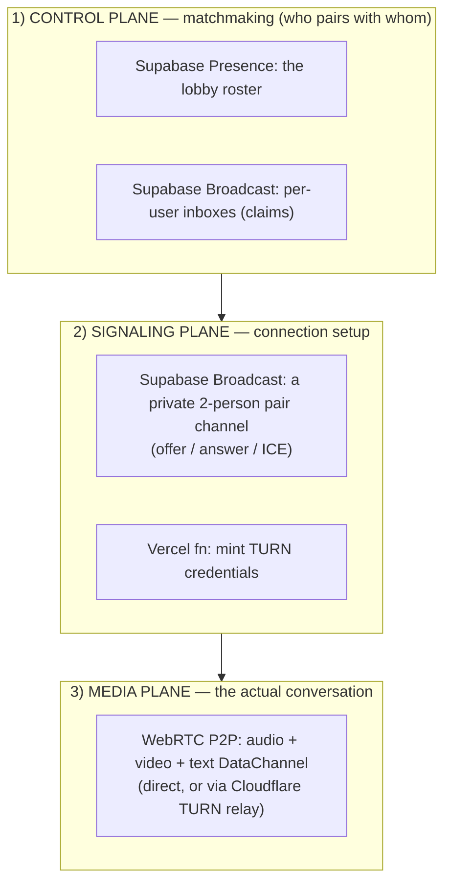
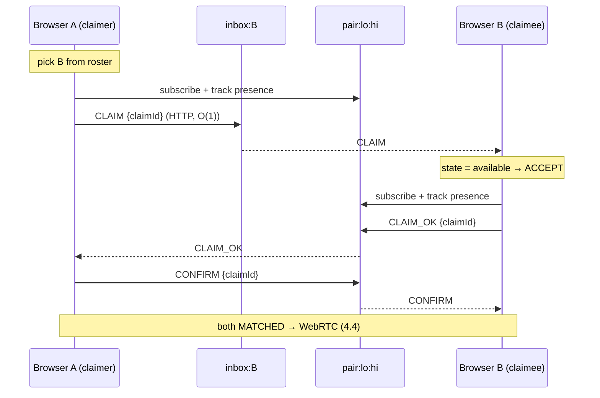
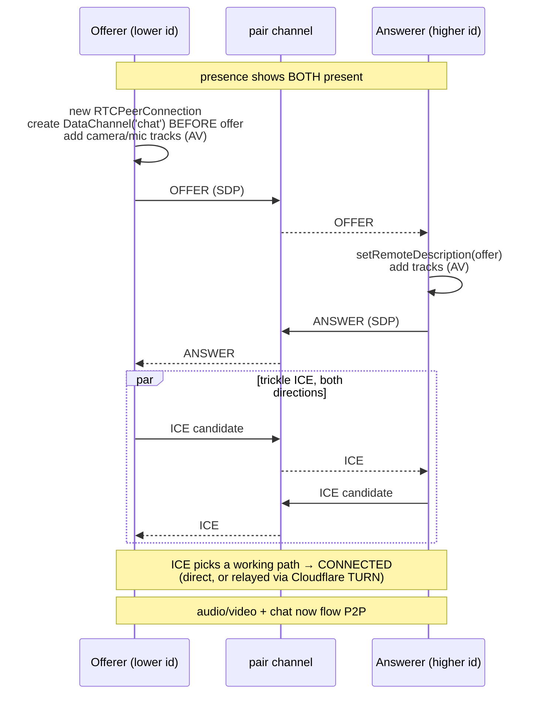
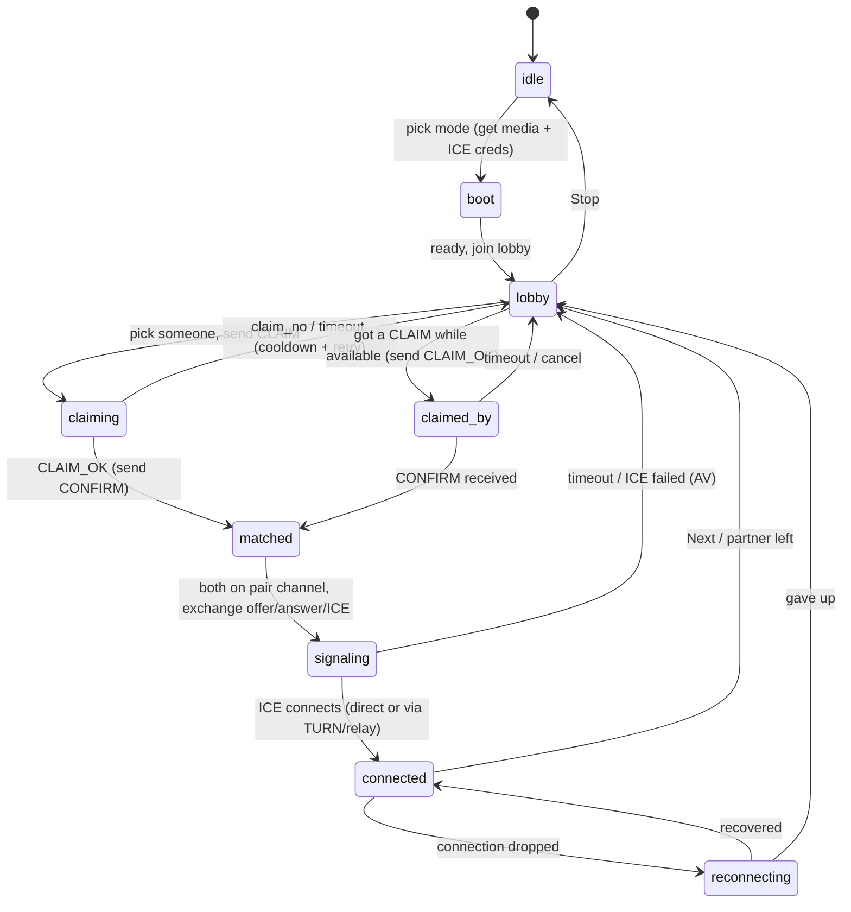

# Architecture — Serverless Random Chat (from scratch)

This document explains the **entire system from first principles**. The early
parts assume *no* prior knowledge of WebRTC or realtime backends — if you've
written a bit of JavaScript, you can follow along. Later parts go deep, map every
concept to the actual code files, and finish with a thorough **"Why this
architecture"** section covering the trade-offs and the alternatives we rejected.

> **What is this app?** A website where you click a button and get connected to a
> random stranger for **text, audio, or video** chat — like Omegle/Uhmegle. When
> you click **Next**, you drop the current stranger and get a new one.
>
> **The hard constraint that shaped everything:** it must run on **free hosting**,
> and the kind of free hosting we use (Vercel) **cannot keep a long-lived
> connection open** to coordinate users. So almost all the "server" logic actually
> runs *in the browsers themselves*, using a managed realtime service as a
> message courier.

---

## Table of contents

- [Part 1 — The concepts (start here if you're new)](#part-1--the-concepts)
- [Part 2 — The big picture](#part-2--the-big-picture)
- [Part 3 — The building blocks (mapped to code)](#part-3--the-building-blocks)
- [Part 4 — Data flows, step by step](#part-4--data-flows-step-by-step)
- [Part 5 — The connection state machine](#part-5--the-connection-state-machine)
- [Part 6 — Why this architecture (rationale & trade-offs)](#part-6--why-this-architecture)
- [Part 7 — Free-tier budget math](#part-7--free-tier-budget-math)
- [Part 8 — Security & privacy](#part-8--security--privacy)
- [Part 9 — File map](#part-9--file-map)
- [Part 10 — Glossary](#part-10--glossary)

---

## Part 1 — The concepts

### 1.1 The core problem

We want **two strangers' browsers to talk directly to each other** — ideally
sending video/audio/text straight from one laptop to the other, without paying
for a server to sit in the middle relaying all that data (video is expensive to
relay).

Two challenges fall out of that:

1. **Discovery / matchmaking** — how does Browser A even find Browser B among
   everyone currently online, and how do they agree to pair up?
2. **Connection** — once paired, how do two browsers on different home/office
   networks open a direct connection? (This is harder than it sounds — see NAT
   below.)

### 1.2 WebRTC — the browser's built-in "direct line"

**WebRTC** is technology built into every modern browser that lets two browsers
send **media (camera/mic)** and **arbitrary data (text/files)** *directly to each
other*, peer-to-peer (P2P), without going through your server.

Analogy: think of a **direct phone call between two houses**. Once the call is
up, the two houses talk directly — nobody else is on the line.

But to *start* that call, the two sides must first exchange some information:
- **"What can you speak?"** — codecs, media formats, encryption keys. This bundle
  is called an **SDP** (Session Description Protocol) blob. One side makes an
  **offer**, the other replies with an **answer**.
- **"Where can I reach you?"** — a list of possible network addresses to try,
  called **ICE candidates**.

The catch: **WebRTC itself does not provide a way to exchange those first
messages.** Two browsers that have never met have no channel to send each other
an offer. That exchange is called **signaling**, and *you* have to provide it.

### 1.3 Signaling — the "mutual friend" who introduces them

**Signaling** = the process of relaying those first setup messages (offer,
answer, ICE candidates) between the two browsers *until the direct connection is
established.*

Analogy: two people want to call each other but don't have each other's number. A
**mutual friend** passes the phone numbers between them. Once both have the
number and the call connects, **the friend is no longer needed** — the two talk
directly.

That "mutual friend" is a small **signaling server**. It doesn't carry your video
— it only carries a few tiny text messages at the start. In our app, the
"mutual friend" is **Supabase Realtime** (explained in 1.6).

### 1.4 NAT — why two browsers can't just connect directly

Your devices at home/work don't have their own public address on the internet.
Instead, your **router** has one public address, and it shares it among all your
devices using **NAT** (Network Address Translation).

Analogy: an apartment building has **one street address** (the router's public
IP), but many apartments inside (your phone, laptop, etc.). If someone mails a
letter to just the street address, the mailroom doesn't know which apartment it's
for. Outgoing mail works fine; *unsolicited incoming* mail is the problem.

Because both strangers are usually behind NAT, neither can simply "dial" the
other. WebRTC solves this with a technique called **ICE** that tries many paths:

- **STUN server** — a free, lightweight server that answers one question: *"From
  the public internet, what does my address look like?"* Knowing your own public
  address lets two peers attempt a clever trick called **hole punching** to
  connect directly. STUN works for **~80–85%** of connections.
- **TURN server** — when hole punching fails (strict corporate firewalls, mobile
  carrier NAT, "symmetric" NAT — about **15–30%** of real-world cases), there's
  no way to go direct. A **TURN server** acts as a **neutral relay in the
  middle**: both peers connect to it, and it forwards their traffic.

Analogy for TURN: if two people *cannot* receive each other's calls directly,
they both call a **shared switchboard** that patches them through. It works, but
the switchboard now carries all the traffic — so **TURN costs bandwidth** (it's
the one piece that isn't "free P2P").

### 1.5 The RTCDataChannel — a direct text/data pipe

Alongside audio/video, WebRTC can open an **RTCDataChannel**: a direct P2P pipe
for sending **arbitrary data**, like chat text. Because it's P2P, messages go
**straight from one browser to the other** — low latency, and **$0** because they
never touch your server. We use it for text chat. (If the direct connection can't
be established, we fall back to sending text through Supabase instead.)

> **Myth-buster:** P2P does **not** mean "no internet" or "instant." Your packets
> still travel across the public internet, so latency is however long the network
> round-trip is — typically **tens of milliseconds**, not microseconds. What P2P
> avoids is the *extra hop through your own server*, which is both a latency win
> and a cost win.

### 1.6 Supabase Realtime — our "message courier"

**Supabase** is a hosted backend (an open-source Firebase alternative) built on a
PostgreSQL database. We use one specific part of it: **Supabase Realtime**, a
managed **WebSocket** service. A WebSocket is a connection that stays open so the
server can push messages to the browser instantly (unlike a normal web request
that closes immediately).

Supabase Realtime gives us three tools:

- **Channels** — named "rooms" that clients subscribe to. A message sent to a
  channel reaches everyone subscribed to that channel.
- **Presence** — a shared, auto-synced **"who's here" list** for a channel. When
  you join a channel you can *track* a little record about yourself (your id,
  your mode), and everyone in the channel sees the up-to-date roster. Think of a
  **shared whiteboard** listing who's currently in the room.
- **Broadcast** — sending a one-off **message** to a channel (e.g. "here's my
  WebRTC offer"). Think of **shouting something** to everyone in the room.

We use Presence to know **who is available to chat**, and Broadcast to **carry the
signaling messages**. Crucially, the **PostgreSQL database is never touched during
a chat** — Realtime runs independently of it.

### 1.7 Matchmaking

**Matchmaking** = the logic that pairs two waiting users. Normally a server keeps
a queue and pairs people. We have no always-on server, so (as you'll see) the
browsers do the matchmaking *themselves* by reading the Presence roster and
performing a small handshake. This is the most unusual part of the design.

---

## Part 2 — The big picture

Here are the four "actors" in the system and what each does:

| Actor | Role | Persistent? |
| --- | --- | --- |
| **Browser (each user)** | Runs *all* the logic: matchmaking, signaling, WebRTC, UI | n/a |
| **Supabase Realtime** | The "mutual friend": carries presence + signaling messages over WebSocket | Managed for us |
| **Vercel function** (`/api/turn-credentials`) | Tiny, short-lived server endpoint that hands out temporary TURN passwords | No (runs per request) |
| **Cloudflare TURN + public STUN** | Help two browsers find a network path to each other | Managed for us |

Notice what's **missing**: there is **no custom always-on server of ours**. The
only code we run on a server is a function that wakes up for a fraction of a
second to mint a credential. Everything else is either in the browser or a managed
service.

We can think of the system as **three planes**:



- **Control plane** decides *who talks to whom*. Lives entirely on Supabase
  Presence + Broadcast.
- **Signaling plane** sets up the *connection* between the two chosen peers. Also
  on Supabase Broadcast, plus the one Vercel function for TURN credentials.
- **Media plane** is the conversation itself — pure WebRTC P2P, not touching our
  infrastructure at all (except the optional TURN relay).

The genius (and the constraint) is that **the control and signaling planes are
just a message courier**. They never run "matchmaking logic" on a server — they
only pass messages that the browsers interpret.

---

## Part 3 — The building blocks

### 3.1 Identity and deterministic naming

When a browser tab opens the app, it generates a random **`peerId`** (a UUID) for
that session — see [`genId()`](lib/matchmaking/handshake.ts) used by the
[`Controller`](lib/matchmaking/fsm.ts). This id is the tab's "name" everywhere:
its presence key, its inbox address, and the input to two **deterministic**
functions (in [`lib/config.ts`](lib/config.ts)):

- **`pairTopic(a, b)`** → sorts the two ids and returns `pair:{lowerId}:{higherId}`.
  Because it sorts, **both peers compute the exact same room name** without having
  to agree on one. (This is what makes "they both pick each other at once" easy to
  resolve — see 4.3.)
- **`isOfferer(self, peer)`** → returns `true` for the peer with the
  lexicographically **smaller** id. This decides, with no negotiation, **who
  creates the WebRTC offer** (exactly one side does).

These "compute the same answer independently" tricks are how we avoid needing a
coordinator to assign rooms or roles.

### 3.2 The three kinds of channel

Everything in the control/signaling planes is built from three channel types.
Keeping them separate is the key to staying within free-tier limits (Part 7):

| Channel (topic) | Who subscribes | Carries | Cost shape |
| --- | --- | --- | --- |
| `lobby:{mode}:{shard}` | everyone online in that mode | **Presence roster only** (who's available) | grows with lobby size — kept cheap by only updating on join/leave |
| `inbox:{peerId}` | **only that one peer** | incoming **CLAIM** ("want to pair?") | **O(1)** — exactly one subscriber |
| `pair:{lo}:{hi}` | exactly the **two** matched peers | handshake + WebRTC offer/answer/ICE + chat fallback | tiny — 2 subscribers |

The most important design decision lives here: **the lobby is used only as a
read-only roster, and the actual "let's pair" handshake happens on O(1) inbox
channels and a private 2-person pair channel — never broadcast to the whole
lobby.** Part 6 explains *why* this matters so much.

### 3.3 How a peer sends a CLAIM without joining someone's inbox

There's a subtlety: in Supabase, to send a message to a channel you normally have
to *subscribe* to it — but if peer A subscribed to `inbox:B` to send a claim, A
would also receive everyone else's claims to B, ruining the "O(1), private"
property.

The fix: claims are sent via Supabase's **HTTP broadcast endpoint**
(`POST /realtime/v1/api/broadcast`), which lets you publish to a topic
**without subscribing**. See [`httpBroadcast()`](lib/realtime/broadcast.ts). So:

- A peer **WS-subscribes to its *own* inbox** to *receive* claims.
- A peer **HTTP-posts** a claim to *another* peer's inbox to *send* one.

No cross-subscription, fully private, one message per claim.

### 3.4 The message types

Two small families of messages (defined in [`lib/types.ts`](lib/types.ts)):

**Inbox messages** (sent to `inbox:{peer}` via HTTP):
```jsonc
{ "type": "claim",    "from": "...", "to": "...", "claimId": "...", "mode": "text|av", "sid": "..." }
{ "type": "claim_no", "from": "...", "to": "...", "claimId": "...", "reason": "busy|mode" }
```

**Pair-channel messages** (a versioned envelope, sent over the `pair` channel):
```jsonc
{
  "v": 1,
  "type": "claim_ok | confirm | cancel | offer | answer | ice | bye | chat-relay",
  "room": "pair:lo:hi",
  "from": "peerId",
  "sid":  "session tag",
  "seq":  0,
  "data": { /* shape depends on type */ }
}
```
- `offer`/`answer` → `{ sdp }`
- `ice` → `{ candidate, sdpMid, sdpMLineIndex, usernameFragment }` or `{ end: true }`
- `claim_ok`/`confirm`/`cancel` → `{ claimId, ... }`
- `bye` → `{ reason }`  (graceful "I'm leaving")
- `chat-relay` → `{ msgId, text, ts }`  (text fallback when P2P is unavailable)

---

## Part 4 — Data flows, step by step

### 4.1 Booting and joining the lobby

When you pick a mode and click start ([`Controller.start()`](lib/matchmaking/fsm.ts)):

1. **Acquire media** (AV mode only): ask the browser for camera/mic with
   `getUserMedia`. (Text mode skips this.)
2. **Fetch ICE servers**: call `/api/turn-credentials` to get STUN + fresh TURN
   credentials (see [`fetchIceServers()`](lib/webrtc/ice.ts)).
3. **Subscribe to your own inbox** so you can receive claims
   ([`InboxClient`](lib/realtime/inbox.ts)).
4. **Join the lobby** and `track()` a tiny presence record `{ id, mode, region,
   joinedAt }` ([`LobbyClient`](lib/realtime/lobby.ts)).
5. State becomes **`lobby`** and you start seeking a partner.

### 4.2 Finding and claiming a peer

In [`maybeSeek()`](lib/matchmaking/fsm.ts):

1. **Read the roster** for free from the local presence cache
   (`presenceState()`), excluding yourself and anyone on a 10-second **cooldown**
   list (so you don't instantly re-match the person you just left).
2. **Pick one at random.** If the roster is empty, retry shortly (and, if
   sharding is enabled, hop to a neighbouring shard).
3. **Start a claim** toward that peer (4.3).

> We don't track a live "available vs busy" flag in presence (that would be
> expensive to update constantly). Instead we use **optimistic probing**: just try
> someone; if they're busy they'll say no, and we try someone else. A "no" is
> cheap (one message).

### 4.3 The race-free handshake (the clever part)

No central server arbitrates pairing, so the browsers run a tiny **claim →
claim_ok → confirm** protocol. The decision logic is one pure function,
[`decideOnClaim()`](lib/matchmaking/handshake.ts).

**Normal case — A claims an available B:**



**Why two people can't pair with the same person:** a peer only ever says
`CLAIM_OK` to **one** claimer at a time (it becomes "busy" the instant it
accepts), and replies `claim_no` to any other claim. JavaScript runs one event at
a time, so "who got accepted first" is unambiguous. The claimer only proceeds on
an explicit `CLAIM_OK` + sends `CONFIRM`. No double-pairing is possible.

**The tricky case — "glare" (A claims B *and* B claims A simultaneously):**
both compute the *same* `pair:lo:hi` room (3.1) and both land there. The rule in
`decideOnClaim`: *if a claim arrives from the very peer you are currently
claiming, **converge*** — skip the `ok/confirm` dance, treat the mutual claim as
the agreement, and let the **lower id be the offerer**. Both sides reach the same
conclusion independently.

**Safety nets:**
- **Timeouts** on every waiting state (T1 claiming ≈ 2s, T2 claimed ≈ 2s,
  T3 connecting ≈ 12s — in [`lib/config.ts`](lib/config.ts)). If anything stalls,
  the peer gives up, cools down that partner, and re-seeks. Worst case is a ~2s
  retry — never a deadlock.
- **`claimId`** (a nonce) lets both sides ignore stale/duplicate messages.
- **Cooldown** prevents immediately re-matching someone you just left.

### 4.4 Setting up the WebRTC connection

Once matched, both peers are on the `pair` channel. Presence on that channel tells
each side when **both are present**; the offerer waits for that before sending its
offer (so the offer isn't sent into an empty room). See
[`Peer`](lib/webrtc/peer.ts) and [`PairSignaling`](lib/webrtc/signaling.ts).



Key detail: the offerer creates the `chat` **DataChannel before** making the
offer, so it's negotiated *inside* the SDP — no extra round-trip. ICE candidates
are "trickled" (sent as they're discovered) for the fastest possible connect.

### 4.5 Chatting

[`ChatTransport`](lib/webrtc/chat.ts) prefers the **P2P DataChannel**. If the data
channel isn't open (e.g. text mode where ICE failed), it transparently falls back
to sending the message as a `chat-relay` **Broadcast** on the existing `pair`
channel. Messages are de-duplicated by id, so the two paths never double-deliver.
Result: **text mode always works** (P2P when possible, relay otherwise) and never
needs TURN.

### 4.6 "Next" and teardown

Clicking **Next** ([`Controller.next()`](lib/matchmaking/fsm.ts)): send a `bye` on
the pair channel, close the `RTCPeerConnection`, unsubscribe the pair channel, add
the ex-partner to the cooldown set, return to `lobby`, and immediately seek again.
The other side detects the departure (via `bye` *or* a presence "leave" on the
pair channel) and does the same — so both re-queue, just like Omegle.

### 4.7 Failure & recovery

- **Claim ignored / partner vanished** → timeout → cooldown + re-seek.
- **ICE can't connect (AV mode)** → tear down + re-seek (try a different partner).
- **ICE can't connect (text mode)** → fall back to relayed chat; stay connected.
- **Connection drops mid-chat** → brief `reconnecting` window; if it doesn't
  recover, return to lobby and re-seek.

---

## Part 5 — The connection state machine

Every browser is, at any moment, in exactly one state. The whole app is this
machine, implemented in [`Controller`](lib/matchmaking/fsm.ts).



| State | Meaning | Leaves when |
| --- | --- | --- |
| `idle` | Not in the app | you pick a mode |
| `boot` | Getting camera/mic + TURN creds, joining Supabase | ready |
| `lobby` | Available; reading roster, probing for a partner | you claim / get claimed |
| `claiming` | You sent a claim, waiting for a yes | `CLAIM_OK`, or timeout |
| `claimed_by` | You accepted someone's claim, waiting for confirm | `CONFIRM`, or timeout |
| `matched` | Agreed to pair; joining the pair channel | start WebRTC |
| `signaling` | Exchanging offer/answer/ICE | connected, or timeout |
| `connected` | Talking (P2P or relay) | Next, or drop |
| `reconnecting` | Connection hiccuped | recovers or gives up |

---

## Part 6 — Why this architecture

This is the "defend every decision" section. Each choice is driven by the same
three constraints, so start there.

### 6.0 The constraints that drive everything

1. **It must run on free hosting.** No paying for an always-on server.
2. **Vercel (our web host) cannot keep a persistent connection open.** Vercel runs
   *serverless functions* — they spin up for one request and die. They **cannot**
   hold a WebSocket open to coordinate users in real time. This single fact rules
   out "just run a signaling/matchmaking server on Vercel."
3. **Keep the PostgreSQL database out of the live chat path.** DB reads/writes add
   latency and burn free-tier rate limits; we want chat to be pure realtime + P2P.

Almost every decision below is the cheapest correct way to satisfy these three.

### 6.1 Why a managed realtime service (Supabase) for signaling

**The need:** WebRTC requires a signaling channel — a way to pass offer/answer/ICE
between two browsers in real time. That inherently needs a *persistent*
connection (WebSocket), which constraint #2 says we can't host ourselves on
Vercel.

**The choice:** use a **managed WebSocket service** so someone else keeps the
persistent connections alive. We picked **Supabase Realtime**.

**Alternatives considered:**

| Option | Why not (for this project) |
| --- | --- |
| **Run our own Node WebSocket server** (ws / Socket.IO) | Needs an always-on host (Render/Fly/Railway). Free tiers sleep, cold-start, or cost money; it's the very thing we're avoiding. |
| **PeerJS / public signaling broker** | Public brokers are unreliable; self-hosting one is the same always-on-server problem; no presence/matchmaking built in. |
| **Firebase Realtime DB / Firestore** | Totally workable. We preferred Supabase for its first-class **Presence + Broadcast** primitives, generous realtime free tier, open-source nature, and the fact that it's Postgres-backed (handy later for the deferred moderation features) while staying *out* of the hot path. |
| **Ably / Pusher (realtime-as-a-service)** | Also viable. Supabase chosen to keep one provider for realtime *and* the future database, and for the integrated Presence model. |

**The trade-off we accept:** Supabase's free tier caps us at **200 concurrent
connections** and **2M messages/month** (Part 7). That's the price of "managed and
free." It's plenty for a demo/small app and the seams to scale are clear.

### 6.2 Why the browsers do matchmaking themselves (no coordinator)

**The need:** pair two waiting strangers.

**The obvious design** is a server with a queue: users join, the server pops two
and pairs them. But constraint #2 means **we have no always-on server to hold that
queue**, and constraint #3 means we don't want to abuse the database as a queue.

**The choice:** push matchmaking **into the clients**. Supabase **Presence** gives
every client a live roster of who's online; each client reads it, picks someone,
and performs a tiny peer-to-peer **claim handshake** to lock in a pair.

**Alternatives considered:**

| Option | Why not |
| --- | --- |
| **Postgres "waiting queue" table + row locking** | Puts the DB squarely in the hot path (constraint #3); serverless functions polling/locking a queue is slow, racy, and rate-limited on free tiers. |
| **A serverless matchmaker function** | Functions are stateless and short-lived; they can't "hold" a queue between calls without external state (back to the DB problem), and can't push results without a persistent connection. |

**The trade-off:** with no central referee, two clients can briefly contend for the
same partner. We solve that with a **decentralized handshake** (6.4) instead of a
lock. The cost is an occasional ~2s retry — never incorrectness.

### 6.3 Why the tiered channel design (this is the crux)

This is the decision that makes the whole thing viable on a free tier, so it gets
the most detail.

**The naïve design** would be: one big global channel where everyone announces
presence and sends "looking for a match" messages. It works in a demo and
**collapses immediately at real usage**. Here's why:

> **Supabase Presence broadcasts every change to *every* subscriber.** If `N`
> people are in one channel and one person joins or leaves, that's `~N` messages.
> People clicking **Next** constantly means constant churn → the message count
> scales like **N²**, and you blow the 2M/month budget in *hours*.

So we split the work into three channels with very different cost shapes (3.2):

1. **Lobby = roster only.** Presence is updated *only* when you enter or leave the
   app — **never on "Next."** "Next" just re-reads the local roster cache (free)
   and probes again. This removes the worst churn from presence entirely.
2. **Inbox = O(1) addressed claims.** A claim goes to exactly one peer's inbox via
   HTTP broadcast (3.3), costing **one** message regardless of lobby size —
   instead of shouting to all `N` people.
3. **Pair = private 2-person channel.** All the chatty signaling (offer, answer,
   many ICE candidates) happens between just the two matched peers, so it never
   touches anyone else.

**The result:** message cost is dominated by a small per-match constant, not by
`N²`. The same app that would die in hours on one global channel comfortably fits
the free tier (Part 7).

**The trade-off:** more moving parts (three channel types, an inbox per peer, a
short-lived pair channel per match) and the "optimistic probing" model (you might
claim someone who's busy and get a quick "no"). We judged that complexity well
worth surviving the free tier.

### 6.4 Why a decentralized claim handshake — and why it's correct

**The need:** pair exactly two peers, with no server lock, even when claims race.

**The choice:** the `claim → claim_ok → confirm` protocol (4.3) with four
properties that together guarantee correctness:

- **Single acceptance:** a peer says "yes" to at most one claimer at a time and
  NACKs the rest. (JS is single-threaded, so "first one wins" is well-defined.)
- **Deterministic room + offerer (3.1):** both peers independently compute the
  same room name and the same "who offers," so mutual claims (*glare*) **converge**
  to one session instead of creating two.
- **Idempotent `claimId`s:** stale or duplicate messages are ignored.
- **Timeouts everywhere:** nothing can wedge; the worst outcome is a retry.

**Alternative considered:** a distributed lock (e.g., in Redis or a DB row).
Rejected — it reintroduces an always-on/stateful dependency we deliberately don't
have. The handshake achieves "good enough" mutual exclusion with only messages.

**The trade-off:** it's not a perfect global lock — there's a tiny window where a
claim is wasted and retried. In exchange we get zero infrastructure and
self-healing behavior.

### 6.5 Why peer-to-peer media (not a media server)

**The need:** carry audio/video between two users.

**The choice:** **WebRTC P2P** — the two browsers send media directly to each
other.

**Alternative considered:** an **SFU / media server** (the standard approach for
group calls), which receives each person's stream and forwards it. Rejected for
this project because **relaying media is bandwidth-expensive** (~1.35 GB/hour per
HD stream) and there's no free tier that absorbs that at scale. P2P pushes that
cost onto the peers' own connections — **$0 for us**.

**The trade-off:** P2P is great for **1:1** (which is exactly random chat) but
doesn't scale to large group calls, and ~15–30% of peers can't go directly P2P and
need a relay anyway — which leads to the next decision.

### 6.6 Why a DataChannel for text (not just Supabase messages)

**The choice:** send chat over the WebRTC **DataChannel** (P2P).

**Why not just send chat text over Supabase Broadcast?** That works and is our
*fallback*, but as the *primary* path it would (a) add a server round-trip of
latency and (b) consume the 2M-message budget for every single chat line. P2P text
is lower-latency and **free** (doesn't touch Supabase). We keep Broadcast purely as
the fallback for when P2P can't be established — which is why **text mode never
needs TURN and always connects**.

### 6.7 Why Cloudflare TURN + exactly one serverless function

**The need:** the ~15–30% of users who can't connect directly need a TURN relay
(1.4), and TURN requires a secret credential that **must not** be exposed in the
browser (anyone could drain it).

**The choice:** **Cloudflare's TURN** (a very generous free allowance, and it's a
global, reliable relay) plus a **single tiny Vercel function**
([`/api/turn-credentials`](app/api/turn-credentials/route.ts)) that holds the
secret and mints **short-lived** credentials on demand.

This is the *one* place we run server code — and notice it **fits constraint #2
perfectly**: it's a quick request/response (mint a credential and return), **not**
a persistent connection. It also touches **no database** (constraint #3). If the
TURN env vars are absent, it returns STUN-only and the app still works for most
users.

**Alternatives considered:** self-hosting `coturn` on a free VM (more ops + you
must secure/monitor it) or putting the credential in the client (insecure).
Cloudflare's managed TURN was the best effort-to-reliability trade.

### 6.8 Why Next.js on Vercel

The app is a React UI plus exactly one serverless endpoint plus static hosting —
which is precisely what **Next.js on Vercel** gives you for free, with automatic
**HTTPS** (required, since browsers only grant camera/mic on a secure origin). The
persistent-connection work it *can't* do is exactly what we offloaded to Supabase.
So the stack splits cleanly along the "persistent vs. short-lived" line: **Supabase
for the always-open parts, Vercel for the request/response part, the browser for
everything else.**

### 6.9 The honest trade-offs and limits

No architecture is free of cost. Ours accepts:

- **~200 concurrent users total** (Supabase free tier). Beyond that you upgrade
  Supabase or shard across projects.
- **Latency is network-bound**, ~tens of ms — *not* "instant"/sub-millisecond.
- **1:1 only** — no group calls (a consequence of choosing P2P over an SFU).
- **Optimistic probing wastes the occasional claim** (you sometimes claim a busy
  peer). Cheap, but real.
- **Matching can be slightly slower with sharding on** — peers in different shards
  meet only via shard-hopping, so we default `SHARD_COUNT = 1` (one lobby) for
  instant matching at small scale, and raise it only when each shard reliably has
  several waiting peers.
- **No moderation** is built in. For an *anonymous video* product this is the
  biggest real-world gap (it's why Omegle shut down). The architecture
  deliberately reserves a clean place to add it — see Part 8.

---

## Part 7 — Free-tier budget math

The whole tiered design exists to fit these two Supabase free-tier numbers:

- **200 concurrent connections** → ~200 simultaneous users (each tab = 1
  connection). This is the app's hard ceiling on the free tier.
- **2,000,000 realtime messages / month.**

**Where messages come from in our design:**

| Source | Cost | Notes |
| --- | --- | --- |
| Presence join/leave | ~`N` per event | Only on entering/leaving the app — **not** on "Next" |
| A claim | 1 | HTTP broadcast to one inbox |
| A "no" (busy) | 1 | |
| Pair handshake (`claim_ok`+`confirm`) | ~2 | On the 2-person pair channel |
| WebRTC signaling per match | ~10–20 | offer + answer + trickled ICE, 2 subscribers |

The cost is therefore **a small constant per match**, plus presence that only
moves on app enter/exit. Contrast the **naïve single global channel**: presence
churn there scales like `N²` and exhausts 2M messages in *a few hours* at ~200
users. Our design stretches that to days-of-peak-equivalent — comfortably fine for
a small public app that isn't pinned at 200 concurrent 24/7.

**TURN (Cloudflare):** free when paired with Cloudflare's SFU; standalone it's
~**$0.05 per real-time GB** relayed beyond the free allowance. Only the ~15–30% of
sessions that can't go direct use it, and only AV (text falls back to the free
relay). Negligible at demo scale.

**The tuning levers** (all in [`lib/config.ts`](lib/config.ts)):
- `SHARD_COUNT` — more shards = cheaper presence at high concurrency (trade-off:
  cross-shard matching needs hopping). Default `1`.
- `COOLDOWN_TTL`, `TIMEOUTS`, `SEEK_RETRY_INTERVAL` — pacing of retries/churn.

When you outgrow 200 concurrent: upgrade Supabase (Pro ≈ 500 connections) or run
multiple Supabase projects and shard users across them (the `SHARD_COUNT`/lobby
seam is where that plugs in).

---

## Part 8 — Security & privacy

**What's protected well:**
- **The TURN secret never reaches the browser.** It lives only in the Vercel
  function, which hands out short-lived credentials.
- **No accounts, no PII, no chat history stored.** `peerId`s are random per-tab and
  vanish when the tab closes. The database is untouched during chats.
- **HTTPS everywhere** (Vercel) — required for camera/mic and for secure WebSocket.
- **Baseline headers** via [`vercel.json`](vercel.json) (`nosniff`,
  `X-Frame-Options: DENY`, referrer policy) — e.g. prevents other sites from
  iframing the app to trick users into granting camera access.
- **Local video is muted** to avoid audio feedback.

**Known limitations (be honest about these):**
- We use **public** Supabase channels with the **anon key** (which is public by
  design). A determined actor could subscribe to the lobby and observe online
  `peerId`s. They **cannot** easily join a `pair` channel (the room name is derived
  from two random UUIDs, infeasible to guess), and our code ignores any message not
  from the expected partner — but this is *best-effort*, not hardened. For a
  production deployment, switch to Supabase **private channels + Realtime
  Authorization (RLS)** so only the two matched peers can join their pair channel.
- **No rate limiting** on claims/joins — a hardened deployment should add some.

**The big gap — moderation (deliberately deferred):** anonymous random video chat
carries serious abuse/legal exposure. Before any public launch, add at minimum: an
**18+ age gate**, **Terms of Service + Privacy Policy**, a **Report button + ban**
capability, and rate limiting. These belong **out-of-band** — e.g. a "Report"
writes to **Postgres via a serverless function**, and a **banlist is checked at
lobby join** — so the chat hot path stays untouched, exactly as this architecture
intends. (Live P2P video can't be inspected server-side, so content moderation
typically means client-side frame sampling to a moderation API, or requiring
accounts.)

---

## Part 9 — File map

```
app/
  api/turn-credentials/route.ts   The ONLY server code: mints ephemeral Cloudflare
                                  TURN credentials (or STUN-only). No database.
  layout.tsx, page.tsx            App shell + the single-page UI.
  globals.css                     Styling.
components/
  VideoStage.tsx                  Binds a MediaStream to a <video> element.
  ChatPanel.tsx                   Message list + input box.
lib/
  config.ts                       All tunables: topic helpers, SHARD_COUNT,
                                  timeouts, STUN list, deterministic room/offerer.
  types.ts                        All shared TypeScript types + message schemas.
  supabase/client.ts              Singleton Supabase Realtime client.
  realtime/
    broadcast.ts                  HTTP broadcast helper (the O(1) claim send).
    lobby.ts                      Lobby presence: join, roster read, shard-hop.
    inbox.ts                      Own-inbox subscription + send claim/claim_no.
  webrtc/
    ice.ts                        Fetches ICE servers from the Vercel function.
    peer.ts                       RTCPeerConnection wrapper: DataChannel-before-
                                  offer, tracks, trickle-ICE queueing.
    signaling.ts                  The pair channel: broadcast envelopes + presence
                                  (both-present + drop detection).
    chat.ts                       Text over DataChannel with Broadcast fallback.
  matchmaking/
    handshake.ts                  Pure, testable decision rule (accept/converge/
                                  nack) + id generation.
    fsm.ts                        The Controller: the whole state machine (Part 5),
                                  wiring lobby + inbox + handshake + WebRTC.
  hooks/useUhmegle.ts             React binding: turns the Controller into state +
                                  actions for the UI.
```

A good reading order to learn the code: `types.ts` → `config.ts` →
`handshake.ts` → `fsm.ts` (the brain) → then the `realtime/` and `webrtc/`
helpers it orchestrates.

---

## Part 10 — Glossary

- **WebRTC** — browser tech for direct P2P audio/video/data between two browsers.
- **Signaling** — exchanging the initial setup messages (offer/answer/ICE) to get
  a WebRTC connection started. Needs a server; ours is Supabase.
- **SDP (offer/answer)** — a text blob describing what media/codecs a peer
  supports. One peer offers, the other answers.
- **ICE** — the process of trying multiple network paths to connect two peers.
- **ICE candidate** — one possible network address/path to try. "Trickle ICE" =
  sending them as they're found, instead of waiting for all of them.
- **STUN** — a free server that tells a peer its own public address (enables direct
  connection). Works for ~80–85% of peers.
- **TURN** — a relay server used when direct connection fails (~15–30%). Carries the
  media, so it costs bandwidth.
- **NAT** — how a router shares one public IP among many devices; the reason direct
  connections are hard.
- **RTCDataChannel** — a P2P pipe for arbitrary data (we use it for chat text).
- **Supabase Realtime** — managed WebSocket service providing Channels, Presence,
  Broadcast.
- **Channel** — a named realtime "room" clients subscribe to.
- **Presence** — a channel's auto-synced "who's here" roster.
- **Broadcast** — a one-off message sent to a channel.
- **SFU** — a media *server* that forwards streams (used for group calls). We
  deliberately avoid it (cost) in favor of P2P.
- **Glare** — two peers trying to claim each other at the same instant; resolved by
  the deterministic room + offerer rule.
- **Offerer / Answerer** — the peer that creates the WebRTC offer vs. the one that
  answers. We pick the offerer deterministically (lower id).
- **peerId** — a random per-tab UUID identifying a user for the session.

---

## Further reading

- This repo's [README.md](README.md) (run it) and [DEPLOYMENT.md](DEPLOYMENT.md) (ship it).
- The original design blueprint in your Claude Code plans directory
  (`act-as-an-expert-elegant-newt.md`) — deeper free-tier analysis.
- [WebRTC — MDN](https://developer.mozilla.org/en-US/docs/Web/API/WebRTC_API)
- [Supabase Realtime docs](https://supabase.com/docs/guides/realtime)
- [Cloudflare Realtime TURN docs](https://developers.cloudflare.com/realtime/turn/)
